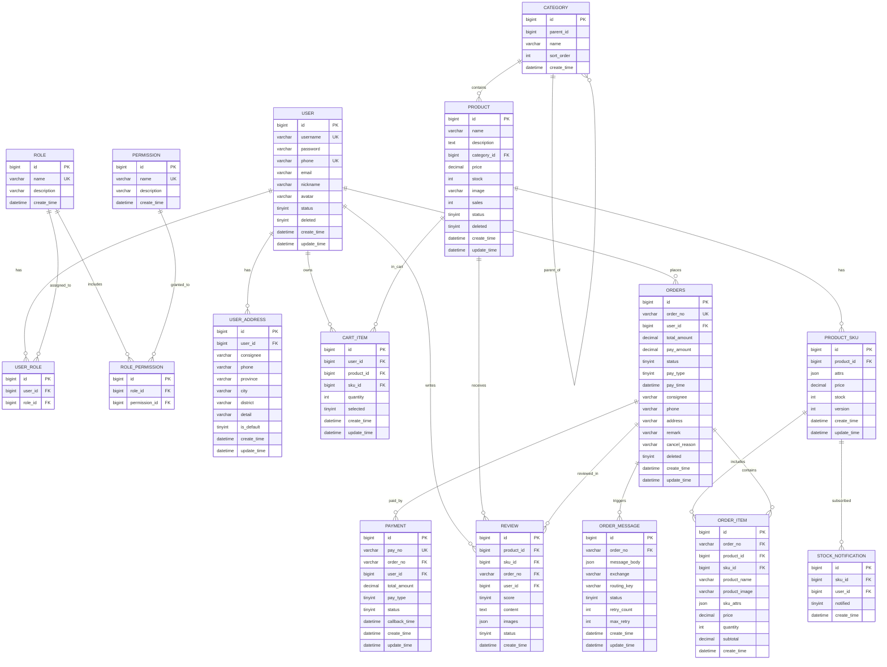
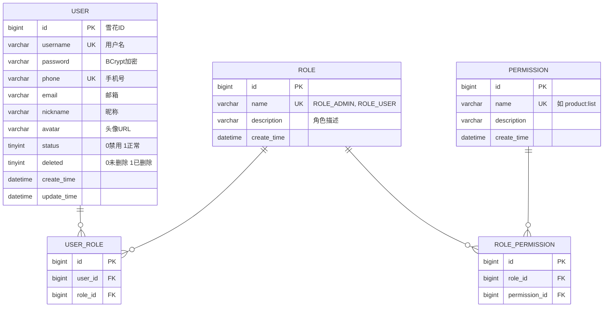
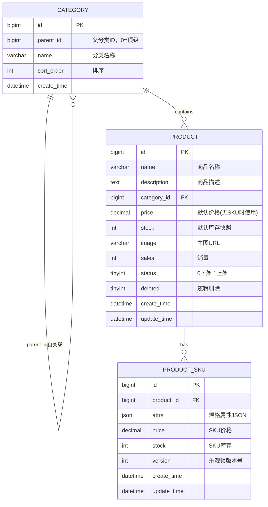
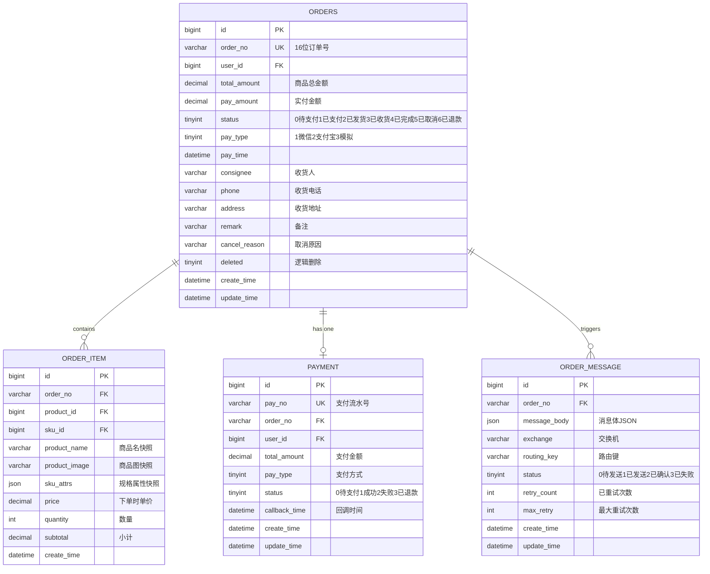
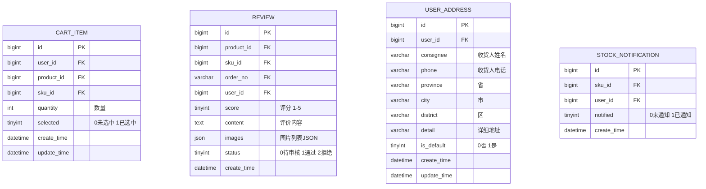

# 高并发电商系统 —— 数据库选型、设计与优化方案

> **项目**：基于 Spring Boot 全栈技术的高并发电商系统实战  
> **技术栈**：Spring Boot 3.5.16 + Spring Cloud 2025.0.3 + MyBatis-Plus 3.5.7 + Redis 7.2  
> **撰写日期**：2026-07-12  
> **文档版本**：v1.0

---

## 目录

- [一、数据库选型比对方案](#一数据库选型比对方案)
  - [1.1 候选数据库概览](#11-候选数据库概览)
  - [1.2 MySQL 8.0（InnoDB）](#12-mysql-80innodb)
  - [1.3 PostgreSQL 16](#13-postgresql-16)
  - [1.4 TiDB](#14-tidb)
  - [1.5 MongoDB](#15-mongodb)
  - [1.6 混合存储方案](#16-混合存储方案)
  - [1.7 综合对比矩阵](#17-综合对比矩阵)
  - [1.8 最终推荐](#18-最终推荐)
- [二、完整数据库设计说明](#二完整数据库设计说明)
  - [2.1 设计原则](#21-设计原则)
  - [2.2 全局 E-R 图](#22-全局-e-r-图)
  - [2.3 核心业务领域 E-R 图](#23-核心业务领域-e-r-图)
  - [2.4 表设计详情](#24-表设计详情)
  - [2.5 索引设计总览](#25-索引设计总览)
  - [2.6 数据字典](#26-数据字典)
- [三、数据库优化建议](#三数据库优化建议)
  - [3.1 查询优化](#31-查询优化)
  - [3.2 索引优化](#32-索引优化)
  - [3.3 缓存策略（与 Redis 协同）](#33-缓存策略与-redis-协同)
  - [3.4 连接池优化](#34-连接池优化)
  - [3.5 读写分离](#35-读写分离)
  - [3.6 分库分表](#36-分库分表)
  - [3.7 表结构优化](#37-表结构优化)
  - [3.8 MySQL 配置调优](#38-mysql-配置调优)
  - [3.9 慢查询监控与治理](#39-慢查询监控与治理)
  - [3.10 高并发场景专项优化](#310-高并发场景专项优化)

---

## 一、数据库选型比对方案

### 1.1 候选数据库概览

本项目是一个**高并发电商系统**，核心业务特征如下：

| 维度 | 特征 |
|:-----|:-----|
| 业务类型 | OLTP（在线事务处理），以短事务为主 |
| 读写比例 | 约 7:3（商品浏览为主，下单/支付为辅） |
| 并发特点 | 秒杀场景瞬时极高并发（1000+ QPS），普通场景中等并发 |
| 数据一致性 | **强要求**：库存不能超卖、金额不能算错、订单不能丢失 |
| 数据规模 | 课程项目级别（万级用户、十万级商品、百万级订单），但需展示可扩展性设计 |
| 事务需求 | 跨服务分布式事务（下单→扣库存→生成订单，MQ 最终一致性） |
| 全文搜索 | 商品名称、描述的关键词搜索 |

基于以上特征，候选数据库为：

| 数据库 | 类型 | 候选理由 |
|:-------|:-----|:---------|
| **MySQL 8.0** | 关系型（RDBMS） | 当前项目默认选型；生态成熟、与 Spring Boot 集成最佳 |
| **PostgreSQL 16** | 关系型-对象（ORDBMS） | 功能更丰富（JSONB、全文搜索、窗口函数）；学院派偏好 |
| **TiDB** | NewSQL 分布式 | MySQL 协议兼容；天然分布式；适合高并发水平扩展 |
| **MongoDB** | 文档型（NoSQL） | 商品 catalog 场景天然适配文档模型；灵活 schema |
| **混合方案** | MySQL + Redis + ES | 各取其长：MySQL 事务、Redis 缓存、ES 搜索 |

---

### 1.2 MySQL 8.0（InnoDB）

#### 1.2.1 优势

| 维度 | 说明 |
|:-----|:-----|
| **生态成熟度** | 🌟🌟🌟🌟🌟 全球最流行的开源关系型数据库，Spring Boot / MyBatis-Plus 一等公民 |
| **事务支持** | InnoDB 引擎提供完整的 ACID 事务，MVCC 多版本并发控制，隔离级别完善 |
| **与项目技术栈的契合度** | **完美契合**：MyBatis-Plus 3.5.7 基于 MySQL 深度优化；乐观锁 `@Version`、逻辑删除 `@TableLogic`、分页插件开箱即用 |
| **人才储备** | 几乎所有 Java 开发者都熟悉 MySQL，学习成本为零 |
| **运维工具** | Docker 一键启动；Navicat/DBeaver 可视化；慢查询日志完善 |
| **高并发能力** | InnoDB 行锁 + MVCC 支持较高并发；配合连接池（HikariCP）和 Redis 缓存，足以应对课程项目的并发需求 |
| **课程/答辩友好** | 面试必问；毕业设计主流；有大量现成的调优最佳实践可直接引用 |

#### 1.2.2 劣势

| 维度 | 说明 |
|:-----|:-----|
| **水平扩展弱** | 原生主从复制和 MGR 不支持自动分片；分库分表需中间件（ShardingSphere），增加复杂度 |
| **全文搜索弱** | 自带 FULLTEXT 索引对中文支持差（无分词器），需额外引入 Elasticsearch |
| **JSON 支持一般** | MySQL 5.7 引入 JSON 类型，功能不如 PostgreSQL 的 JSONB 丰富 |
| **分析能力弱** | 缺少物化视图、窗口函数虽已有但不如 PostgreSQL 完善；复杂分析查询性能一般 |
| **连接开销** | 每个连接一个线程（thread-per-connection），超高并发下连接数压力大（需连接池化解） |

#### 1.2.3 与本项目的适配度

```
功能适配度：  ████████████████████ 95%
性能适配度：  ██████████████████░░ 85%
扩展适配度：  ████████████████░░░░ 75%
学习成本：    ██░░░░░░░░░░░░░░░░░░  5%（极低）
运维成本：    ████░░░░░░░░░░░░░░░░ 15%（低）
────────────────────────────────
综合适配度：  ██████████████████░░ 88%
```

---

### 1.3 PostgreSQL 16

#### 1.3.1 优势

| 维度 | 说明 |
|:-----|:-----|
| **SQL 标准遵从度** | 🌟🌟🌟🌟🌟 最严格遵循 SQL 标准的开源数据库，窗口函数、CTE（WITH 递归）、LATERAL JOIN 等 |   
| **JSONB 支持** | 原生二进制 JSON，支持 GIN 索引。SKU 的 `attrs` 字段直接存 JSONB 并建索引，查询 `attrs->>'颜色' = '黑色'` 性能等同于普通列 |
| **全文搜索** | 内置 `tsvector` + `ts_query`，配合 `zhparser`（中文分词扩展），**可以不引入 Elasticsearch**，简化架构 |
| **数组/范围类型** | 原生支持 `INT[]`、`daterange` 等，如商品的适用机型列表、活动的有效日期范围 |
| **物化视图** | 预计算聚合结果（如商品评分统计），定时刷新，减少重复计算 |
| **MVCC 实现** | 基于 UNDO 日志，无回滚段膨胀问题；VACUUM 自动化比早期版本大幅改进 |
| **水平扩展** | Citus 扩展实现分布式；内置逻辑复制 + 分区表 |

#### 1.3.2 劣势

| 维度 | 说明 |
|:-----|:-----|
| **与 MyBatis-Plus 集成** | MyBatis-Plus 主要针对 MySQL 优化，对 PostgreSQL 的 JSONB/数组等特性**无一等支持**；部分高级特性仍需手写 SQL |
| **生态差距** | 国内互联网公司主流仍是 MySQL，PostgreSQL 在国内的部署比例约为 MySQL 的 1/5 |
| **运维经验** | 大多数 Java 开发者对 PostgreSQL 运维经验不足（VACUUM 策略、连接管理差异等） |
| **Spring Data JPA 更适配** | PostgreSQL 的 ORM 最佳搭档是 Hibernate/JPA，而非 MyBatis |
| **答辩验收风险** | 评委/导师更熟悉 MySQL；用 PostgreSQL 需要额外解释选型动机 |

#### 1.3.3 与本项目的适配度

```
功能适配度：  ████████████████████ 95%
性能适配度：  ██████████████████░░ 88%
扩展适配度：  ██████████████████░░ 85%
学习成本：    ████████████░░░░░░░░ 55%（中高）
运维成本：    ██████████████░░░░░░ 65%（中）
────────────────────────────────
综合适配度：  █████████████████░░░ 82%
```

---

### 1.4 TiDB

#### 1.4.1 优势

| 维度 | 说明 |
|:-----|:-----|
| **MySQL 协议兼容** | 应用层几乎零改动：JDBC 驱动直接用 MySQL Connector/J；MyBatis-Plus 无需修改 |
| **水平扩展** | 存储与计算分离：TiKV（存储节点）和 TiDB Server（计算节点）可独立横向扩容 |
| **分布式事务** | 基于 Percolator 模型的分布式事务，对外仍表现为标准 ACID 事务 |
| **HTAP** | 同时支持 OLTP 和 OLAP：TiFlash 列存引擎支持实时分析，商品销售统计等报表查询可直接在 TiDB 上完成 |
| **自动分片** | 数据自动按 Range 切分为多个 Region，Leader 分散在各节点，无需手动 Sharding |
| **答辩价值** | 🌟🌟🌟🌟🌟 "分布式数据库"是新基建热门方向，答辩时能展示对 NewSQL 架构的理解 |

#### 1.4.2 劣势

| 维度 | 说明 |
|:-----|:-----|
| **资源开销大** | 最小集群需要 PD × 1 + TiKV × 1 + TiDB Server × 1 = 至少 3 个进程，内存需求 ≥ 8GB，对个人开发机（16GB）压力较大 |
| **延迟略高** | 相比单机 MySQL，分布式事务协调带来的额外网络往返，单条 SQL 延迟高 2~5ms |
| **学习曲线** | 需理解 Region/Leader/PD 调度等 TiDB 特有概念；调试分布式问题比单机数据库复杂 |
| **课程项目比例** | 用 TiDB 做课程项目属于"杀鸡用牛刀"，且额外的运维负担可能拖慢开发进度 |
| **Docker Compose** | TiDB 集群在 Docker Compose 下的搭建比 MySQL 复杂很多 |

#### 1.4.3 与本项目的适配度

```
功能适配度：  ███████████████████░ 90%
性能适配度：  ██████████████████░░ 85%
扩展适配度：  ████████████████████ 100%
学习成本：    ██████████████████░░ 85%（高）
运维成本：    ██████████████████░░ 85%（高）
────────────────────────────────
综合适配度：  ████████████████░░░░ 78%
```

---

### 1.5 MongoDB

#### 1.5.1 优势

| 维度 | 说明 |
|:-----|:-----|
| **商品 Catalog 天然适配** | 电商商品的 schema 天然就是文档型：一个商品有多个 SKU、多张图片、多组属性，用嵌套文档表示比 JOIN 多张表更自然 |
| **Schema 灵活** | 不同品类的商品属性差异大（手机有"运行内存"，衣服有"尺码"），文档模型的动态 schema 比关系型的 EAV 模式优雅 |
| **水平扩展** | 原生 Sharding，基于 Shard Key 自动分片 |
| **写入性能** | 单文档写入性能优于 MySQL（无事务开销时），适合日志/埋点等场景 |

#### 1.5.2 劣势

| 维度 | 说明 |
|:-----|:-----|
| **事务支持弱** | MongoDB 4.0+ 支持多文档事务，但性能开销大，不适合高并发订单/支付场景 |
| **关联查询弱** | 不支持 JOIN（`$lookup` 是左外连接，性能不如 SQL JOIN）；电商中订单-商品-用户的关联查询会非常痛苦 |
| **与 Spring 生态割裂** | Spring Data MongoDB 与 MyBatis-Plus 无法同时使用同一套 DAO 层；项目中需维护两套数据访问代码 |
| **金额精度** | 浮点数存储金额有精度问题（需用 Decimal128 或 String），不如 MySQL `DECIMAL` 直观 |
| **答辩挑战** | 面试中常问"MongoDB 和 MySQL 的区别""你选 MongoDB 的理由是什么"——对课程项目来说，纯 MongoDB 很难自圆其说 |

#### 1.5.3 与本项目的适配度

```
功能适配度：  ██████████████░░░░░░ 65%
性能适配度：  █████████████████░░░ 80%
扩展适配度：  ████████████████████ 95%
学习成本：    ██████████████░░░░░░ 65%（中高）
运维成本：    ████████████████░░░░ 70%（中高）
────────────────────────────────
综合适配度：  ██████████████░░░░░░ 68%（不推荐独用）
```

---

### 1.6 混合存储方案

> **核心思想**：不依赖单一数据库解决所有问题，而是根据不同数据特征选择最合适的存储引擎。

```
                    ┌──────────────────────────────────┐
                    │         Spring Boot 应用层        │
                    └──────┬───────┬───────┬───────────┘
                           │       │       │
              ┌────────────▼─┐  ┌──▼────┐  ┌▼──────────┐
              │  MySQL 8.0   │  │ Redis │  │Elasticsearch│
              │  (主存储)     │  │ (缓存) │  │  (搜索)     │
              └──────────────┘  └───────┘  └────────────┘
                    │                │              │
              事务数据          热点数据         全文索引
              强一致性         会话状态         分词搜索
              订单/支付/用户   购物车/库存      商品检索
```

| 存储层 | 数据类型 | 说明 |
|:-------|:---------|:-----|
| **MySQL** | 用户、订单、支付、收货地址 | 核心事务数据，ACID 保证 |
| **MySQL** | 商品（主数据） | 商品、分类、SKU 的权威数据源 |
| **Redis** | 购物车 | Hash 结构，`cart:{userId}` → `{skuId: quantity}` |
| **Redis** | 库存（热数据） | `stock:sku:{id}:total/frozen/available` 三 Key 结构 |
| **Redis** | 分布式锁 | Redisson RLock，防止超卖和重复下单 |
| **Redis** | JWT 黑名单、限流计数器 | 短期过期 Key |
| **Elasticsearch** | 商品搜索索引 | MySQL 商品数据全量/增量同步到 ES，IK 分词 |

#### 1.6.1 优势

| 维度 | 说明 |
|:-----|:-----|
| **各取所长** | MySQL 负责事务、Redis 负责性能、ES 负责搜索，每层聚焦自己最擅长的事 |
| **本项目已采用** | 项目文档中已明确设计该方案，所有缓存 Key、同步策略已有成熟设计 |
| **答辩友好** | "为什么不用一个数据库做所有事？"→ 引出 CAP 理论的工程实践 |
| **渐进式** | ES 是可选组件，去掉仍可运行（退化为 MySQL LIKE 搜索） |

#### 1.6.2 劣势

| 维度 | 说明 |
|:-----|:-----|
| **数据一致性问题** | MySQL ↔ Redis ↔ ES 三者之间的数据同步，是经典难题（需延迟双删 + 本地消息表 + 定时对账） |
| **运维复杂度** | 3 个中间件 = 3 个 Docker 容器，本地开发环境内存占用约 2~3GB |
| **开发复杂度** | 需维护多套数据访问代码（MyBatis Mapper + RedisTemplate + ElasticsearchRepository） |

#### 1.6.3 同步策略

```
MySQL (主数据) ──写入时──> 删除 Redis 缓存
                           │
                           └──> 发送 MQ 消息 ──> ES 同步（异步）
                           
Redis ──定时任务(5s)──> 库存增量同步到 MySQL
                           
ES    <──MQ 消费者── 监听商品变更事件
```

---

### 1.7 综合对比矩阵

| 维度 | MySQL 8.0 | PostgreSQL 16 | TiDB | MongoDB | **MySQL+Redis+ES** |
|:-----|:---------:|:------------:|:----:|:-------:|:------------------:|
| **ACID 事务** | ⭐⭐⭐⭐⭐ | ⭐⭐⭐⭐⭐ | ⭐⭐⭐⭐ | ⭐⭐ | ⭐⭐⭐⭐⭐ |
| **JSON 支持** | ⭐⭐⭐ | ⭐⭐⭐⭐⭐ | ⭐⭐⭐ | ⭐⭐⭐⭐⭐ | ⭐⭐⭐ |
| **全文搜索** | ⭐⭐ | ⭐⭐⭐⭐ | ⭐⭐ | ⭐⭐⭐⭐ | ⭐⭐⭐⭐⭐ |
| **水平扩展** | ⭐⭐ | ⭐⭐⭐ | ⭐⭐⭐⭐⭐ | ⭐⭐⭐⭐⭐ | ⭐⭐⭐ |
| **MyBatis-Plus 契合度** | ⭐⭐⭐⭐⭐ | ⭐⭐⭐ | ⭐⭐⭐⭐ | ⭐ | ⭐⭐⭐⭐⭐ |
| **课程项目适用性** | ⭐⭐⭐⭐⭐ | ⭐⭐⭐ | ⭐⭐ | ⭐⭐ | ⭐⭐⭐⭐⭐ |
| **答辩加分** | ⭐⭐⭐ | ⭐⭐⭐⭐ | ⭐⭐⭐⭐⭐ | ⭐⭐⭐ | ⭐⭐⭐⭐⭐ |
| **资源开销** | ⭐⭐⭐⭐⭐ | ⭐⭐⭐⭐ | ⭐⭐ | ⭐⭐⭐ | ⭐⭐⭐ |
| **运维难度** | ⭐⭐⭐⭐⭐ | ⭐⭐⭐ | ⭐⭐ | ⭐⭐⭐ | ⭐⭐⭐ |
| **人才普及度** | ⭐⭐⭐⭐⭐ | ⭐⭐⭐ | ⭐⭐ | ⭐⭐⭐ | — |

---

### 1.8 最终推荐

```
┌─────────────────────────────────────────────────────────────────────┐
│                                                                     │
│   ★ 推荐方案：MySQL 8.0（主存储）+ Redis 7.2（缓存/分布式锁）+      │
│                 Elasticsearch 7.17（可选，全文搜索）                │
│                                                                     │
│   理由：                                                             │
│   1. 项目当前文档已按此方案设计，改旗易帜成本高                       │
│   2. 与 Spring Boot + MyBatis-Plus 集成最丝滑                       │
│   3. 课程项目场景下 MySQL 单机 + Redis 足以支撑 1000+ QPS            │
│   4. 混合方案本身就是答辩亮点：可讲解 CAP 理论、缓存一致性策略       │
│   5. 导师/评委最熟悉这套组合，沟通成本最低                           │
│                                                                     │
│   备选方案：PostgreSQL 16（如果团队熟悉 PG，且不想引入 ES 做搜索）    │
│   观望方案：TiDB（如需展示分布式数据库理解，可作为"扩展方向"提及）     │
│                                                                     │
└─────────────────────────────────────────────────────────────────────┘
```

---

## 二、完整数据库设计说明

### 2.1 设计原则

| 原则 | 说明 |
|:-----|:-----|
| **按业务领域垂直拆分** | 用户域（user-service）、商品域（product-service）、订单域（order-service）、支付域（payment-service）各自独立 schema / 数据库 |
| **主键全局唯一** | 雪花算法（Snowflake Id），避免分布式环境下的主键冲突；便于未来分库分表 |
| **金额字段统一 DECIMAL** | 金额、价格字段统一使用 `DECIMAL(10,2)`，避免 `FLOAT`/`DOUBLE` 精度问题 |
| **必备审计字段** | 每张表均含 `create_time` 和 `update_time`，由数据库或框架自动维护 |
| **软删除优先** | 核心业务表（user、product、orders）使用逻辑删除（`deleted` 字段），避免数据误删无法恢复 |
| **索引左前缀原则** | 联合索引按最左前缀设计，查询条件必须包含最左列 |
| **字符集统一** | 使用 `utf8mb4`（支持 emoji），排序规则 `utf8mb4_unicode_ci` |
| **不依赖外键** | 高并发场景外键带来额外锁检查，由应用层保证引用完整性 |
| **预留扩展字段** | SKU 属性等用 JSON 存储，灵活应对多品类差异化属性 |

---

### 2.2 全局 E-R 图



---

### 2.3 核心业务领域 E-R 图

#### 2.3.1 用户权限域



#### 2.3.2 商品域



#### 2.3.3 订单支付域



#### 2.3.4 购物车与评价域



---

### 2.4 表设计详情

#### 2.4.1 用户权限体系（5 张表）

**表 1：`user`（用户表）**

```sql
CREATE TABLE `user` (
    `id`            BIGINT          NOT NULL    COMMENT '主键ID（雪花算法）',
    `username`      VARCHAR(50)     NOT NULL    COMMENT '用户名',
    `password`      VARCHAR(255)    NOT NULL    COMMENT 'BCrypt加密密码',
    `phone`         VARCHAR(20)     DEFAULT NULL COMMENT '手机号',
    `email`         VARCHAR(100)    DEFAULT NULL COMMENT '邮箱',
    `nickname`      VARCHAR(50)     DEFAULT NULL COMMENT '昵称',
    `avatar`        VARCHAR(500)    DEFAULT NULL COMMENT '头像URL',
    `status`        TINYINT         DEFAULT 1   COMMENT '状态：0禁用 1正常',
    `deleted`       TINYINT         DEFAULT 0   COMMENT '逻辑删除：0未删除 1已删除',
    `create_time`   DATETIME        NOT NULL    COMMENT '创建时间',
    `update_time`   DATETIME        NOT NULL    COMMENT '更新时间',
    PRIMARY KEY (`id`),
    UNIQUE KEY `uk_username` (`username`),
    UNIQUE KEY `uk_phone` (`phone`),
    KEY `idx_status` (`status`),
    KEY `idx_create_time` (`create_time`)
) ENGINE=InnoDB DEFAULT CHARSET=utf8mb4 COLLATE=utf8mb4_unicode_ci COMMENT='用户表';
```

| 设计要点 | 说明 |
|:---------|:-----|
| 主键策略 | 雪花算法 BIGINT，不使用自增（避免分库分表时主键冲突，且不暴露用户量） |
| 密码存储 | BCrypt 加密，长度 255 以适应未来算法升级 |
| 唯一索引 | username + phone 各自独立唯一索引（允许 NULL 的 phone 不冲突） |
| 逻辑删除 | MyBatis-Plus `@TableLogic` 自动拼接 `deleted=0` 条件 |
| 状态字段 | TINYINT 比 ENUM 扩展性好，MyBatis-Plus 可映射为枚举 |

**表 2：`role`（角色表）**

```sql
CREATE TABLE `role` (
    `id`            BIGINT          NOT NULL    COMMENT '主键ID',
    `name`          VARCHAR(50)     NOT NULL    COMMENT '角色标识：ROLE_ADMIN, ROLE_USER',
    `description`   VARCHAR(200)    DEFAULT NULL COMMENT '角色描述',
    `create_time`   DATETIME        NOT NULL    COMMENT '创建时间',
    PRIMARY KEY (`id`),
    UNIQUE KEY `uk_name` (`name`)
) ENGINE=InnoDB DEFAULT CHARSET=utf8mb4 COLLATE=utf8mb4_unicode_ci COMMENT='角色表';
```

**表 3：`user_role`（用户角色关联表）**

```sql
CREATE TABLE `user_role` (
    `id`            BIGINT      NOT NULL    COMMENT '主键ID',
    `user_id`       BIGINT      NOT NULL    COMMENT '用户ID',
    `role_id`       BIGINT      NOT NULL    COMMENT '角色ID',
    PRIMARY KEY (`id`),
    UNIQUE KEY `uk_user_role` (`user_id`, `role_id`),
    KEY `idx_role_id` (`role_id`)
) ENGINE=InnoDB DEFAULT CHARSET=utf8mb4 COLLATE=utf8mb4_unicode_ci COMMENT='用户角色关联表';
```

| 设计要点 | 说明 |
|:---------|:-----|
| 联合唯一索引 | `uk_user_role(user_id, role_id)` 防止重复授权 |
| 反向索引 | `idx_role_id` 支持"查询拥有某角色的所有用户" |

**表 4：`permission`（权限表）**

```sql
CREATE TABLE `permission` (
    `id`            BIGINT          NOT NULL    COMMENT '主键ID',
    `name`          VARCHAR(100)    NOT NULL    COMMENT '权限标识：product:list, order:ship',
    `description`   VARCHAR(200)    DEFAULT NULL COMMENT '权限描述',
    `create_time`   DATETIME        NOT NULL    COMMENT '创建时间',
    PRIMARY KEY (`id`),
    UNIQUE KEY `uk_name` (`name`)
) ENGINE=InnoDB DEFAULT CHARSET=utf8mb4 COLLATE=utf8mb4_unicode_ci COMMENT='权限表';
```

**表 5：`role_permission`（角色权限关联表）**

```sql
CREATE TABLE `role_permission` (
    `id`            BIGINT      NOT NULL    COMMENT '主键ID',
    `role_id`       BIGINT      NOT NULL    COMMENT '角色ID',
    `permission_id` BIGINT      NOT NULL    COMMENT '权限ID',
    PRIMARY KEY (`id`),
    UNIQUE KEY `uk_role_perm` (`role_id`, `permission_id`),
    KEY `idx_perm_id` (`permission_id`)
) ENGINE=InnoDB DEFAULT CHARSET=utf8mb4 COLLATE=utf8mb4_unicode_ci COMMENT='角色权限关联表';
```

**初始化种子数据：**

```sql
-- 角色
INSERT INTO role (id, name, description, create_time) VALUES
(1, 'ROLE_ADMIN', '系统管理员', NOW()),
(2, 'ROLE_USER',  '普通用户',   NOW());

-- 权限（9条）
INSERT INTO permission (id, name, description, create_time) VALUES
(1,  'product:list',   '商品列表查看',  NOW()),
(2,  'product:create', '商品新增',      NOW()),
(3,  'product:update', '商品更新',      NOW()),
(4,  'product:delete', '商品删除',      NOW()),
(5,  'order:list',     '订单列表查看',  NOW()),
(6,  'order:detail',   '订单详情查看',  NOW()),
(7,  'order:ship',     '订单发货',      NOW()),
(8,  'user:list',      '用户列表查看',  NOW()),
(9,  'user:manage',    '用户管理',      NOW());

-- 角色-权限关联
INSERT INTO role_permission (id, role_id, permission_id) VALUES
(1, 1, 1), (2, 1, 2), (3, 1, 3), (4, 1, 4),
(5, 1, 5), (6, 1, 6), (7, 1, 7), (8, 1, 8), (9, 1, 9);
-- ROLE_USER 默认无权限（或仅 product:list），按需授予
```

---

#### 2.4.2 商品体系（3 张表）

**表 6：`category`（商品分类表）**

```sql
CREATE TABLE `category` (
    `id`            BIGINT          NOT NULL    COMMENT '主键ID',
    `parent_id`     BIGINT          DEFAULT 0   COMMENT '父分类ID，0=顶级分类',
    `name`          VARCHAR(50)     NOT NULL    COMMENT '分类名称',
    `sort_order`    INT             DEFAULT 0   COMMENT '排序值，越小越靠前',
    `create_time`   DATETIME        NOT NULL    COMMENT '创建时间',
    PRIMARY KEY (`id`),
    KEY `idx_parent_id` (`parent_id`),
    KEY `idx_sort_order` (`sort_order`)
) ENGINE=InnoDB DEFAULT CHARSET=utf8mb4 COLLATE=utf8mb4_unicode_ci COMMENT='商品分类表';
```

| 设计要点 | 说明 |
|:---------|:-----|
| 邻接表模型 | `parent_id` 自关联实现多级分类树（电子产品→手机→5G手机） |
| 查询优化 | 分类层级 ≤ 3 级，应用层一次查出全量后组装树，避免递归查询 |
| 排序 | `sort_order` 控制同级分类的展示顺序 |

**初始化种子数据：**

```sql
INSERT INTO category (id, parent_id, name, sort_order, create_time) VALUES
(1, 0, '电子产品', 1, NOW()),
(2, 0, '服装鞋帽', 2, NOW()),
(3, 0, '食品饮料', 3, NOW()),
(4, 1, '手机通讯', 1, NOW()),
(5, 1, '电脑办公', 2, NOW());
```

**表 7：`product`（商品表）**

```sql
CREATE TABLE `product` (
    `id`            BIGINT          NOT NULL    COMMENT '主键ID（雪花算法）',
    `name`          VARCHAR(200)    NOT NULL    COMMENT '商品名称',
    `description`   TEXT            DEFAULT NULL COMMENT '商品描述（富文本/Markdown）',
    `category_id`   BIGINT          NOT NULL    COMMENT '分类ID',
    `price`         DECIMAL(10,2)   DEFAULT 0.00 COMMENT '默认价格（无SKU或最低价快照）',
    `stock`         INT             DEFAULT 0   COMMENT '默认库存快照（单规格时直接使用）',
    `image`         VARCHAR(500)    DEFAULT NULL COMMENT '商品主图URL',
    `sales`         INT             DEFAULT 0   COMMENT '累计销量（冗余，避免 COUNT 统计）',
    `status`        TINYINT         DEFAULT 1   COMMENT '状态：0下架 1上架',
    `deleted`       TINYINT         DEFAULT 0   COMMENT '逻辑删除：0未删除 1已删除',
    `create_time`   DATETIME        NOT NULL    COMMENT '创建时间',
    `update_time`   DATETIME        NOT NULL    COMMENT '更新时间',
    PRIMARY KEY (`id`),
    KEY `idx_category_status` (`category_id`, `status`),
    KEY `idx_name` (`name`(50)),
    KEY `idx_sales` (`sales`),
    KEY `idx_create_time` (`create_time`)
) ENGINE=InnoDB DEFAULT CHARSET=utf8mb4 COLLATE=utf8mb4_unicode_ci COMMENT='商品表（SPU）';
```

| 设计要点 | 说明 |
|:---------|:-----|
| `price`/`stock` 冗余 | 单规格商品直接使用；多规格时存最低价/总库存快照，避免每次都 JOIN SKU 表 |
| `sales` 冗余计数 | 商品列表常按销量排序，冗余字段避免 `COUNT(order_item)` 慢查询；由订单完成时异步更新 |
| `image` 存 URL | 图片实际存储为外部 URL（占位图/对象存储），不在 MySQL 中存 Base64 |
| 前缀索引 | `idx_name(50)` 对商品名称前 50 个字符建索引，节省空间（200 字符全索引浪费） |

**表 8：`product_sku`（商品 SKU 表）**

```sql
CREATE TABLE `product_sku` (
    `id`            BIGINT          NOT NULL    COMMENT '主键ID',
    `product_id`    BIGINT          NOT NULL    COMMENT '商品ID（SPU）',
    `attrs`         JSON            DEFAULT NULL COMMENT '规格属性：{"颜色":"黑色","容量":"128G"}',
    `price`         DECIMAL(10,2)   NOT NULL    COMMENT 'SKU价格',
    `stock`         INT             NOT NULL    COMMENT 'SKU库存',
    `version`       INT             DEFAULT 1   COMMENT '乐观锁版本号',
    `create_time`   DATETIME        NOT NULL    COMMENT '创建时间',
    `update_time`   DATETIME        NOT NULL    COMMENT '更新时间',
    PRIMARY KEY (`id`),
    KEY `idx_product_id` (`product_id`),
    KEY `idx_product_stock` (`product_id`, `stock`)
) ENGINE=InnoDB DEFAULT CHARSET=utf8mb4 COLLATE=utf8mb4_unicode_ci COMMENT='商品SKU表';
```

| 设计要点 | 说明 |
|:---------|:-----|
| `attrs` JSON 格式 | 灵活应对不同品类的差异化属性，前端直接解析渲染规格选择器 |
| `version` 乐观锁 | MyBatis-Plus `@Version` 自动拼接 `WHERE version = ?`；库存扣减时防止超卖的最后防线 |
| `idx_product_stock` | 支持"查询某商品下有库存的 SKU"：`WHERE product_id = ? AND stock > 0` |

---

#### 2.4.3 订单体系（3 张表）

**表 9：`orders`（订单表）**

```sql
CREATE TABLE `orders` (
    `id`                BIGINT          NOT NULL    COMMENT '主键ID',
    `order_no`          VARCHAR(32)     NOT NULL    COMMENT '订单号（唯一，16位：时间戳+随机数+用户ID后4位）',
    `user_id`           BIGINT          NOT NULL    COMMENT '用户ID',
    `total_amount`      DECIMAL(10,2)   NOT NULL    COMMENT '商品总金额',
    `pay_amount`        DECIMAL(10,2)   NOT NULL    COMMENT '实付金额（= total_amount - 优惠，当前无优惠）',
    `status`            TINYINT         DEFAULT 0   COMMENT '订单状态：0待支付 1已支付 2已发货 3已收货 4已完成 5已取消 6已退款',
    `pay_type`          TINYINT         DEFAULT NULL COMMENT '支付方式：1微信 2支付宝 3模拟支付',
    `pay_time`          DATETIME        DEFAULT NULL COMMENT '支付时间',
    `consignee`         VARCHAR(50)     DEFAULT NULL COMMENT '收货人姓名',
    `phone`             VARCHAR(20)     DEFAULT NULL COMMENT '收货人电话',
    `address`           VARCHAR(500)    DEFAULT NULL COMMENT '收货地址（完整拼接）',
    `remark`            VARCHAR(500)    DEFAULT NULL COMMENT '用户备注',
    `cancel_reason`     VARCHAR(200)    DEFAULT NULL COMMENT '取消原因',
    `deleted`           TINYINT         DEFAULT 0   COMMENT '逻辑删除',
    `create_time`       DATETIME        NOT NULL    COMMENT '创建时间',
    `update_time`       DATETIME        NOT NULL    COMMENT '更新时间',
    PRIMARY KEY (`id`),
    UNIQUE KEY `uk_order_no` (`order_no`),
    KEY `idx_user_id` (`user_id`),
    KEY `idx_status` (`status`),
    KEY `idx_user_status` (`user_id`, `status`),
    KEY `idx_create_time` (`create_time`),
    KEY `idx_status_create` (`status`, `create_time`)
) ENGINE=InnoDB DEFAULT CHARSET=utf8mb4 COLLATE=utf8mb4_unicode_ci COMMENT='订单表';
```

| 设计要点 | 说明 |
|:---------|:-----|
| `order_no` 生成规则 | "时间戳后 10 位 + 用户 ID 后 4 位 + 2 位随机数" 共 16 位；兼顾可读性、唯一性和分库友好 |
| 地址快照 | 下单时把地址信息整体快照到订单表（即使后续用户修改地址也不影响已下单订单） |
| `idx_user_status` | "我的订单"页面最频繁的查询：`WHERE user_id = ? AND status = ?` |
| `idx_status_create` | 定时任务扫描超时未支付订单：`WHERE status = 0 AND create_time < ?` |

**表 10：`order_item`（订单明细表）**

```sql
CREATE TABLE `order_item` (
    `id`                BIGINT          NOT NULL    COMMENT '主键ID',
    `order_no`          VARCHAR(32)     NOT NULL    COMMENT '订单号',
    `product_id`        BIGINT          NOT NULL    COMMENT '商品ID',
    `sku_id`            BIGINT          NOT NULL    COMMENT 'SKU ID',
    `product_name`      VARCHAR(200)    NOT NULL    COMMENT '商品名称快照',
    `product_image`     VARCHAR(500)    DEFAULT NULL COMMENT '商品图片快照',
    `sku_attrs`         JSON            DEFAULT NULL COMMENT 'SKU属性快照',
    `price`             DECIMAL(10,2)   NOT NULL    COMMENT '下单时单价',
    `quantity`          INT             NOT NULL    COMMENT '购买数量',
    `subtotal`          DECIMAL(10,2)   NOT NULL    COMMENT '小计（price × quantity）',
    `create_time`       DATETIME        NOT NULL    COMMENT '创建时间',
    PRIMARY KEY (`id`),
    KEY `idx_order_no` (`order_no`),
    KEY `idx_product_id` (`product_id`)
) ENGINE=InnoDB DEFAULT CHARSET=utf8mb4 COLLATE=utf8mb4_unicode_ci COMMENT='订单明细表';
```

| 设计要点 | 说明 |
|:---------|:-----|
| **所有商品信息快照存** | 即使后续商品改名/下架/涨价，订单明细中看到的仍是下单时的信息（历史不可变原则） |
| `subtotal` 冗余 | 避免每次展示时重新计算，保存下单时的确定性结果 |
| `idx_product_id` | 支持"查看本商品的销售记录" |

**表 11：`order_message`（本地消息表）**

```sql
CREATE TABLE `order_message` (
    `id`                BIGINT          NOT NULL    COMMENT '主键ID',
    `order_no`          VARCHAR(32)     NOT NULL    COMMENT '订单号',
    `message_body`      JSON            NOT NULL    COMMENT '消息体（完整业务数据）',
    `exchange`          VARCHAR(100)    DEFAULT NULL COMMENT 'RabbitMQ 交换机',
    `routing_key`       VARCHAR(100)    DEFAULT NULL COMMENT '路由键',
    `status`            TINYINT         DEFAULT 0   COMMENT '状态：0待发送 1已发送 2已确认 3已失败',
    `retry_count`       INT             DEFAULT 0   COMMENT '已重试次数',
    `max_retry`         INT             DEFAULT 3   COMMENT '最大重试次数',
    `create_time`       DATETIME        NOT NULL    COMMENT '创建时间',
    `update_time`       DATETIME        NOT NULL    COMMENT '更新时间',
    PRIMARY KEY (`id`),
    KEY `idx_status` (`status`),
    KEY `idx_order_no` (`order_no`),
    KEY `idx_status_update` (`status`, `update_time`)
) ENGINE=InnoDB DEFAULT CHARSET=utf8mb4 COLLATE=utf8mb4_unicode_ci COMMENT='本地消息表（分布式事务 — MQ最终一致性）';
```

| 设计要点 | 说明 |
|:---------|:-----|
| **分布式事务核心** | 先写本地消息表（与业务在同一个本地事务中），再异步发 MQ；发送失败由定时任务重试 |
| `idx_status_update` | 定时任务扫描：`WHERE status IN (0,1) AND update_time < ?` 找出发送超时的消息 |
| 超过 `max_retry` 后 | 标记为 `status=3`（失败），同时 ERROR 级别日志告警，人工介入 |

---

#### 2.4.4 支付体系（1 张表）

**表 12：`payment`（支付流水表）**

```sql
CREATE TABLE `payment` (
    `id`                BIGINT          NOT NULL    COMMENT '主键ID',
    `pay_no`            VARCHAR(32)     NOT NULL    COMMENT '支付流水号（唯一）',
    `order_no`          VARCHAR(32)     NOT NULL    COMMENT '订单号',
    `user_id`           BIGINT          NOT NULL    COMMENT '用户ID',
    `total_amount`      DECIMAL(10,2)   NOT NULL    COMMENT '支付金额',
    `pay_type`          TINYINT         NOT NULL    COMMENT '支付方式：1微信 2支付宝 3模拟',
    `status`            TINYINT         DEFAULT 0   COMMENT '状态：0待支付 1支付成功 2支付失败 3已退款',
    `callback_time`     DATETIME        DEFAULT NULL COMMENT '支付回调时间',
    `create_time`       DATETIME        NOT NULL    COMMENT '创建时间',
    `update_time`       DATETIME        NOT NULL    COMMENT '更新时间',
    PRIMARY KEY (`id`),
    UNIQUE KEY `uk_pay_no` (`pay_no`),
    KEY `idx_order_no` (`order_no`),
    KEY `idx_user_id` (`user_id`)
) ENGINE=InnoDB DEFAULT CHARSET=utf8mb4 COLLATE=utf8mb4_unicode_ci COMMENT='支付流水表';
```

| 设计要点 | 说明 |
|:---------|:-----|
| `pay_no` 独立唯一 | 与 `order_no` 分离，支持一个订单多次支付（退款后重新支付） |
| 幂等保障 | 支付回调时先查 `pay_no` 是否存在 + 状态是否已完成，防止重复处理 |

---

#### 2.4.5 补充功能表（4 张表）

**表 13：`user_address`（用户收货地址表）**

```sql
CREATE TABLE `user_address` (
    `id`            BIGINT          NOT NULL    COMMENT '主键ID',
    `user_id`       BIGINT          NOT NULL    COMMENT '用户ID',
    `consignee`     VARCHAR(50)     NOT NULL    COMMENT '收货人姓名',
    `phone`         VARCHAR(20)     NOT NULL    COMMENT '收货人电话',
    `province`      VARCHAR(50)     NOT NULL    COMMENT '省',
    `city`          VARCHAR(50)     NOT NULL    COMMENT '市',
    `district`      VARCHAR(50)     NOT NULL    COMMENT '区/县',
    `detail`        VARCHAR(200)    NOT NULL    COMMENT '详细地址',
    `is_default`    TINYINT         DEFAULT 0   COMMENT '是否默认地址：0否 1是',
    `create_time`   DATETIME        NOT NULL    COMMENT '创建时间',
    `update_time`   DATETIME        NOT NULL    COMMENT '更新时间',
    PRIMARY KEY (`id`),
    KEY `idx_user_id` (`user_id`),
    KEY `idx_user_default` (`user_id`, `is_default`)
) ENGINE=InnoDB DEFAULT CHARSET=utf8mb4 COLLATE=utf8mb4_unicode_ci COMMENT='用户收货地址表';
```

**表 14：`cart_item`（购物车备份表）**

```sql
CREATE TABLE `cart_item` (
    `id`            BIGINT      NOT NULL    COMMENT '主键ID',
    `user_id`       BIGINT      NOT NULL    COMMENT '用户ID',
    `product_id`    BIGINT      NOT NULL    COMMENT '商品ID',
    `sku_id`        BIGINT      NOT NULL    COMMENT 'SKU ID',
    `quantity`      INT         DEFAULT 1   COMMENT '数量',
    `selected`      TINYINT     DEFAULT 1   COMMENT '是否选中：0未选 1已选',
    `create_time`   DATETIME    NOT NULL    COMMENT '创建时间',
    `update_time`   DATETIME    NOT NULL    COMMENT '更新时间',
    PRIMARY KEY (`id`),
    UNIQUE KEY `uk_user_sku` (`user_id`, `product_id`, `sku_id`)
) ENGINE=InnoDB DEFAULT CHARSET=utf8mb4 COLLATE=utf8mb4_unicode_ci COMMENT='购物车表（Redis为主，MySQL为容灾备份）';
```

| 设计要点 | 说明 |
|:---------|:-----|
| **Redis 为主存储** | 购物车核心操作在 Redis Hash：`cart:{userId}` → `{skuId: json}`，性能远高于 MySQL |
| **MySQL 为灾备** | 定时（或用户登出时）将 Redis 购物车异步同步回 MySQL；Redis 故障时可从 MySQL 恢复 |
| `uk_user_sku` | 同一用户对同一 SKU 最多一条记录，更新 quantity 即可 |

**表 15：`review`（商品评价表）**

```sql
CREATE TABLE `review` (
    `id`            BIGINT          NOT NULL    COMMENT '主键ID',
    `product_id`    BIGINT          NOT NULL    COMMENT '商品ID',
    `sku_id`        BIGINT          NOT NULL    COMMENT 'SKU ID',
    `order_no`      VARCHAR(32)     NOT NULL    COMMENT '订单号',
    `user_id`       BIGINT          NOT NULL    COMMENT '用户ID',
    `score`         TINYINT         NOT NULL    COMMENT '评分：1-5',
    `content`       TEXT            DEFAULT NULL COMMENT '评价内容',
    `images`        JSON            DEFAULT NULL COMMENT '评价图片列表JSON',
    `status`        TINYINT         DEFAULT 0   COMMENT '审核状态：0待审核 1通过 2拒绝',
    `create_time`   DATETIME        NOT NULL    COMMENT '创建时间',
    PRIMARY KEY (`id`),
    UNIQUE KEY `uk_order_sku` (`order_no`, `sku_id`),
    KEY `idx_product_id` (`product_id`),
    KEY `idx_sku_id` (`sku_id`),
    KEY `idx_user_id` (`user_id`)
) ENGINE=InnoDB DEFAULT CHARSET=utf8mb4 COLLATE=utf8mb4_unicode_ci COMMENT='商品评价表';
```

| 设计要点 | 说明 |
|:---------|:-----|
| `uk_order_sku` | 同一订单中的同一 SKU 只能评价一次（防刷评） |
| 先审后发 | `status=0` 待审核，通过后才对外展示；内容审核可在应用层做敏感词过滤 |

**表 16：`stock_notification`（到货通知表）**

```sql
CREATE TABLE `stock_notification` (
    `id`            BIGINT      NOT NULL    COMMENT '主键ID',
    `sku_id`        BIGINT      NOT NULL    COMMENT 'SKU ID',
    `user_id`       BIGINT      NOT NULL    COMMENT '用户ID',
    `notified`      TINYINT     DEFAULT 0   COMMENT '是否已通知：0未通知 1已通知',
    `create_time`   DATETIME    NOT NULL    COMMENT '创建时间',
    PRIMARY KEY (`id`),
    UNIQUE KEY `uk_sku_user` (`sku_id`, `user_id`),
    KEY `idx_sku_notified` (`sku_id`, `notified`)
) ENGINE=InnoDB DEFAULT CHARSET=utf8mb4 COLLATE=utf8mb4_unicode_ci COMMENT='到货通知订阅表';
```

| 设计要点 | 说明 |
|:---------|:-----|
| Redis Set 为主 | 实时订阅检查用 Redis `SADD notify:sku:{skuId} userId`，MySQL 为持久化备份 |
| `idx_sku_notified` | 管理员补货后查询未通知的订阅用户：`WHERE sku_id = ? AND notified = 0` |

---

### 2.5 索引设计总览

#### 2.5.1 索引一览表

| 表名 | 索引名 | 类型 | 字段 | 用途 |
|:-----|:-------|:-----|:-----|:-----|
| **user** | `PRIMARY` | 主键 | `id` | — |
| | `uk_username` | 唯一 | `username` | 登录、注册查重 |
| | `uk_phone` | 唯一 | `phone` | 手机号登录、注册查重 |
| | `idx_status` | 普通 | `status` | 后台查询启用/禁用用户列表 |
| | `idx_create_time` | 普通 | `create_time` | 按时间范围查询 |
| **role** | `PRIMARY` | 主键 | `id` | — |
| | `uk_name` | 唯一 | `name` | 角色查重 |
| **user_role** | `PRIMARY` | 主键 | `id` | — |
| | `uk_user_role` | 唯一 | `user_id, role_id` | 防重复授权 |
| | `idx_role_id` | 普通 | `role_id` | 查拥有某角色的所有用户 |
| **permission** | `PRIMARY` | 主键 | `id` | — |
| | `uk_name` | 唯一 | `name` | 权限查重 |
| **role_permission** | `PRIMARY` | 主键 | `id` | — |
| | `uk_role_perm` | 唯一 | `role_id, permission_id` | 防重复授权 |
| | `idx_perm_id` | 普通 | `permission_id` | 查拥有某权限的所有角色 |
| **category** | `PRIMARY` | 主键 | `id` | — |
| | `idx_parent_id` | 普通 | `parent_id` | 查子分类 |
| | `idx_sort_order` | 普通 | `sort_order` | 排序 |
| **product** | `PRIMARY` | 主键 | `id` | — |
| | `idx_category_status` | 联合 | `category_id, status` | 按分类浏览商品（最频繁） |
| | `idx_name` | 前缀 | `name(50)` | 商品名搜索 |
| | `idx_sales` | 普通 | `sales` | 按销量排序 |
| | `idx_create_time` | 普通 | `create_time` | 新品上架时间排序 |
| **product_sku** | `PRIMARY` | 主键 | `id` | — |
| | `idx_product_id` | 普通 | `product_id` | 查询某商品的所有 SKU |
| | `idx_product_stock` | 联合 | `product_id, stock` | 查询有库存的 SKU |
| **orders** | `PRIMARY` | 主键 | `id` | — |
| | `uk_order_no` | 唯一 | `order_no` | 订单号精确查询 |
| | `idx_user_id` | 普通 | `user_id` | 按用户查订单 |
| | `idx_status` | 普通 | `status` | 按状态筛选 |
| | `idx_user_status` | 联合 | `user_id, status` | "我的订单"分状态查看 |
| | `idx_create_time` | 普通 | `create_time` | 按时间范围查询 |
| | `idx_status_create` | 联合 | `status, create_time` | 扫描超时未支付订单 |
| **order_item** | `PRIMARY` | 主键 | `id` | — |
| | `idx_order_no` | 普通 | `order_no` | 查询订单明细 |
| | `idx_product_id` | 普通 | `product_id` | 查商品销售记录 |
| **order_message** | `PRIMARY` | 主键 | `id` | — |
| | `idx_status` | 普通 | `status` | 按状态扫描消息 |
| | `idx_order_no` | 普通 | `order_no` | 按订单号查消息 |
| | `idx_status_update` | 联合 | `status, update_time` | 定时扫描超时消息 |
| **payment** | `PRIMARY` | 主键 | `id` | — |
| | `uk_pay_no` | 唯一 | `pay_no` | 支付流水查询 + 幂等 |
| | `idx_order_no` | 普通 | `order_no` | 查订单的支付记录 |
| | `idx_user_id` | 普通 | `user_id` | 查用户的支付记录 |
| **user_address** | `PRIMARY` | 主键 | `id` | — |
| | `idx_user_id` | 普通 | `user_id` | 查用户地址列表 |
| | `idx_user_default` | 联合 | `user_id, is_default` | 找用户默认地址 |
| **cart_item** | `PRIMARY` | 主键 | `id` | — |
| | `uk_user_sku` | 唯一 | `user_id, product_id, sku_id` | 购物车去重 + 快速定位 |
| **review** | `PRIMARY` | 主键 | `id` | — |
| | `uk_order_sku` | 唯一 | `order_no, sku_id` | 防重复评价 |
| | `idx_product_id` | 普通 | `product_id` | 查商品评价列表 |
| | `idx_sku_id` | 普通 | `sku_id` | 按 SKU 查评价 |
| | `idx_user_id` | 普通 | `user_id` | 查用户评价记录 |
| **stock_notification** | `PRIMARY` | 主键 | `id` | — |
| | `uk_sku_user` | 唯一 | `sku_id, user_id` | 防重复订阅 |
| | `idx_sku_notified` | 联合 | `sku_id, notified` | 查未通知的订阅 |

#### 2.5.2 索引设计原则

| 原则 | 应用 |
|:-----|:-----|
| **最左前缀** | 联合索引 `(user_id, status)` 可以被 `WHERE user_id = ?` 利用（最左列匹配），但不能被 `WHERE status = ?` 利用 |
| **高选择性优先** | 唯一键、`user_id`、`order_no` 选择性高 → 放联合索引最左侧；`status`（枚举6个值）、`deleted`（0/1）选择性低 → 放右侧 |
| **覆盖索引** | `SELECT id, name FROM product WHERE category_id = ? AND status = 1` → `idx_category_status` 作为覆盖索引无需回表 |
| **避免冗余** | `idx_user_id` 和 `idx_user_status(user_id, status)` 不冗余（后者不能替代前者：`WHERE user_id = ? ORDER BY create_time` 用不到联合索引的排序） |
| **前缀索引** | 长字符串列（`name`、`description`）用前缀索引降低空间占用，损失部分区分度可接受 |
| **外键无索引** | 不使用外键约束，但关联字段（`user_id`、`product_id`、`order_no`）全部建索引 |

---

### 2.6 数据字典

#### 2.6.1 关键字段命名规范

| 规范 | 示例 |
|:-----|:-----|
| 表名：单数、小写、下划线分隔 | `user`、`order_item`、`product_sku` |
| 字段名：小写、下划线分隔 | `order_no`、`create_time`、`is_default` |
| 主键：统一 `id`，类型 BIGINT | `id BIGINT NOT NULL` |
| 关联外键：`表名_id` | `user_id`、`category_id`、`product_id` |
| 时间字段：`_time` 后缀、DATETIME 类型 | `create_time`、`update_time`、`pay_time` |
| 布尔字段：`is_` 前缀、TINYINT 类型 | `is_default`、`deleted` |
| 索引命名：`{类型}_{字段}` | `uk_order_no`、`idx_user_status`、`pk_id` |

#### 2.6.2 枚举值定义

| 字段 | 枚举值 |
|:-----|:-----|
| `product.status` | `0` = 下架，`1` = 上架 |
| `orders.status` | `0` = 待支付，`1` = 已支付，`2` = 已发货，`3` = 已收货，`4` = 已完成，`5` = 已取消，`6` = 已退款 |
| `orders.pay_type` | `1` = 微信支付，`2` = 支付宝，`3` = 模拟支付 |
| `payment.status` | `0` = 待支付，`1` = 支付成功，`2` = 支付失败，`3` = 已退款 |
| `payment.pay_type` | `1` = 微信支付，`2` = 支付宝，`3` = 模拟支付 |
| `order_message.status` | `0` = 待发送，`1` = 已发送，`2` = 已确认，`3` = 发送失败 |
| `review.status` | `0` = 待审核，`1` = 审核通过，`2` = 审核拒绝 |
| `user.status` | `0` = 禁用，`1` = 正常 |
| `cart_item.selected` | `0` = 未选中，`1` = 已选中 |
| `user_address.is_default` | `0` = 否，`1` = 是 |
| `stock_notification.notified` | `0` = 未通知，`1` = 已通知 |

---

## 三、数据库优化建议

### 3.1 查询优化

#### 3.1.1 N+1 问题与解决方案

**典型场景**：查询订单列表 → 循环查每个订单的明细

```java
// ❌ 反模式：N+1 查询
List<Order> orders = orderMapper.selectByUserId(userId);          // 1 次
for (Order order : orders) {
    List<OrderItem> items = itemMapper.selectByOrderNo(order.getOrderNo()); // N 次
}

// ✅ 优化方案 1：批量查询
List<String> orderNos = orders.stream().map(Order::getOrderNo).toList();
List<OrderItem> allItems = itemMapper.selectByOrderNos(orderNos); // 1 次
Map<String, List<OrderItem>> grouped = allItems.stream()
    .collect(Collectors.groupingBy(OrderItem::getOrderNo));

// ✅ 优化方案 2：MyBatis 关联映射（association/collection）
// 一次 SQL JOIN 查询完成
```

#### 3.1.2 SELECT 字段最小化

```sql
-- ❌ 避免
SELECT * FROM product WHERE category_id = 1 AND status = 1;

-- ✅ 推荐：只查需要的字段
SELECT id, name, price, image FROM product WHERE category_id = 1 AND status = 1;

-- ✅ 配合 MyBatis-Plus
LambdaQueryWrapper<Product> wrapper = new LambdaQueryWrapper<>();
wrapper.select(Product::getId, Product::getName, Product::getPrice, Product::getImage)
       .eq(Product::getCategoryId, categoryId)
       .eq(Product::getStatus, 1);
```

**收益**：减少网络传输、利用覆盖索引（`SELECT` 字段全在索引中 → 不回表）

#### 3.1.3 分页查询优化

```sql
-- ❌ 深分页：OFFSET 100000 LIMIT 20 → 需扫描 100020 行
SELECT * FROM product WHERE status = 1 ORDER BY id LIMIT 100000, 20;

-- ✅ 方案 1：基于主键的游标分页（Cursor-based）
SELECT * FROM product WHERE id > 199382 AND status = 1 ORDER BY id LIMIT 20;
-- 前提：上一页最后一条 id = 199382

-- ✅ 方案 2：MyBatis-Plus 分页插件
Page<Product> page = new Page<>(current, size);
productMapper.selectPage(page, wrapper);
```

#### 3.1.4 避免隐式类型转换

```sql
-- ❌ phone 是 VARCHAR，传入数字会导致全表扫描
SELECT * FROM user WHERE phone = 13800138000;
-- → 等价于 CAST(phone AS SIGNED) = 13800138000，索引失效

-- ✅ 始终用正确的类型
SELECT * FROM user WHERE phone = '13800138000';
```

---

### 3.2 索引优化

#### 3.2.1 高并发场景索引设计

| 场景 | SQL | 最优索引 |
|:-----|:----|:--------|
| 商品搜索（MySQL 兜底） | `SELECT id,name,price,image FROM product WHERE name LIKE ? AND status=1` | 前缀索引 `idx_name(50)` + 应用层补充 status 过滤 |
| 商品分页浏览 | `SELECT id,name,price FROM product WHERE category_id=? AND status=1 ORDER BY sales DESC LIMIT 20` | `idx_category_status_sales(category_id, status, sales)` — **建议新增** |
| 我的订单 | `SELECT * FROM orders WHERE user_id=? AND status=? ORDER BY create_time DESC` | `idx_user_status_create(user_id, status, create_time)` — **建议新增**（替换 idx_user_status + idx_create_time） |
| 超时订单扫描 | `SELECT order_no FROM orders WHERE status=0 AND create_time < ?` | `idx_status_create(status, create_time)` ✅ 已设计 |
| 库存扣减 | `UPDATE product_sku SET stock=stock-1, version=version+1 WHERE id=? AND version=?` | 主键 id ✅ 已满足（无需额外索引） |

#### 3.2.2 建议新增索引

```sql
-- 1. 商品浏览（高频！）：按分类+状态+销量排序
ALTER TABLE product ADD INDEX `idx_category_status_sales` (`category_id`, `status`, `sales`);

-- 2. 我的订单列表（高频！）：用户+状态+时间
ALTER TABLE orders ADD INDEX `idx_user_status_create` (`user_id`, `status`, `create_time`);

-- 3. 商品评价列表：商品+审核状态+时间
ALTER TABLE review ADD INDEX `idx_product_status_time` (`product_id`, `status`, `create_time`);
```

#### 3.2.3 索引使用监控

```sql
-- 1. 查看未使用的索引（MySQL 8.0+）
SELECT * FROM sys.schema_unused_indexes WHERE object_schema = 'ecommerce';

-- 2. 查看冗余索引
SELECT * FROM sys.schema_redundant_indexes WHERE table_schema = 'ecommerce';

-- 3. 定期清理无用索引（减少写入时索引维护开销）
-- DROP INDEX idx_unused ON table_name;
```

#### 3.2.4 索引失效场景速查

| 场景 | 示例 | 原因 |
|:-----|:-----|:-----|
| 左模糊/全模糊 | `WHERE name LIKE '%手机'` | 索引无法匹配前缀 |
| 函数/运算包裹 | `WHERE DATE(create_time) = '2026-07-12'` | 索引列参与运算 |
| 隐式类型转换 | `WHERE phone = 13800138000` | 字符串列用数字比较 |
| OR 非索引列 | `WHERE status = 1 OR name = '手机'` | name 有索引但 OR 导致全表扫描 |
| NOT / != | `WHERE status != 5` | 非等值不走索引 |
| 联合索引不满足最左前缀 | 索引 `(a,b,c)`，`WHERE b = 1` | 缺少最左列 a |

---

### 3.3 缓存策略（与 Redis 协同）

> 本项目已设计完备的 Redis 缓存体系，以下从 MySQL 视角强化与缓存的协同。

#### 3.3.1 缓存架构总览

```
                            请求 (QPS: 1000+)
                                 │
                    ┌────────────▼────────────┐
                    │   Nginx / Gateway        │
                    └────────────┬────────────┘
                                 │
                    ┌────────────▼────────────┐
                    │  布隆过滤器（前置拦截）    │  ← 拦截不存在的商品ID
                    │  Guava BloomFilter       │
                    └────────────┬────────────┘
                                 │ hit
                    ┌────────────▼────────────┐
                    │  Redis 缓存层             │  ← 热点商品（99% 命中率）
                    │  product:{id}            │
                    └────────────┬────────────┘
                                 │ miss (<1%)
                    ┌────────────▼────────────┐
                    │  Redisson 互斥锁          │  ← 防止缓存击穿
                    │  lock:product:{id}        │
                    └────────────┬────────────┘
                                 │
                    ┌────────────▼────────────┐
                    │  MySQL 数据库（兜底）      │  ← 最后防线
                    └─────────────────────────┘
```

#### 3.3.2 缓存策略矩阵

| 场景 | 策略 | 具体实现 | MySQL 保护 |
|:-----|:-----|:---------|:-----------|
| **缓存穿透** | 布隆过滤器 + 空值缓存 | (1) BloomFilter 预加载所有 productId + skuId；(2) 查询不存在的数据，缓存 NPE 标记 30s | MySQL 永远不会被"查不存在商品"打到 |
| **缓存击穿** | Redisson 互斥锁 | 热点 Key 过期瞬间，只有 1 个线程去查 MySQL 并重建缓存 | MySQL 同一时刻只有 1 个查询 |
| **缓存雪崩** | TTL 随机偏移 | `TTL = 600 + Random(0, 120)` 秒 | 避免大量 Key 同一秒失效集中访问 MySQL |
| **缓存一致性** | 延迟双删 + MQ 重试 | (1) 删缓存 → (2) 更新 DB → (3) sleep(500ms) → (4) 再删缓存 → (5) 失败则 MQ 重试 | 确保最终一致性 |

#### 3.3.3 库存的 Redis-MySQL 同步

```java
/**
 * 库存同步策略：Redis 为主，MySQL 异步追随
 * 
 * 1. 所有库存扣减走 Redis Lua 脚本（原子操作）
 * 2. 定时任务（每 5 秒）批量同步到 MySQL：
 *    UPDATE product_sku SET stock = ?, version = version + 1 WHERE id = ? AND version = ?
 * 3. 极端恢复：MySQL 库存作为"真实库存"兜底基准
 */
@Scheduled(fixedDelay = 5000)
public void syncStockToMySQL() {
    List<StockDelta> deltas = collectRedisStockDeltas();
    if (!deltas.isEmpty()) {
        skuMapper.batchUpdateStock(deltas); // 批量 UPDATE，每批 100 条
    }
}
```

**收益**：MySQL 的库存 UPDATE 从"每次下单 1 次"变为"每 5 秒批量 1 次"，写压力降低 99%+。

---

### 3.4 连接池优化

#### 3.4.1 HikariCP 配置（Spring Boot 默认）

```yaml
# application.yml — 各服务数据库连接池配置
spring:
  datasource:
    hikari:
      # 连接池大小（核心）
      minimum-idle: 10              # 最小空闲连接数
      maximum-pool-size: 20         # 最大连接数
      
      # 超时设置
      connection-timeout: 3000      # 等待连接超时（ms），超时抛异常而非无限等
      idle-timeout: 600000          # 空闲连接最大存活时间 10min（超时回收）
      max-lifetime: 1800000         # 连接最大存活时间 30min（MySQL wait_timeout=8h，应小于它）
      
      # 验证
      connection-test-query: SELECT 1  # 连接有效性检测
      
      # 连接泄漏检测
      leak-detection-threshold: 10000  # 10秒未归还 → 日志告警
```

#### 3.4.2 各服务连接池建议值

| 服务 | 最大连接数 | 理由 |
|:-----|:---------|:-----|
| **gateway** | 5 | 仅路由转发，不直接访问 DB |
| **user-service** | 10 | 注册/登录频率中等 |
| **product-service** | 20 | 商品浏览是最高频查询，需较大连接池 |
| **cart-service** | 5 | 购物车主存 Redis，MySQL 仅灾备 |
| **order-service** | 15 | 下单为写密集型，连接占用时间短 |
| **payment-service** | 10 | 支付回调异步化，连接需求中等 |
| **inventory-service** | 10 | 库存操作主要走 Redis，MySQL 仅定时同步 |

**总计**：9 个服务 × 平均 12 个连接 ≈ **108 个连接**  
**MySQL max_connections** 建议设为：**200**（留有余量）

#### 3.4.3 连接池监控

```sql
-- 查看当前连接数
SHOW STATUS LIKE 'Threads_connected';

-- 查看历史最大连接数
SHOW STATUS LIKE 'Max_used_connections';

-- 查看连接来源
SELECT HOST, COUNT(*) AS conn_count 
FROM information_schema.PROCESSLIST 
GROUP BY HOST;
```

---

### 3.5 读写分离

#### 3.5.1 适用性分析

| 维度 | 结论 |
|:-----|:-----|
| **课程项目必要性** | ⚠️ 单机 MySQL 足以支撑万级 QPS（配合 Redis），读写分离在当前阶段非必须 |
| **答辩展示价值** | 🌟🌟🌟🌟 读写分离是"数据库高可用"的经典主题，答辩中可以方案讲解方式展示 |
| **实施复杂度** | 中等：Docker Compose 搭建 1 主 1 从 + ShardingSphere 配置读写分离规则 |

#### 3.5.2 Docker Compose 搭建（如需展示）

```yaml
# docker-compose.yml 追加
services:
  mysql-master:
    image: mysql:8.0
    environment:
      MYSQL_ROOT_PASSWORD: root123
      MYSQL_DATABASE: ecommerce
    ports:
      - "3306:3306"
    volumes:
      - ./mysql/init.sql:/docker-entrypoint-initdb.d/init.sql
      - ./mysql/master.cnf:/etc/mysql/conf.d/custom.cnf
    command:
      - --server-id=1
      - --log-bin=mysql-bin
      - --binlog-format=ROW

  mysql-slave:
    image: mysql:8.0
    environment:
      MYSQL_ROOT_PASSWORD: root123
    ports:
      - "3307:3306"
    command:
      - --server-id=2
      - --relay-log=relay-log
      - --read-only=1
    depends_on:
      - mysql-master
```

#### 3.5.3 ShardingSphere 配置

```yaml
# 读写分离配置
spring:
  shardingsphere:
    datasource:
      names: master, slave
      master:
        type: com.zaxxer.hikari.HikariDataSource
        driver-class-name: com.mysql.cj.jdbc.Driver
        jdbc-url: jdbc:mysql://localhost:3306/ecommerce
        username: root
        password: root123
      slave:
        type: com.zaxxer.hikari.HikariDataSource
        driver-class-name: com.mysql.cj.jdbc.Driver
        jdbc-url: jdbc:mysql://localhost:3307/ecommerce
        username: root
        password: root123
    rules:
      readwrite-splitting:
        data-sources:
          ecommerce:
            type: Static
            props:
              write-data-source-name: master
              read-data-source-name: slave
            load-balancer-name: round_robin
```

#### 3.5.4 读写分离注意事项

| 注意点 | 说明 |
|:-------|:-----|
| **主从延迟** | 写后立即读可能读到旧数据 → 核心场景（支付回调后查订单状态）强制走主库 |
| **Hint 强制走主库** | `HintManager.getInstance().setWriteRouteOnly()` |
| **事务内读写** | 事务中所有操作走主库（一致性要求） |
| **延迟监控** | `SHOW SLAVE STATUS` 的 `Seconds_Behind_Master` → 超过阈值告警 |

---

### 3.6 分库分表

#### 3.6.1 适用性分析

| 维度 | 结论 |
|:-----|:-----|
| **课程项目必要性** | ⚠️ 单表百万级数据，MySQL 完全能承受；但分库分表方案设计是答辩加分项 |
| **实施建议** | **暂不实施实际分片**，但在文档/答辩中展示"当订单表达到千万级时的分片方案" |

#### 3.6.2 分片策略设计（方案层面）

```
水平分库 + 分表方案：

订单表 orders → 按 user_id 分片（用户维度，一个用户的所有订单在同一分片）
  ├── ecommerce_0.orders_0   (user_id % 2 = 0 → db0, user_id % 4 < 2 → table0)
  ├── ecommerce_0.orders_1   (user_id % 2 = 0 → db0, user_id % 4 >= 2 → table1)
  ├── ecommerce_1.orders_0   (user_id % 2 = 1 → db1, user_id % 4 < 2 → table0)
  └── ecommerce_1.orders_1   (user_id % 2 = 1 → db1, user_id % 4 >= 2 → table1)

分片键选择：user_id（非 order_id 或 order_no）
理由：
  - "我的订单"查询是最频繁的场景 → 分片键 = user_id，所有相关查询在单个分片内完成
  - 按 order_id 分片会导致"查用户所有订单"需要遍历所有分片（Scatter-Gather）
  - order_no 的前缀可嵌入分片信息：{userHash}_{timestamp}_{random}
```

#### 3.6.3 基因法：order_no 嵌入分片信息

```java
/**
 * 订单号生成规则（基因法）：
 * 前 4 位 = user_id 的 hash 后 4 位（分片定位基因）
 * 中间 = 时间戳
 * 末尾 = 随机数
 * 
 * 示例：A3F2_1705_9K2L
 * 通过前 4 位 A3F2 可直接确定分片位置，无需建全局索引表
 */
public String generateOrderNo(Long userId) {
    String gene = String.format("%04X", userId.hashCode() & 0xFFFF);
    String ts = String.valueOf(System.currentTimeMillis()).substring(7);
    String rand = RandomStringUtils.randomAlphanumeric(4).toUpperCase();
    return gene + ts + rand;
}
```

---

### 3.7 表结构优化

#### 3.7.1 大字段拆分

```
当前设计已做拆分：
  product 表存 TEXT 商品描述 → 主表只查 id/name/price/image，详情页才触发 TEXT 查询

如果未来引入"商品详情页（富文本/多图）"：
  建议进一步拆分为 product_detail 表：
  CREATE TABLE product_detail (
      product_id  BIGINT PRIMARY KEY,
      detail_html TEXT COMMENT '商品详情富文本',
      images      JSON COMMENT '商品详情图集',
      params      JSON COMMENT '商品参数表'
  ) ENGINE=InnoDB;
```

#### 3.7.2 冷热数据分离

```sql
-- 订单表按时间分区（MySQL 8.0+ 支持）
ALTER TABLE orders PARTITION BY RANGE (TO_DAYS(create_time)) (
    PARTITION p2026_q3 VALUES LESS THAN (TO_DAYS('2026-10-01')),
    PARTITION p2026_q4 VALUES LESS THAN (TO_DAYS('2027-01-01')),
    PARTITION p_future VALUES LESS THAN MAXVALUE
);

-- 收益：
-- 1. 查询近期订单自动分区裁剪，不扫描全表
-- 2. 历史数据可独立迁移/归档
-- 3. 删除历史分区 O(1) 时间（DROP PARTITION vs DELETE WHERE）
```

> ⚠️ 课程项目暂不实施分区，此方案作为答辩中的"扩展优化"展示。

---

### 3.8 MySQL 配置调优

#### 3.8.1 Docker Compose 推荐配置

```yaml
# docker-compose.yml
services:
  mysql:
    image: mysql:8.0
    command:
      # === InnoDB 核心配置 ===
      - --innodb-buffer-pool-size=512M          # 缓冲池 = 物理内存的 50-70%（16G → 8G，8G → 512M）
      - --innodb-log-file-size=256M              # 重做日志大小
      - --innodb-flush-log-at-trx-commit=2       # 每秒刷盘（性能优先，允许丢失 1 秒数据）
      - --innodb-flush-method=O_DIRECT           # 绕过 OS 缓存，避免双缓冲
      
      # === 连接 ===
      - --max-connections=200                    # 最大连接数
      - --max-connect-errors=100                 # 最大连接错误数
      
      # === 查询缓存（MySQL 8.0 已废弃，不配置） ===
      
      # === 临时表 ===
      - --tmp-table-size=32M
      - --max-heap-table-size=32M
      
      # === 慢查询 ===
      - --slow-query-log=1
      - --slow-query-log-file=/var/log/mysql/slow.log
      - --long-query-time=1                      # 超过 1 秒记录
      - --log-queries-not-using-indexes=1        # 记录未使用索引的查询（调试阶段开启）
      
      # === 字符集 ===
      - --character-set-server=utf8mb4
      - --collation-server=utf8mb4_unicode_ci
```

#### 3.8.2 关键参数调优说明

| 参数 | 推荐值 | 原理 |
|:-----|:------|:-----|
| `innodb_buffer_pool_size` | 物理内存 50%~70% | InnoDB 的数据和索引缓存，命中率应 > 99% |
| `innodb_flush_log_at_trx_commit` | `2`（课程项目）/ `1`（生产） | `2` = 每秒刷盘（性能最佳）；`1` = 每次提交刷盘（安全最佳） |
| `innodb_log_file_size` | 256M~512M | 越大则 checkpoint 频率越低，写入性能越好；但崩溃恢复时间越长 |
| `innodb_io_capacity` | SSD: 2000；HDD: 200 | 告诉 InnoDB 磁盘的 IOPS 能力，影响后台刷新速率 |
| `max_connections` | 200 | 总数 = 应用连接数（108）+ 预留 92 给管理/监控 |

---

### 3.9 慢查询监控与治理

#### 3.9.1 慢查询分析流程

```
发现慢查询
    │
    ▼
┌──────────────┐
│ 1. EXPLAIN   │ → 看执行计划：type(ALL/INDEX/RANGE/REF)、rows、Extra(Using filesort/temporary)
└──────┬───────┘
       │
       ▼
┌──────────────┐
│ 2. 索引优化   │ → 加索引 / 调整联合索引顺序 / 覆盖索引
└──────┬───────┘
       │
       ▼
┌──────────────┐
│ 3. SQL 重写   │ → 消除子查询 / JOIN 改小表驱动大表 / 避免函数包裹索引列
└──────┬───────┘
       │
       ▼
┌──────────────┐
│ 4. 架构优化   │ → 引入 Redis 缓存 / 读写分离 / 分库分表
└──────────────┘
```

#### 3.9.2 EXPLAIN 解读速查表

| type 值 | 性能等级 | 说明 |
|:--------|:-------:|:-----|
| `system` / `const` | ⭐⭐⭐⭐⭐ | 主键/唯一键等值查询，只返回 1 行 |
| `eq_ref` | ⭐⭐⭐⭐⭐ | JOIN 时使用主键/唯一键关联 |
| `ref` | ⭐⭐⭐⭐ | 普通索引等值查询 |
| `range` | ⭐⭐⭐ | 索引范围扫描 |
| `index` | ⭐⭐ | 索引全扫描（比 ALL 好但仍慢） |
| `ALL` | ⭐ | **全表扫描 → 必须优化** |

```sql
-- 示例分析
EXPLAIN SELECT * FROM orders WHERE user_id = 1001 AND status = 0 ORDER BY create_time DESC;
-- 期望结果：type = ref, key = idx_user_status_create, Extra = Using index condition
```

#### 3.9.3 慢查询日志管理

```bash
# 查看慢查询统计（MySQL 8.0 Performance Schema）
mysql> SELECT * FROM sys.statements_with_runtimes_in_95th_percentile LIMIT 10;

# 查看最耗时的查询
mysql> SELECT 
    query, 
    avg_timer_wait / 1000000000000 AS avg_sec, 
    rows_examined_avg 
FROM sys.statement_analysis 
ORDER BY avg_timer_wait DESC 
LIMIT 10;
```

---

### 3.10 高并发场景专项优化

#### 3.10.1 下单链路优化

```
用户点击"提交订单"
    │
    ▼
┌──────────────────────┐
│ 1. Token 幂等校验      │  Redis GET + DEL（原子）→ 防重复提交
│    order_token:{userId}│  耗时：< 1ms
└──────┬───────────────┘
       │
       ▼
┌──────────────────────┐
│ 2. Redis Lua 库存预占  │  原子操作：检查可用库存 → 扣减 available → 增加 frozen
│    stock:sku:{id}:*   │  耗时：< 2ms
└──────┬───────────────┘
       │
       ▼
┌──────────────────────┐
│ 3. MQ 异步下单         │  发送下单消息到 RabbitMQ → 立即返回"下单成功"
│    queue:order.create │  耗时：< 3ms
└──────┬───────────────┘
       │
       ▼
┌──────────────────────┐
│ 4. MQ 消费者落库       │  消费消息 → INSERT orders + order_item
│    MySQL INSERT       │  耗时：< 20ms（异步，不影响用户响应）
└──────────────────────┘

总用户响应时间：< 10ms（步骤 1-3）
对比同步落库方案：< 50ms → 性能提升 5 倍
```

#### 3.10.2 秒杀场景额外优化

| 优化点 | 普通下单 | 秒杀 |
|:-------|:-------|:----|
| 限流 | 无 | Sentinel QPS 限流（如 200 QPS/用户） |
| 去重 | Redis Token 幂等 | Redis 布隆过滤器（拦截已抢到用户） + `SETNX` |
| 库存扣减 | Redis Lua 预占 | Redis Lua 直接实扣 + DECR（失败直接返回） |
| 订单生成 | MQ 异步 | MQ 异步（秒杀不关心订单号，只关心"抢到没"） |
| MySQL 写入 | INSERT orders | **秒杀商品库存扣减全在 Redis，MySQL 仅批量同步** |

#### 3.10.3 MySQL 高并发写入优化

```sql
-- 1. 批量插入代替逐条插入
-- MyBatis-Plus saveBatch：
userService.saveBatch(userList, 500);  -- 每批 500 条，减少网络往返

-- 2. 使用 INSERT ... ON DUPLICATE KEY UPDATE（购物车同步）
INSERT INTO cart_item (user_id, product_id, sku_id, quantity)
VALUES (?, ?, ?, ?)
ON DUPLICATE KEY UPDATE quantity = VALUES(quantity), update_time = NOW();

-- 3. 减少索引数量（写入时每个索引都要更新）
-- 审慎评估 idx_create_time、idx_sales 等辅助索引的必要性

-- 4. 异步更新非关键字段
-- 商品销量、评论数等统计字段，通过 MQ 异步 + 批量 UPDATE 更新
UPDATE product SET sales = sales + ? WHERE id = ?;  -- 批量合并多条为一条
```

---

## 附录：完整 init.sql

完整的数据库初始化脚本整合如下，可直接放入 `docker/mysql/init.sql` 使用：

```sql
-- ============================================================
-- 高并发电商系统 — 数据库初始化脚本
-- MySQL 8.0+ | 字符集 utf8mb4
-- ============================================================

CREATE DATABASE IF NOT EXISTS ecommerce 
    DEFAULT CHARACTER SET utf8mb4 
    COLLATE utf8mb4_unicode_ci;

USE ecommerce;

-- =========================================
-- 1. 用户权限体系（5 张表）
-- =========================================
CREATE TABLE `user` (
    `id`            BIGINT          NOT NULL,
    `username`      VARCHAR(50)     NOT NULL,
    `password`      VARCHAR(255)    NOT NULL,
    `phone`         VARCHAR(20)     DEFAULT NULL,
    `email`         VARCHAR(100)    DEFAULT NULL,
    `nickname`      VARCHAR(50)     DEFAULT NULL,
    `avatar`        VARCHAR(500)    DEFAULT NULL,
    `status`        TINYINT         DEFAULT 1,
    `deleted`       TINYINT         DEFAULT 0,
    `create_time`   DATETIME        NOT NULL,
    `update_time`   DATETIME        NOT NULL,
    PRIMARY KEY (`id`),
    UNIQUE KEY `uk_username` (`username`),
    UNIQUE KEY `uk_phone` (`phone`),
    KEY `idx_status` (`status`),
    KEY `idx_create_time` (`create_time`)
) ENGINE=InnoDB DEFAULT CHARSET=utf8mb4 COLLATE=utf8mb4_unicode_ci COMMENT='用户表';

CREATE TABLE `role` (
    `id`            BIGINT          NOT NULL,
    `name`          VARCHAR(50)     NOT NULL,
    `description`   VARCHAR(200)    DEFAULT NULL,
    `create_time`   DATETIME        NOT NULL,
    PRIMARY KEY (`id`),
    UNIQUE KEY `uk_name` (`name`)
) ENGINE=InnoDB DEFAULT CHARSET=utf8mb4 COLLATE=utf8mb4_unicode_ci COMMENT='角色表';

CREATE TABLE `user_role` (
    `id`            BIGINT      NOT NULL,
    `user_id`       BIGINT      NOT NULL,
    `role_id`       BIGINT      NOT NULL,
    PRIMARY KEY (`id`),
    UNIQUE KEY `uk_user_role` (`user_id`, `role_id`),
    KEY `idx_role_id` (`role_id`)
) ENGINE=InnoDB DEFAULT CHARSET=utf8mb4 COLLATE=utf8mb4_unicode_ci COMMENT='用户角色关联表';

CREATE TABLE `permission` (
    `id`            BIGINT          NOT NULL,
    `name`          VARCHAR(100)    NOT NULL,
    `description`   VARCHAR(200)    DEFAULT NULL,
    `create_time`   DATETIME        NOT NULL,
    PRIMARY KEY (`id`),
    UNIQUE KEY `uk_name` (`name`)
) ENGINE=InnoDB DEFAULT CHARSET=utf8mb4 COLLATE=utf8mb4_unicode_ci COMMENT='权限表';

CREATE TABLE `role_permission` (
    `id`            BIGINT      NOT NULL,
    `role_id`       BIGINT      NOT NULL,
    `permission_id` BIGINT      NOT NULL,
    PRIMARY KEY (`id`),
    UNIQUE KEY `uk_role_perm` (`role_id`, `permission_id`),
    KEY `idx_perm_id` (`permission_id`)
) ENGINE=InnoDB DEFAULT CHARSET=utf8mb4 COLLATE=utf8mb4_unicode_ci COMMENT='角色权限关联表';

-- =========================================
-- 2. 商品体系（3 张表）
-- =========================================
CREATE TABLE `category` (
    `id`            BIGINT          NOT NULL,
    `parent_id`     BIGINT          DEFAULT 0,
    `name`          VARCHAR(50)     NOT NULL,
    `sort_order`    INT             DEFAULT 0,
    `create_time`   DATETIME        NOT NULL,
    PRIMARY KEY (`id`),
    KEY `idx_parent_id` (`parent_id`),
    KEY `idx_sort_order` (`sort_order`)
) ENGINE=InnoDB DEFAULT CHARSET=utf8mb4 COLLATE=utf8mb4_unicode_ci COMMENT='商品分类表';

CREATE TABLE `product` (
    `id`            BIGINT          NOT NULL,
    `name`          VARCHAR(200)    NOT NULL,
    `description`   TEXT            DEFAULT NULL,
    `category_id`   BIGINT          NOT NULL,
    `price`         DECIMAL(10,2)   DEFAULT 0.00,
    `stock`         INT             DEFAULT 0,
    `image`         VARCHAR(500)    DEFAULT NULL,
    `sales`         INT             DEFAULT 0,
    `status`        TINYINT         DEFAULT 1,
    `deleted`       TINYINT         DEFAULT 0,
    `create_time`   DATETIME        NOT NULL,
    `update_time`   DATETIME        NOT NULL,
    PRIMARY KEY (`id`),
    KEY `idx_category_status` (`category_id`, `status`),
    KEY `idx_name` (`name`(50)),
    KEY `idx_sales` (`sales`),
    KEY `idx_create_time` (`create_time`),
    KEY `idx_category_status_sales` (`category_id`, `status`, `sales`)
) ENGINE=InnoDB DEFAULT CHARSET=utf8mb4 COLLATE=utf8mb4_unicode_ci COMMENT='商品表（SPU）';

CREATE TABLE `product_sku` (
    `id`            BIGINT          NOT NULL,
    `product_id`    BIGINT          NOT NULL,
    `attrs`         JSON            DEFAULT NULL,
    `price`         DECIMAL(10,2)   NOT NULL,
    `stock`         INT             NOT NULL,
    `version`       INT             DEFAULT 1,
    `create_time`   DATETIME        NOT NULL,
    `update_time`   DATETIME        NOT NULL,
    PRIMARY KEY (`id`),
    KEY `idx_product_id` (`product_id`),
    KEY `idx_product_stock` (`product_id`, `stock`)
) ENGINE=InnoDB DEFAULT CHARSET=utf8mb4 COLLATE=utf8mb4_unicode_ci COMMENT='商品SKU表';

-- =========================================
-- 3. 订单体系（3 张表）
-- =========================================
CREATE TABLE `orders` (
    `id`                BIGINT          NOT NULL,
    `order_no`          VARCHAR(32)     NOT NULL,
    `user_id`           BIGINT          NOT NULL,
    `total_amount`      DECIMAL(10,2)   NOT NULL,
    `pay_amount`        DECIMAL(10,2)   NOT NULL,
    `status`            TINYINT         DEFAULT 0,
    `pay_type`          TINYINT         DEFAULT NULL,
    `pay_time`          DATETIME        DEFAULT NULL,
    `consignee`         VARCHAR(50)     DEFAULT NULL,
    `phone`             VARCHAR(20)     DEFAULT NULL,
    `address`           VARCHAR(500)    DEFAULT NULL,
    `remark`            VARCHAR(500)    DEFAULT NULL,
    `cancel_reason`     VARCHAR(200)    DEFAULT NULL,
    `deleted`           TINYINT         DEFAULT 0,
    `create_time`       DATETIME        NOT NULL,
    `update_time`       DATETIME        NOT NULL,
    PRIMARY KEY (`id`),
    UNIQUE KEY `uk_order_no` (`order_no`),
    KEY `idx_user_id` (`user_id`),
    KEY `idx_status` (`status`),
    KEY `idx_user_status_create` (`user_id`, `status`, `create_time`),
    KEY `idx_status_create` (`status`, `create_time`)
) ENGINE=InnoDB DEFAULT CHARSET=utf8mb4 COLLATE=utf8mb4_unicode_ci COMMENT='订单表';

CREATE TABLE `order_item` (
    `id`                BIGINT          NOT NULL,
    `order_no`          VARCHAR(32)     NOT NULL,
    `product_id`        BIGINT          NOT NULL,
    `sku_id`            BIGINT          NOT NULL,
    `product_name`      VARCHAR(200)    NOT NULL,
    `product_image`     VARCHAR(500)    DEFAULT NULL,
    `sku_attrs`         JSON            DEFAULT NULL,
    `price`             DECIMAL(10,2)   NOT NULL,
    `quantity`          INT             NOT NULL,
    `subtotal`          DECIMAL(10,2)   NOT NULL,
    `create_time`       DATETIME        NOT NULL,
    PRIMARY KEY (`id`),
    KEY `idx_order_no` (`order_no`),
    KEY `idx_product_id` (`product_id`)
) ENGINE=InnoDB DEFAULT CHARSET=utf8mb4 COLLATE=utf8mb4_unicode_ci COMMENT='订单明细表';

CREATE TABLE `order_message` (
    `id`                BIGINT          NOT NULL,
    `order_no`          VARCHAR(32)     NOT NULL,
    `message_body`      JSON            NOT NULL,
    `exchange`          VARCHAR(100)    DEFAULT NULL,
    `routing_key`       VARCHAR(100)    DEFAULT NULL,
    `status`            TINYINT         DEFAULT 0,
    `retry_count`       INT             DEFAULT 0,
    `max_retry`         INT             DEFAULT 3,
    `create_time`       DATETIME        NOT NULL,
    `update_time`       DATETIME        NOT NULL,
    PRIMARY KEY (`id`),
    KEY `idx_status` (`status`),
    KEY `idx_order_no` (`order_no`),
    KEY `idx_status_update` (`status`, `update_time`)
) ENGINE=InnoDB DEFAULT CHARSET=utf8mb4 COLLATE=utf8mb4_unicode_ci COMMENT='本地消息表';

-- =========================================
-- 4. 支付体系（1 张表）
-- =========================================
CREATE TABLE `payment` (
    `id`                BIGINT          NOT NULL,
    `pay_no`            VARCHAR(32)     NOT NULL,
    `order_no`          VARCHAR(32)     NOT NULL,
    `user_id`           BIGINT          NOT NULL,
    `total_amount`      DECIMAL(10,2)   NOT NULL,
    `pay_type`          TINYINT         NOT NULL,
    `status`            TINYINT         DEFAULT 0,
    `callback_time`     DATETIME        DEFAULT NULL,
    `create_time`       DATETIME        NOT NULL,
    `update_time`       DATETIME        NOT NULL,
    PRIMARY KEY (`id`),
    UNIQUE KEY `uk_pay_no` (`pay_no`),
    KEY `idx_order_no` (`order_no`),
    KEY `idx_user_id` (`user_id`)
) ENGINE=InnoDB DEFAULT CHARSET=utf8mb4 COLLATE=utf8mb4_unicode_ci COMMENT='支付流水表';

-- =========================================
-- 5. 补充功能表（4 张表）
-- =========================================
CREATE TABLE `user_address` (
    `id`            BIGINT          NOT NULL,
    `user_id`       BIGINT          NOT NULL,
    `consignee`     VARCHAR(50)     NOT NULL,
    `phone`         VARCHAR(20)     NOT NULL,
    `province`      VARCHAR(50)     NOT NULL,
    `city`          VARCHAR(50)     NOT NULL,
    `district`      VARCHAR(50)     NOT NULL,
    `detail`        VARCHAR(200)    NOT NULL,
    `is_default`    TINYINT         DEFAULT 0,
    `create_time`   DATETIME        NOT NULL,
    `update_time`   DATETIME        NOT NULL,
    PRIMARY KEY (`id`),
    KEY `idx_user_id` (`user_id`),
    KEY `idx_user_default` (`user_id`, `is_default`)
) ENGINE=InnoDB DEFAULT CHARSET=utf8mb4 COLLATE=utf8mb4_unicode_ci COMMENT='用户收货地址表';

CREATE TABLE `cart_item` (
    `id`            BIGINT      NOT NULL,
    `user_id`       BIGINT      NOT NULL,
    `product_id`    BIGINT      NOT NULL,
    `sku_id`        BIGINT      NOT NULL,
    `quantity`      INT         DEFAULT 1,
    `selected`      TINYINT     DEFAULT 1,
    `create_time`   DATETIME    NOT NULL,
    `update_time`   DATETIME    NOT NULL,
    PRIMARY KEY (`id`),
    UNIQUE KEY `uk_user_sku` (`user_id`, `product_id`, `sku_id`)
) ENGINE=InnoDB DEFAULT CHARSET=utf8mb4 COLLATE=utf8mb4_unicode_ci COMMENT='购物车表（Redis为主，MySQL为容灾备份）';

CREATE TABLE `review` (
    `id`            BIGINT          NOT NULL,
    `product_id`    BIGINT          NOT NULL,
    `sku_id`        BIGINT          NOT NULL,
    `order_no`      VARCHAR(32)     NOT NULL,
    `user_id`       BIGINT          NOT NULL,
    `score`         TINYINT         NOT NULL,
    `content`       TEXT            DEFAULT NULL,
    `images`        JSON            DEFAULT NULL,
    `status`        TINYINT         DEFAULT 0,
    `create_time`   DATETIME        NOT NULL,
    PRIMARY KEY (`id`),
    UNIQUE KEY `uk_order_sku` (`order_no`, `sku_id`),
    KEY `idx_product_id` (`product_id`),
    KEY `idx_sku_id` (`sku_id`),
    KEY `idx_user_id` (`user_id`),
    KEY `idx_product_status_time` (`product_id`, `status`, `create_time`)
) ENGINE=InnoDB DEFAULT CHARSET=utf8mb4 COLLATE=utf8mb4_unicode_ci COMMENT='商品评价表';

CREATE TABLE `stock_notification` (
    `id`            BIGINT      NOT NULL,
    `sku_id`        BIGINT      NOT NULL,
    `user_id`       BIGINT      NOT NULL,
    `notified`      TINYINT     DEFAULT 0,
    `create_time`   DATETIME    NOT NULL,
    PRIMARY KEY (`id`),
    UNIQUE KEY `uk_sku_user` (`sku_id`, `user_id`),
    KEY `idx_sku_notified` (`sku_id`, `notified`)
) ENGINE=InnoDB DEFAULT CHARSET=utf8mb4 COLLATE=utf8mb4_unicode_ci COMMENT='到货通知订阅表';

-- =========================================
-- 6. 初始化种子数据
-- =========================================
INSERT INTO `role` (`id`, `name`, `description`, `create_time`) VALUES
(1, 'ROLE_ADMIN', '系统管理员', NOW()),
(2, 'ROLE_USER',  '普通用户', NOW());

INSERT INTO `permission` (`id`, `name`, `description`, `create_time`) VALUES
(1,  'product:list',   '商品列表查看', NOW()),
(2,  'product:create', '商品新增',     NOW()),
(3,  'product:update', '商品更新',     NOW()),
(4,  'product:delete', '商品删除',     NOW()),
(5,  'order:list',     '订单列表查看', NOW()),
(6,  'order:detail',   '订单详情查看', NOW()),
(7,  'order:ship',     '订单发货',     NOW()),
(8,  'user:list',      '用户列表查看', NOW()),
(9,  'user:manage',    '用户管理',     NOW());

INSERT INTO `role_permission` (`id`, `role_id`, `permission_id`) VALUES
(1,1,1),(2,1,2),(3,1,3),(4,1,4),(5,1,5),(6,1,6),(7,1,7),(8,1,8),(9,1,9);

INSERT INTO `category` (`id`, `parent_id`, `name`, `sort_order`, `create_time`) VALUES
(1, 0, '电子产品', 1, NOW()),
(2, 0, '服装鞋帽', 2, NOW()),
(3, 0, '食品饮料', 3, NOW()),
(4, 1, '手机通讯', 1, NOW()),
(5, 1, '电脑办公', 2, NOW());
```

---

## 文档变更记录

| 版本 | 日期 | 变更内容 |
|:-----|:-----|:---------|
| v1.0 | 2026-07-12 | 初始版本：完成数据库选型比对、完整 E-R 图与表设计、数据库优化建议 |
