# 多商户高并发电商平台 —— 数据库设计文档

> **项目定位**：中型 B2B2C 多商户电商平台，目标日均 10 万+ 订单  
> **架构风格**：微服务架构（Spring Cloud Alibaba），Database per Service  
> **数据库**：MySQL 8.0，字符集 utf8mb4，InnoDB 引擎  
> **Schema 总数**：13 个独立 Schema（含 1 个"逻辑 Schema"）  
> **数据表总数**：46 张  
> **编制日期**：2026-07-13  
> **编制依据**：《系统设计完整报告》v3.0 + `docker/mysql/init.sql` + DDD 限界上下文分析

---

## 目录

- [一、数据库概述](#一数据库概述)
- [二、ER 图与关系说明](#二er-图与关系说明)
- [三、数据表结构设计](#三数据表结构设计)
  - [3.1 user-service — ecommerce\_user](#31-user-service--ecommerce_user)
  - [3.2 product-service/cart-service — ecommerce\_product](#32-product-servicecart-service--ecommerce_product)
  - [3.3 order-service — ecommerce\_order](#33-order-service--ecommerce_order)
  - [3.4 payment-service — ecommerce\_payment](#34-payment-service--ecommerce_payment)
  - [3.5 merchant-service — ecommerce\_merchant](#35-merchant-service--ecommerce_merchant)
  - [3.6 settlement-service — ecommerce\_settlement](#36-settlement-service--ecommerce_settlement)
  - [3.7 promotion-service — ecommerce\_promotion](#37-promotion-service--ecommerce_promotion)
  - [3.8 message-service — ecommerce\_message](#38-message-service--ecommerce_message)
  - [3.9 cs-service — ecommerce\_customer\_service](#39-cs-service--ecommerce_customer_service)
  - [3.10 recommendation-service — ecommerce\_recommendation + ecommerce\_behavior](#310-recommendation-service--ecommerce_recommendation--ecommerce_behavior)
- [四、索引设计](#四索引设计)
- [五、字段约束与校验规则](#五字段约束与校验规则)
- [六、数据字典](#六数据字典)
- [七、分库分表策略](#七分库分表策略)
- [八、数据迁移与初始化脚本概要](#八数据迁移与初始化脚本概要)

---

## 一、数据库概述

### 1.1 设计目标

本数据库设计的核心目标是支撑一个 **日均 10 万+ 订单**的生产级 B2B2C 电商平台，在满足业务功能完整性的前提下，确保数据层面的 **高可用**、**强一致/最终一致组合**、**安全隔离** 和 **可水平扩展**。

| 维度 | 目标 | 实现路径 |
|:-----|:-----|:--------|
| **完整性** | 覆盖所有 15 个微服务的持久化需求 | 46 张表，每表完整 DDL + 索引 + 约束 |
| **隔离性** | 各服务数据库物理/逻辑隔离 | Database per Service，13 个独立 Schema |
| **一致性** | 库存强一致，订单/支付/消息最终一致 | Saga 编排 + MQ + 本地消息表 + 定时补偿 |
| **安全性** | 支付数据 PCI DSS 级别隔离 | 独立 Schema + 独立密钥 + 审计日志 + 手机号加密 |
| **可扩展** | 支持垂直拆分 → 水平分表 → 分库 | 预留分库键（user_id），分区表（行为日志） |
| **可维护** | 版本化迁移、可回滚 | Flyway 管理 DDL 版本 |

### 1.2 适用场景

本数据库设计适配以下业务场景：

- **OLTP 事务处理**：下单、支付、扣库存、领券锁券（< 500ms P99）
- **时序日志写入**：用户行为日志日均百万级，按日期分区
- **实时消息存储**：消息收发先落库再推送，保证不丢不重
- **推荐离线计算**：行为数据聚合 + 商品相似度矩阵物化存储
- **审计追溯**：客服工单操作日志全量不可删除

### 1.3 技术选型依据

| 技术 | 版本 | 选型依据 |
|:-----|:-----|:--------|
| **MySQL** | 8.0 | 生态成熟，ACID 事务，电商领域标准选型；8.0 的窗口函数 + CTE 满足复杂结算查询 |
| **InnoDB** | — | 行级锁、MVCC、崩溃恢复，全部表强制 InnoDB |
| **utf8mb4** | — | 支持 emoji 和全 Unicode 字符集（消息内容、评价等用户生成内容） |
| **分区表** | RANGE (TO_DAYS) | behavior.user_behavior 按日分区，支撑日均百万级写入 + 定期归档 |
| **Flyway** | 9.x | 声明式 DDL 版本管理，支持 repeatable + versioned migration |

### 1.4 Database per Service 原则

每个微服务拥有独立 Schema，**严禁跨 Schema 的直接 SQL 访问**。服务间数据交互只能通过：
- **Feign 同步 RPC**（关键读写路径，如 order → inventory/promotion）
- **RabbitMQ 异步消息**（最终一致性路径，如 order.paid → message）
- **Redis 缓存**（只读副本，如 product → cart 的快照数据）

### 1.5 Schema 总览

```
MySQL 8.0 实例（演进路径：单机 → 主从 → 集群 → 分库）
│
├── ecommerce_user              用户权限体系（6 张表）
├── ecommerce_product           商品 + 评价 + 到货通知（4 张表）
├── ecommerce_order             订单 + 本地消息表（4 张表）
├── ecommerce_payment           支付流水（1 张表）—— 安全级别最高
├── ecommerce_merchant          商家入驻管理（5 张表）
├── ecommerce_settlement        结算财务（3 张表）
├── ecommerce_promotion         促销引擎（8 张表）—— 独立 Redis 实例
├── ecommerce_message           消息通信（3 张表）—— 时序数据特征
├── ecommerce_customer_service  官方客服工单（4 张表）
├── ecommerce_recommendation    推荐引擎（3 张表）
├── ecommerce_behavior          用户行为日志（1 张表）—— 按日分区
│
├── [Redis] inventory 实例      实时库存（逻辑 Schema，不计入 MySQL Schema 数）
├── [Redis] cart 实例           购物车 CQRS 读模型
└── [Redis] promotion 实例      券锁定 + 活动预算
```

| Schema | 归属服务 | 表数 | 数据特征 | 安全级别 |
|:-------|:--------|:---:|:--------|:------:|
| ecommerce_user | user-service | 6 | 用户主数据，读多写少 | 🔒 高（密码加密 + 手机号脱敏） |
| ecommerce_product | product/cart-service | 4 | 商品目录，读极多写少 | 🟢 低 |
| ecommerce_order | order-service | 4 | 订单流水，写多读多 | 🔒 高 |
| ecommerce_payment | payment-service | 1 | 支付流水，财务敏感 | 🔴 极高（PCI DSS 隔离） |
| ecommerce_merchant | merchant-service | 5 | 商家主数据，读写均衡 | 🟡 中 |
| ecommerce_settlement | settlement-service | 3 | 结算财务，批处理写入 | 🔴 极高 |
| ecommerce_promotion | promotion-service | 8 | 营销配置 + 领用流水 | 🟡 中 |
| ecommerce_message | message-service | 3 | 时序消息，写多读多 | 🟡 中（用户隐私） |
| ecommerce_customer_service | cs-service | 4 | 工单记录 + 审计日志 | 🔒 高 |
| ecommerce_recommendation | recommendation-service | 3 | 推荐物化结果 | 🟢 低 |
| ecommerce_behavior | recommendation-service | 1 | 行为日志，极高写入 | 🟢 低（匿名化） |

> **合计**：11 个 MySQL Schema + 1 个逻辑 Schema（库存 Redis-first），共 **46 张 MySQL 表**。

---

## 二、ER 图与关系说明

### 2.1 整体 ER 图（核心关系）

```mermaid
erDiagram
    USER ||--o{ USER_ADDRESS : has
    USER ||--o{ USER_ROLE : assigned
    USER ||--o{ CART_ITEM : adds
    USER ||--o{ ORDERS : places
    USER ||--o{ REVIEW : writes
    USER ||--o{ PAYMENT : pays
    USER ||--o{ COUPON_USER : claims
    USER ||--o{ CONVERSATION : participates
    USER ||--o{ TICKET : submits
    USER ||--o{ USER_BEHAVIOR : generates
    ROLE ||--o{ USER_ROLE : assigned
    ROLE ||--o{ ROLE_PERMISSION : has
    PERMISSION ||--o{ ROLE_PERMISSION : has

    MERCHANT ||--o{ PRODUCT : owns
    MERCHANT ||--o{ MERCHANT_SETTLEMENT : has
    MERCHANT ||--o{ MERCHANT_AUDIT_LOG : tracked_by
    MERCHANT ||--o{ MERCHANT_SUB_ACCOUNT : manages
    MERCHANT ||--o{ MERCHANT_QUALIFICATION : provides
    MERCHANT ||--o{ CONVERSATION : receives
    MERCHANT ||--o{ ORDERS : receives

    CATEGORY ||--o{ CATEGORY : parent_of
    CATEGORY ||--o{ PRODUCT : categorizes

    PRODUCT ||--o{ PRODUCT_SKU : has
    PRODUCT ||--o{ ORDER_ITEM : ordered_as
    PRODUCT ||--o{ REVIEW : reviewed
    PRODUCT ||--o{ STOCK_NOTIFICATION : subscribed
    PRODUCT ||--o{ RECO_RESULT : recommended_as
    PRODUCT ||--o{ PRODUCT_SIMILARITY_A : similar_to
    PRODUCT ||--o{ PRODUCT_SIMILARITY_B : similar_from
    PRODUCT ||--o{ PROMOTION_SCOPE : scoped_in

    ORDERS ||--o{ ORDER_ITEM : contains
    ORDERS ||--o{ ORDER_SPLIT : split_into
    ORDERS ||--o{ ORDER_MESSAGE : tracked_by
    ORDERS ||--o{ PAYMENT : paid_via
    ORDERS ||--o{ ORDER_COUPON : uses_coupon
    ORDERS ||--o{ CONVERSATION : discussed_in
    ORDERS ||--o{ TICKET : disputed_in

    COUPON_TEMPLATE ||--o{ COUPON_USER : issued_as
    COUPON_TEMPLATE ||--o{ PROMOTION_SCOPE : scoped_by
    PROMOTION_ACTIVITY ||--o{ PROMOTION_RULE : defined_by
    PROMOTION_ACTIVITY ||--o{ PROMOTION_SCOPE : scoped_by
    SECKILL_ACTIVITY ||--o{ PROMOTION_SCOPE : scoped_by
    USER_COUPON_TAG ||--o{ USER : tagged

    CONVERSATION ||--o{ MESSAGE : contains
    CONVERSATION ||--o{ PUSH_RECORD : triggers

    TICKET ||--o{ TICKET_MESSAGE : contains
    TICKET ||--o{ TICKET_AUDIT_LOG : tracked_by
    CS_AGENT ||--o{ TICKET : handles

    SETTLEMENT_BILL ||--o{ SETTLEMENT_DETAIL : contains
    COMMISSION_RULE ||--o{ SETTLEMENT_DETAIL : applied_in
    MERCHANT ||--o{ SETTLEMENT_BILL : settled
```

### 2.2 核心关系说明

#### 用户-权限体系（User Context）

| 关系 | 类型 | 关联键 | 说明 |
|:-----|:---:|:------|:-----|
| user → user_role | 1:N | user_id | 一个用户拥有多个角色 |
| role → user_role | 1:N | role_id | 一个角色可赋予多个用户 |
| role → role_permission | 1:N | role_id | 一个角色包含多个权限 |
| permission → role_permission | 1:N | permission_id | 一个权限可分配给多个角色 |
| user → user_address | 1:N | user_id | 每个用户最多 20 个收货地址 |

#### 商品体系（Product Context）

| 关系 | 类型 | 关联键 | 说明 |
|:-----|:---:|:------|:-----|
| category → category | 自引用 1:N | parent_id | 无限级分类树（电子产品 → 手机通讯 → 智能手机） |
| category → product | 1:N | category_id | 一个分类下有多个商品 |
| product → product_sku | 1:N | product_id | 一个 SPU 下多个 SKU（颜色/尺码等规格组合） |
| product → review | 1:N | product_id | 一个商品有多个评价 |
| product → stock_notification | 1:N | sku_id | 一个 SKU 多个到货通知 |

#### 交易体系（Order Context）

| 关系 | 类型 | 关联键 | 说明 |
|:-----|:---:|:------|:-----|
| orders → order_item | 1:N | order_no | 一个订单包含多个商品明细 |
| orders → order_split | 1:N | order_no | 多商家订单按商家拆分 |
| orders → payment | 1:1 | order_no | 一个订单对应一个支付单 |
| orders → order_message | 1:N | order_no | 订单的本地消息投递记录 |
| orders → order_coupon | 1:N | order_no | 订单使用的优惠券快照 |

#### 商家体系（Merchant Context）

| 关系 | 类型 | 关联键 | 说明 |
|:-----|:---:|:------|:-----|
| merchant → product | 1:N | merchant_id | 一个商家发布多个商品 |
| merchant → merchant_settlement | 1:1 | merchant_id | 商家结算账户 |
| merchant → merchant_audit_log | 1:N | merchant_id | 商家审核历史 |
| merchant → merchant_sub_account | 1:N | merchant_id | 商家子账号 |
| merchant → merchant_qualification | 1:N | merchant_id | 商家资质文件 |

#### 促销体系（Promotion Context）

| 关系 | 类型 | 关联键 | 说明 |
|:-----|:---:|:------|:-----|
| coupon_template → coupon_user | 1:N | template_id | 一个券模板被多次领取 |
| coupon_template → promotion_scope | 1:N | target_id | 券适用范围 |
| promotion_activity → promotion_rule | 1:N | activity_id | 活动阶梯规则 |
| promotion_activity → promotion_scope | 1:N | target_id | 活动适用范围 |
| seckill_activity → promotion_scope | 1:N | target_id | 秒杀商品范围 |

#### 社交体系（Message + CS Context）

| 关系 | 类型 | 关联键 | 说明 |
|:-----|:---:|:------|:-----|
| user → conversation | N:M | (user_id, merchant_id, product_id?, order_id?) | 一个用户与多个商家对话 |
| conversation → message | 1:N | conversation_id | 对话中的消息列表 |
| message → push_record | 1:1 | message_id | 离线推送记录 |
| user → ticket | 1:N | user_id | 一个用户创建多个工单 |
| ticket → ticket_message | 1:N | ticket_id | 工单内的消息对话 |
| ticket → ticket_audit_log | 1:N | ticket_id | 工单操作审计 |
| cs_agent → ticket | 1:N | assigned_agent_id | 客服处理的工单列表 |

#### 推荐体系（Recommendation Context）

| 关系 | 类型 | 关联键 | 说明 |
|:-----|:---:|:------|:-----|
| user → user_behavior | 1:N | user_id | 用户行为日志 |
| user → reco_result | 1:N | user_id | 用户推荐结果 |
| product → reco_result | 1:N | product_id | 商品被推荐的记录 |
| product → product_similarity (A) | N:M | (product_id_a, product_id_b) | 商品相似度矩阵 |

#### 结算体系（Settlement Context）

| 关系 | 类型 | 关联键 | 说明 |
|:-----|:---:|:------|:-----|
| commission_rule → settlement_detail | 1:N | rule_id | 佣金规则在结算详情中的应用 |
| merchant → settlement_bill | 1:N | merchant_id | 商家结算账单 |
| settlement_bill → settlement_detail | 1:N | bill_id | 账单明细 |

---

## 三、数据表结构设计

> **通用约定**：
> - 全部表使用 InnoDB 引擎，字符集 utf8mb4，排序规则 utf8mb4_unicode_ci
> - 主键 id 统一使用 BIGINT，由应用层雪花算法生成（非 AUTO_INCREMENT）
> - create_time / update_time 统一 DATETIME 类型，由应用层设置
> - deleted 字段为逻辑删除标记（0=正常 / 1=已删除）
> - 金额字段统一 DECIMAL(10,2)，精度保证到分
> - JSON 字段存储灵活结构（SKU 规格、评价图片、消息附件等）

### 3.1 user-service — ecommerce_user

用户权限体系 Schema，6 张表。核心特征：密码 BCrypt 加密，手机号 AES-256 加密存储。

**领域 ER 图**：

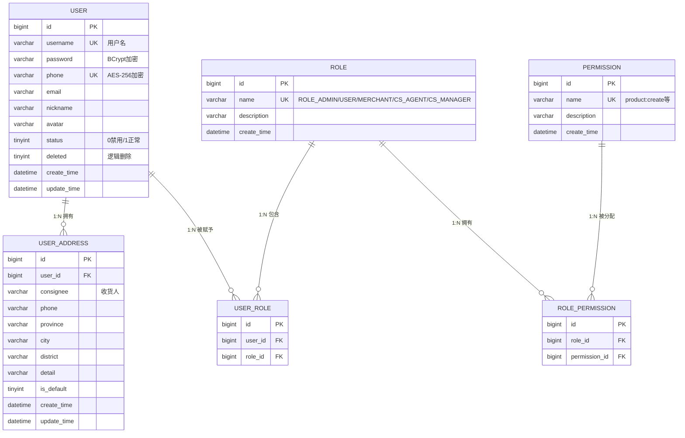

---

#### 3.1.1 user（用户表）

| # | 字段名 | 数据类型 | 长度 | 允许空 | 默认值 | 键 | 说明 |
|:--:|:-------|:--------|:---:|:-----:|:-----:|:--:|:-----|
| 1 | id | BIGINT | — | ❌ | — | 🔑 PK | 用户 ID（雪花算法） |
| 2 | username | VARCHAR | 50 | ❌ | — | 🔷 UQ | 用户名 |
| 3 | password | VARCHAR | 255 | ❌ | — | — | 密码（BCrypt cost=12） |
| 4 | phone | VARCHAR | 20 | ✅ | NULL | 🔷 UQ | 手机号（AES-256 加密存储） |
| 5 | email | VARCHAR | 100 | ✅ | NULL | — | 邮箱 |
| 6 | nickname | VARCHAR | 50 | ✅ | NULL | — | 昵称 |
| 7 | avatar | VARCHAR | 500 | ✅ | NULL | — | 头像 URL |
| 8 | status | TINYINT | — | ✅ | 1 | 🟩 IDX | 状态：1=正常 / 0=禁用 |
| 9 | deleted | TINYINT | — | ✅ | 0 | — | 逻辑删除标记 |
| 10 | create_time | DATETIME | — | ❌ | — | 🟩 IDX | 创建时间 |
| 11 | update_time | DATETIME | — | ❌ | — | — | 更新时间 |

**DDL**：

```sql
CREATE TABLE ecommerce_user.`user` (
    `id`          BIGINT       NOT NULL,
    `username`    VARCHAR(50)  NOT NULL,
    `password`    VARCHAR(255) NOT NULL,
    `phone`       VARCHAR(20)  DEFAULT NULL,
    `email`       VARCHAR(100) DEFAULT NULL,
    `nickname`    VARCHAR(50)  DEFAULT NULL,
    `avatar`      VARCHAR(500) DEFAULT NULL,
    `status`      TINYINT      DEFAULT 1,
    `deleted`     TINYINT      DEFAULT 0,
    `create_time` DATETIME     NOT NULL,
    `update_time` DATETIME     NOT NULL,
    PRIMARY KEY (`id`),
    UNIQUE KEY `uk_username` (`username`),
    UNIQUE KEY `uk_phone` (`phone`),
    KEY `idx_status` (`status`),
    KEY `idx_create_time` (`create_time`)
) ENGINE=InnoDB DEFAULT CHARSET=utf8mb4 COLLATE=utf8mb4_unicode_ci COMMENT='用户表';
```

---

#### 3.1.2 role（角色表）

| # | 字段名 | 数据类型 | 长度 | 允许空 | 默认值 | 键 | 说明 |
|:--:|:-------|:--------|:---:|:-----:|:-----:|:--:|:-----|
| 1 | id | BIGINT | — | ❌ | — | 🔑 PK | 角色 ID |
| 2 | name | VARCHAR | 50 | ❌ | — | 🔷 UQ | 角色名（ROLE_ADMIN / ROLE_USER / ROLE_MERCHANT / ROLE_CS_AGENT / ROLE_CS_MANAGER） |
| 3 | description | VARCHAR | 200 | ✅ | NULL | — | 角色描述 |
| 4 | create_time | DATETIME | — | ❌ | — | — | 创建时间 |

**DDL**：

```sql
CREATE TABLE ecommerce_user.`role` (
    `id`          BIGINT       NOT NULL,
    `name`        VARCHAR(50)  NOT NULL,
    `description` VARCHAR(200) DEFAULT NULL,
    `create_time` DATETIME     NOT NULL,
    PRIMARY KEY (`id`),
    UNIQUE KEY `uk_name` (`name`)
) ENGINE=InnoDB DEFAULT CHARSET=utf8mb4 COLLATE=utf8mb4_unicode_ci COMMENT='角色表';
```

**预置角色**：

| id | name | description |
|:--:|:-----|:-----------|
| 1 | ROLE_ADMIN | 系统管理员——全权限 |
| 2 | ROLE_USER | 普通用户——C 端买家 |
| 3 | ROLE_MERCHANT | 入驻商家——B 端商家 |
| 4 | ROLE_CS_AGENT | 客服人员——工单处理 |
| 5 | ROLE_CS_MANAGER | 客服主管——工单分配与管理 |

---

#### 3.1.3 user_role（用户角色关联表）

| # | 字段名 | 数据类型 | 长度 | 允许空 | 默认值 | 键 | 说明 |
|:--:|:-------|:--------|:---:|:-----:|:-----:|:--:|:-----|
| 1 | id | BIGINT | — | ❌ | — | 🔑 PK | 关联 ID |
| 2 | user_id | BIGINT | — | ❌ | — | 🔷 UQ₁ | 用户 ID |
| 3 | role_id | BIGINT | — | ❌ | — | 🔷 UQ₁, 🟩 IDX | 角色 ID |

**DDL**：

```sql
CREATE TABLE ecommerce_user.`user_role` (
    `id`      BIGINT NOT NULL,
    `user_id` BIGINT NOT NULL,
    `role_id` BIGINT NOT NULL,
    PRIMARY KEY (`id`),
    UNIQUE KEY `uk_user_role` (`user_id`, `role_id`),
    KEY `idx_role_id` (`role_id`)
) ENGINE=InnoDB DEFAULT CHARSET=utf8mb4 COLLATE=utf8mb4_unicode_ci COMMENT='用户角色关联表';
```

> **约束说明**：一个用户可拥有多个角色（如既是普通用户又是商家），唯一联合索引防重。

---

#### 3.1.4 permission（权限表）

| # | 字段名 | 数据类型 | 长度 | 允许空 | 默认值 | 键 | 说明 |
|:--:|:-------|:--------|:---:|:-----:|:-----:|:--:|:-----|
| 1 | id | BIGINT | — | ❌ | — | 🔑 PK | 权限 ID |
| 2 | name | VARCHAR | 100 | ❌ | — | 🔷 UQ | 权限标识（如 `product:create`） |
| 3 | description | VARCHAR | 200 | ✅ | NULL | — | 权限描述 |
| 4 | create_time | DATETIME | — | ❌ | — | — | 创建时间 |

**DDL**：

```sql
CREATE TABLE ecommerce_user.`permission` (
    `id`          BIGINT       NOT NULL,
    `name`        VARCHAR(100) NOT NULL,
    `description` VARCHAR(200) DEFAULT NULL,
    `create_time` DATETIME     NOT NULL,
    PRIMARY KEY (`id`),
    UNIQUE KEY `uk_name` (`name`)
) ENGINE=InnoDB DEFAULT CHARSET=utf8mb4 COLLATE=utf8mb4_unicode_ci COMMENT='权限表';
```

---

#### 3.1.5 role_permission（角色权限关联表）

| # | 字段名 | 数据类型 | 长度 | 允许空 | 默认值 | 键 | 说明 |
|:--:|:-------|:--------|:---:|:-----:|:-----:|:--:|:-----|
| 1 | id | BIGINT | — | ❌ | — | 🔑 PK | 关联 ID |
| 2 | role_id | BIGINT | — | ❌ | — | 🔷 UQ₁ | 角色 ID |
| 3 | permission_id | BIGINT | — | ❌ | — | 🔷 UQ₁, 🟩 IDX | 权限 ID |

**DDL**：

```sql
CREATE TABLE ecommerce_user.`role_permission` (
    `id`            BIGINT NOT NULL,
    `role_id`       BIGINT NOT NULL,
    `permission_id` BIGINT NOT NULL,
    PRIMARY KEY (`id`),
    UNIQUE KEY `uk_role_perm` (`role_id`, `permission_id`),
    KEY `idx_perm_id` (`permission_id`)
) ENGINE=InnoDB DEFAULT CHARSET=utf8mb4 COLLATE=utf8mb4_unicode_ci COMMENT='角色权限关联表';
```

---

#### 3.1.6 user_address（用户收货地址表）

| # | 字段名 | 数据类型 | 长度 | 允许空 | 默认值 | 键 | 说明 |
|:--:|:-------|:--------|:---:|:-----:|:-----:|:--:|:-----|
| 1 | id | BIGINT | — | ❌ | — | 🔑 PK | 地址 ID |
| 2 | user_id | BIGINT | — | ❌ | — | 🟩 IDX₁, 🟩 IDX₂ | 用户 ID |
| 3 | consignee | VARCHAR | 50 | ❌ | — | — | 收货人姓名 |
| 4 | phone | VARCHAR | 20 | ❌ | — | — | 收货人手机号 |
| 5 | province | VARCHAR | 50 | ❌ | — | — | 省份 |
| 6 | city | VARCHAR | 50 | ❌ | — | — | 城市 |
| 7 | district | VARCHAR | 50 | ❌ | — | — | 区/县 |
| 8 | detail | VARCHAR | 200 | ❌ | — | — | 详细地址 |
| 9 | is_default | TINYINT | — | ✅ | 0 | 🟩 IDX₂ | 是否默认地址 |
| 10 | create_time | DATETIME | — | ❌ | — | — | 创建时间 |
| 11 | update_time | DATETIME | — | ❌ | — | — | 更新时间 |

**DDL**：

```sql
CREATE TABLE ecommerce_user.`user_address` (
    `id`          BIGINT       NOT NULL,
    `user_id`     BIGINT       NOT NULL,
    `consignee`   VARCHAR(50)  NOT NULL,
    `phone`       VARCHAR(20)  NOT NULL,
    `province`    VARCHAR(50)  NOT NULL,
    `city`        VARCHAR(50)  NOT NULL,
    `district`    VARCHAR(50)  NOT NULL,
    `detail`      VARCHAR(200) NOT NULL,
    `is_default`  TINYINT      DEFAULT 0,
    `create_time` DATETIME     NOT NULL,
    `update_time` DATETIME     NOT NULL,
    PRIMARY KEY (`id`),
    KEY `idx_user_id` (`user_id`),
    KEY `idx_user_default` (`user_id`, `is_default`)
) ENGINE=InnoDB DEFAULT CHARSET=utf8mb4 COLLATE=utf8mb4_unicode_ci COMMENT='用户收货地址表';
```

> **约束说明**：每个用户最多 20 个收货地址，由应用层校验。设置新默认地址时，应用层先将旧默认地址 is_default 置 0，再设新地址为 1。

---

### 3.2 product-service/cart-service — ecommerce_product

商品体系 Schema，6 张表（含购物车灾备、评价、到货通知）。核心特征：SPU/SKU 二级模型，库存以 Redis 为准 MySQL 灾备，评价图片 JSON 存储。

**领域 ER 图**：

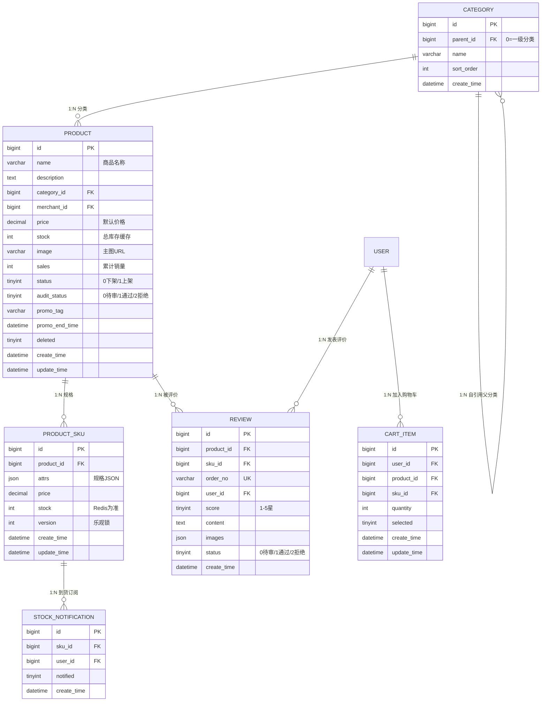

---

#### 3.2.1 category（商品分类表）

| # | 字段名 | 数据类型 | 长度 | 允许空 | 默认值 | 键 | 说明 |
|:--:|:-------|:--------|:---:|:-----:|:-----:|:--:|:-----|
| 1 | id | BIGINT | — | ❌ | — | 🔑 PK | 分类 ID |
| 2 | parent_id | BIGINT | — | ✅ | 0 | 🟩 IDX | 父分类 ID（0=一级分类） |
| 3 | name | VARCHAR | 50 | ❌ | — | — | 分类名称 |
| 4 | sort_order | INT | — | ✅ | 0 | 🟩 IDX | 排序权重（数值越小越靠前） |
| 5 | create_time | DATETIME | — | ❌ | — | — | 创建时间 |

**DDL**：

```sql
CREATE TABLE ecommerce_product.`category` (
    `id`          BIGINT      NOT NULL,
    `parent_id`   BIGINT      DEFAULT 0,
    `name`        VARCHAR(50) NOT NULL,
    `sort_order`  INT         DEFAULT 0,
    `create_time` DATETIME    NOT NULL,
    PRIMARY KEY (`id`),
    KEY `idx_parent_id` (`parent_id`),
    KEY `idx_sort_order` (`sort_order`)
) ENGINE=InnoDB DEFAULT CHARSET=utf8mb4 COLLATE=utf8mb4_unicode_ci COMMENT='商品分类表';
```

---

#### 3.2.2 product（商品 SPU 表）

| # | 字段名 | 数据类型 | 长度 | 允许空 | 默认值 | 键 | 说明 |
|:--:|:-------|:--------|:---:|:-----:|:-----:|:--:|:-----|
| 1 | id | BIGINT | — | ❌ | — | 🔑 PK | 商品 ID（SPU） |
| 2 | name | VARCHAR | 200 | ❌ | — | 🟩 IDX | 商品名称 |
| 3 | description | TEXT | — | ✅ | NULL | — | 商品描述 |
| 4 | category_id | BIGINT | — | ❌ | — | 🟩 IDX₁, 🟩 IDX₂ | 所属分类 ID |
| 5 | merchant_id | BIGINT | — | ❌ | — | — | 所属商家 ID |
| 6 | price | DECIMAL | 10,2 | ✅ | 0.00 | — | 默认价格（最低 SKU 价格） |
| 7 | stock | INT | — | ✅ | 0 | — | 总库存（所有 SKU 库存之和，缓存字段） |
| 8 | image | VARCHAR | 500 | ✅ | NULL | — | 主图 URL |
| 9 | sales | INT | — | ✅ | 0 | 🟩 IDX | 累计销量（搜索排序加权） |
| 10 | status | TINYINT | — | ✅ | 1 | 🟩 IDX₁, 🟩 IDX₂ | 状态（见数据字典） |
| 11 | audit_status | TINYINT | — | ✅ | 0 | — | 审核状态（0=待审 / 1=通过 / 2=拒绝） |
| 12 | promo_tag | VARCHAR | 50 | ✅ | NULL | — | 营销标签（NEW_USER_ONLY / FLASH_SALE / NONE） |
| 13 | promo_end_time | DATETIME | ✅ | NULL | — | — | 营销活动结束时间（搜索排序加权） |
| 14 | deleted | TINYINT | — | ✅ | 0 | — | 逻辑删除标记 |
| 15 | create_time | DATETIME | — | ❌ | — | 🟩 IDX | 创建时间 |
| 16 | update_time | DATETIME | — | ❌ | — | — | 更新时间 |

**DDL**：

```sql
CREATE TABLE ecommerce_product.`product` (
    `id`             BIGINT        NOT NULL,
    `name`           VARCHAR(200)  NOT NULL,
    `description`    TEXT          DEFAULT NULL,
    `category_id`    BIGINT        NOT NULL,
    `merchant_id`    BIGINT        NOT NULL,
    `price`          DECIMAL(10,2) DEFAULT 0.00,
    `stock`          INT           DEFAULT 0,
    `image`          VARCHAR(500)  DEFAULT NULL,
    `sales`          INT           DEFAULT 0,
    `status`         TINYINT       DEFAULT 1,
    `audit_status`   TINYINT       DEFAULT 0,
    `promo_tag`      VARCHAR(50)   DEFAULT NULL,
    `promo_end_time` DATETIME      DEFAULT NULL,
    `deleted`        TINYINT       DEFAULT 0,
    `create_time`    DATETIME      NOT NULL,
    `update_time`    DATETIME      NOT NULL,
    PRIMARY KEY (`id`),
    KEY `idx_category_status` (`category_id`, `status`),
    KEY `idx_name` (`name`(50)),
    KEY `idx_sales` (`sales`),
    KEY `idx_create_time` (`create_time`),
    KEY `idx_category_status_sales` (`category_id`, `status`, `sales`)
) ENGINE=InnoDB DEFAULT CHARSET=utf8mb4 COLLATE=utf8mb4_unicode_ci COMMENT='商品表（SPU）';
```

---

#### 3.2.3 product_sku（商品 SKU 表）

| # | 字段名 | 数据类型 | 长度 | 允许空 | 默认值 | 键 | 说明 |
|:--:|:-------|:--------|:---:|:-----:|:-----:|:--:|:-----|
| 1 | id | BIGINT | — | ❌ | — | 🔑 PK | SKU ID |
| 2 | product_id | BIGINT | — | ❌ | — | 🟩 IDX₁, 🟩 IDX₂ | 所属 SPU ID |
| 3 | attrs | JSON | — | ✅ | NULL | — | 规格属性（如 `{"颜色":"黑色","尺码":"XL"}`） |
| 4 | price | DECIMAL | 10,2 | ❌ | — | — | SKU 价格 |
| 5 | stock | INT | — | ❌ | — | 🟩 IDX₂ | SKU 库存（Redis 为准，MySQL 为灾备+回源） |
| 6 | version | INT | — | ✅ | 1 | — | 乐观锁版本号（库存更新时 CAS） |
| 7 | create_time | DATETIME | — | ❌ | — | — | 创建时间 |
| 8 | update_time | DATETIME | — | ❌ | — | — | 更新时间 |

**DDL**：

```sql
CREATE TABLE ecommerce_product.`product_sku` (
    `id`          BIGINT        NOT NULL,
    `product_id`  BIGINT        NOT NULL,
    `attrs`       JSON          DEFAULT NULL,
    `price`       DECIMAL(10,2) NOT NULL,
    `stock`       INT           NOT NULL,
    `version`     INT           DEFAULT 1,
    `create_time` DATETIME      NOT NULL,
    `update_time` DATETIME      NOT NULL,
    PRIMARY KEY (`id`),
    KEY `idx_product_id` (`product_id`),
    KEY `idx_product_stock` (`product_id`, `stock`)
) ENGINE=InnoDB DEFAULT CHARSET=utf8mb4 COLLATE=utf8mb4_unicode_ci COMMENT='商品SKU表';
```

> **特别说明**：库存以 Redis 为准（Lua 原子操作），MySQL 为灾备数据源。Redis 宕机时从 MySQL 恢复。version 字段在库存更新时用于乐观锁 CAS 校验。

---

#### 3.2.4 cart_item（购物车表 —— Redis 为主，MySQL 为容灾备份）

| # | 字段名 | 数据类型 | 长度 | 允许空 | 默认值 | 键 | 说明 |
|:--:|:-------|:--------|:---:|:-----:|:-----:|:--:|:-----|
| 1 | id | BIGINT | — | ❌ | — | 🔑 PK | 购物车记录 ID |
| 2 | user_id | BIGINT | — | ❌ | — | 🔷 UQ₁ | 用户 ID |
| 3 | product_id | BIGINT | — | ❌ | — | 🔷 UQ₁ | 商品 ID |
| 4 | sku_id | BIGINT | — | ❌ | — | 🔷 UQ₁ | SKU ID |
| 5 | quantity | INT | — | ✅ | 1 | — | 数量 |
| 6 | selected | TINYINT | — | ✅ | 1 | — | 是否选中（1=选中 / 0=未选中） |
| 7 | create_time | DATETIME | — | ❌ | — | — | 创建时间 |
| 8 | update_time | DATETIME | — | ❌ | — | — | 更新时间 |

**DDL**：

```sql
CREATE TABLE ecommerce_product.`cart_item` (
    `id`          BIGINT   NOT NULL,
    `user_id`     BIGINT   NOT NULL,
    `product_id`  BIGINT   NOT NULL,
    `sku_id`      BIGINT   NOT NULL,
    `quantity`    INT      DEFAULT 1,
    `selected`    TINYINT  DEFAULT 1,
    `create_time` DATETIME NOT NULL,
    `update_time` DATETIME NOT NULL,
    PRIMARY KEY (`id`),
    UNIQUE KEY `uk_user_sku` (`user_id`, `product_id`, `sku_id`)
) ENGINE=InnoDB DEFAULT CHARSET=utf8mb4 COLLATE=utf8mb4_unicode_ci COMMENT='购物车表（Redis为主，MySQL为容灾备份）';
```

---

#### 3.2.5 review（商品评价表）

| # | 字段名 | 数据类型 | 长度 | 允许空 | 默认值 | 键 | 说明 |
|:--:|:-------|:--------|:---:|:-----:|:-----:|:--:|:-----|
| 1 | id | BIGINT | — | ❌ | — | 🔑 PK | 评价 ID |
| 2 | product_id | BIGINT | — | ❌ | — | 🟩 IDX₁, 🟩 IDX₂ | 商品 ID |
| 3 | sku_id | BIGINT | — | ❌ | — | 🟩 IDX | SKU ID |
| 4 | order_no | VARCHAR | 32 | ❌ | — | 🔷 UQ₁ | 订单号 |
| 5 | user_id | BIGINT | — | ❌ | — | 🟩 IDX | 用户 ID |
| 6 | score | TINYINT | — | ❌ | — | — | 评分（1-5 星） |
| 7 | content | TEXT | — | ✅ | NULL | — | 评价内容 |
| 8 | images | JSON | — | ✅ | NULL | — | 评价图片 URL 列表 |
| 9 | status | TINYINT | — | ✅ | 0 | 🟩 IDX₂ | 审核状态（0=待审 / 1=通过 / 2=拒绝） |
| 10 | create_time | DATETIME | — | ❌ | — | 🟩 IDX₂ | 创建时间 |

**DDL**：

```sql
CREATE TABLE ecommerce_product.`review` (
    `id`          BIGINT       NOT NULL,
    `product_id`  BIGINT       NOT NULL,
    `sku_id`      BIGINT       NOT NULL,
    `order_no`    VARCHAR(32)  NOT NULL,
    `user_id`     BIGINT       NOT NULL,
    `score`       TINYINT      NOT NULL,
    `content`     TEXT         DEFAULT NULL,
    `images`      JSON         DEFAULT NULL,
    `status`      TINYINT      DEFAULT 0,
    `create_time` DATETIME     NOT NULL,
    PRIMARY KEY (`id`),
    UNIQUE KEY `uk_order_sku` (`order_no`, `sku_id`),
    KEY `idx_product_id` (`product_id`),
    KEY `idx_sku_id` (`sku_id`),
    KEY `idx_user_id` (`user_id`),
    KEY `idx_product_status_time` (`product_id`, `status`, `create_time`)
) ENGINE=InnoDB DEFAULT CHARSET=utf8mb4 COLLATE=utf8mb4_unicode_ci COMMENT='商品评价表';
```

> **约束说明**：同一订单的同一 SKU 只能评价一次（uk_order_sku 保证）。

---

#### 3.2.6 stock_notification（到货通知订阅表）

| # | 字段名 | 数据类型 | 长度 | 允许空 | 默认值 | 键 | 说明 |
|:--:|:-------|:--------|:---:|:-----:|:-----:|:--:|:-----|
| 1 | id | BIGINT | — | ❌ | — | 🔑 PK | 记录 ID |
| 2 | sku_id | BIGINT | — | ❌ | — | 🔷 UQ₁, 🟩 IDX₁ | SKU ID |
| 3 | user_id | BIGINT | — | ❌ | — | 🔷 UQ₁ | 用户 ID |
| 4 | notified | TINYINT | — | ✅ | 0 | 🟩 IDX₁ | 是否已通知 |
| 5 | create_time | DATETIME | — | ❌ | — | — | 创建时间 |

**DDL**：

```sql
CREATE TABLE ecommerce_product.`stock_notification` (
    `id`          BIGINT   NOT NULL,
    `sku_id`      BIGINT   NOT NULL,
    `user_id`     BIGINT   NOT NULL,
    `notified`    TINYINT  DEFAULT 0,
    `create_time` DATETIME NOT NULL,
    PRIMARY KEY (`id`),
    UNIQUE KEY `uk_sku_user` (`sku_id`, `user_id`),
    KEY `idx_sku_notified` (`sku_id`, `notified`)
) ENGINE=InnoDB DEFAULT CHARSET=utf8mb4 COLLATE=utf8mb4_unicode_ci COMMENT='到货通知订阅表';
```

---

### 3.3 order-service — ecommerce_order

订单体系 Schema，4 张表。核心特征：Saga 编排事务、下单信息快照、多商家拆分、本地消息表可靠投递。

**领域 ER 图**：

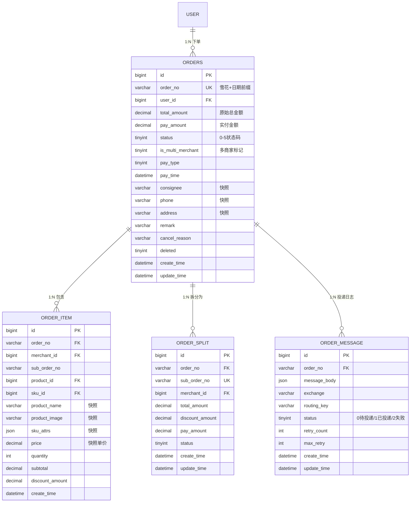

---

#### 3.3.1 orders（订单主表）

| # | 字段名 | 数据类型 | 长度 | 允许空 | 默认值 | 键 | 说明 |
|:--:|:-------|:--------|:---:|:-----:|:-----:|:--:|:-----|
| 1 | id | BIGINT | — | ❌ | — | 🔑 PK | 订单 ID |
| 2 | order_no | VARCHAR | 32 | ❌ | — | 🔷 UQ | 订单号（雪花算法 + 日期前缀） |
| 3 | user_id | BIGINT | — | ❌ | — | 🟩 IDX₁ | 用户 ID |
| 4 | total_amount | DECIMAL | 10,2 | ❌ | — | — | 订单原始总金额 |
| 5 | pay_amount | DECIMAL | 10,2 | ❌ | — | — | 实付金额（优惠后） |
| 6 | status | TINYINT | — | ✅ | 0 | 🟩 IDX₁, 🟩 IDX₂ | 订单状态（见数据字典） |
| 7 | is_multi_merchant | TINYINT | — | ✅ | 0 | — | 是否多商家订单（0=否 / 1=是） |
| 8 | pay_type | TINYINT | — | ✅ | NULL | — | 支付方式（1=支付宝 / 2=微信） |
| 9 | pay_time | DATETIME | — | ✅ | NULL | — | 支付时间 |
| 10 | consignee | VARCHAR | 50 | ✅ | NULL | — | 收货人（下单快照） |
| 11 | phone | VARCHAR | 20 | ✅ | NULL | — | 收货手机号（下单快照） |
| 12 | address | VARCHAR | 500 | ✅ | NULL | — | 收货地址（下单快照） |
| 13 | remark | VARCHAR | 500 | ✅ | NULL | — | 用户备注 |
| 14 | cancel_reason | VARCHAR | 200 | ✅ | NULL | — | 取消原因 |
| 15 | deleted | TINYINT | — | ✅ | 0 | — | 逻辑删除标记 |
| 16 | create_time | DATETIME | — | ❌ | — | 🟩 IDX₁, 🟩 IDX₂ | 创建时间 |
| 17 | update_time | DATETIME | — | ❌ | — | — | 更新时间 |

**DDL**：

```sql
CREATE TABLE ecommerce_order.`orders` (
    `id`                BIGINT        NOT NULL,
    `order_no`          VARCHAR(32)   NOT NULL,
    `user_id`           BIGINT        NOT NULL,
    `total_amount`      DECIMAL(10,2) NOT NULL,
    `pay_amount`        DECIMAL(10,2) NOT NULL,
    `status`            TINYINT       DEFAULT 0,
    `is_multi_merchant` TINYINT       DEFAULT 0,
    `pay_type`          TINYINT       DEFAULT NULL,
    `pay_time`          DATETIME      DEFAULT NULL,
    `consignee`         VARCHAR(50)   DEFAULT NULL,
    `phone`             VARCHAR(20)   DEFAULT NULL,
    `address`           VARCHAR(500)  DEFAULT NULL,
    `remark`            VARCHAR(500)  DEFAULT NULL,
    `cancel_reason`     VARCHAR(200)  DEFAULT NULL,
    `deleted`           TINYINT       DEFAULT 0,
    `create_time`       DATETIME      NOT NULL,
    `update_time`       DATETIME      NOT NULL,
    PRIMARY KEY (`id`),
    UNIQUE KEY `uk_order_no` (`order_no`),
    KEY `idx_user_id` (`user_id`),
    KEY `idx_status` (`status`),
    KEY `idx_user_status_create` (`user_id`, `status`, `create_time`),
    KEY `idx_status_create` (`status`, `create_time`)
) ENGINE=InnoDB DEFAULT CHARSET=utf8mb4 COLLATE=utf8mb4_unicode_ci COMMENT='订单表';
```

---

#### 3.3.2 order_item（订单明细表）

| # | 字段名 | 数据类型 | 长度 | 允许空 | 默认值 | 键 | 说明 |
|:--:|:-------|:--------|:---:|:-----:|:-----:|:--:|:-----|
| 1 | id | BIGINT | — | ❌ | — | 🔑 PK | 明细 ID |
| 2 | order_no | VARCHAR | 32 | ❌ | — | 🟩 IDX | 订单号 |
| 3 | merchant_id | BIGINT | — | ❌ | — | — | 该商品所属商家 ID |
| 4 | sub_order_no | VARCHAR | 32 | ✅ | NULL | — | 拆分后子订单号 |
| 5 | product_id | BIGINT | — | ❌ | — | 🟩 IDX | 商品 ID |
| 6 | sku_id | BIGINT | — | ❌ | — | — | SKU ID |
| 7 | product_name | VARCHAR | 200 | ❌ | — | — | 商品名称（下单快照） |
| 8 | product_image | VARCHAR | 500 | ✅ | NULL | — | 商品图片（下单快照） |
| 9 | sku_attrs | JSON | — | ✅ | NULL | — | SKU 规格（下单快照） |
| 10 | price | DECIMAL | 10,2 | ❌ | — | — | 单价（下单快照） |
| 11 | quantity | INT | — | ❌ | — | — | 数量 |
| 12 | subtotal | DECIMAL | 10,2 | ❌ | — | — | 小计（= price × quantity） |
| 13 | discount_amount | DECIMAL | 10,2 | ✅ | 0.00 | — | 该明细优惠金额 |
| 14 | create_time | DATETIME | — | ❌ | — | — | 创建时间 |

**DDL**：

```sql
CREATE TABLE ecommerce_order.`order_item` (
    `id`              BIGINT        NOT NULL,
    `order_no`        VARCHAR(32)   NOT NULL,
    `merchant_id`     BIGINT        NOT NULL,
    `sub_order_no`    VARCHAR(32)   DEFAULT NULL,
    `product_id`      BIGINT        NOT NULL,
    `sku_id`          BIGINT        NOT NULL,
    `product_name`    VARCHAR(200)  NOT NULL,
    `product_image`   VARCHAR(500)  DEFAULT NULL,
    `sku_attrs`       JSON          DEFAULT NULL,
    `price`           DECIMAL(10,2) NOT NULL,
    `quantity`        INT           NOT NULL,
    `subtotal`        DECIMAL(10,2) NOT NULL,
    `discount_amount` DECIMAL(10,2) DEFAULT 0.00,
    `create_time`     DATETIME      NOT NULL,
    PRIMARY KEY (`id`),
    KEY `idx_order_no` (`order_no`),
    KEY `idx_product_id` (`product_id`),
    KEY `idx_sub_order_no` (`sub_order_no`)
) ENGINE=InnoDB DEFAULT CHARSET=utf8mb4 COLLATE=utf8mb4_unicode_ci COMMENT='订单明细表';
```

---

#### 3.3.3 order_split（订单商家拆分表）

| # | 字段名 | 数据类型 | 长度 | 允许空 | 默认值 | 键 | 说明 |
|:--:|:-------|:--------|:---:|:-----:|:-----:|:--:|:-----|
| 1 | id | BIGINT | — | ❌ | — | 🔑 PK | 拆分记录 ID |
| 2 | order_no | VARCHAR | 32 | ❌ | — | 🟩 IDX | 原订单号 |
| 3 | sub_order_no | VARCHAR | 32 | ❌ | — | 🔷 UQ | 子订单号 |
| 4 | merchant_id | BIGINT | — | ❌ | — | 🟩 IDX | 商家 ID |
| 5 | total_amount | DECIMAL | 10,2 | ❌ | — | — | 子订单原始金额 |
| 6 | discount_amount | DECIMAL | 10,2 | ✅ | 0.00 | — | 子订单优惠金额 |
| 7 | pay_amount | DECIMAL | 10,2 | ❌ | — | — | 子订单实付金额 |
| 8 | status | TINYINT | — | ✅ | 0 | — | 子订单状态（同步主订单） |
| 9 | create_time | DATETIME | — | ❌ | — | — | 创建时间 |
| 10 | update_time | DATETIME | — | ❌ | — | — | 更新时间 |

**DDL**：

```sql
CREATE TABLE ecommerce_order.`order_split` (
    `id`              BIGINT        NOT NULL,
    `order_no`        VARCHAR(32)   NOT NULL,
    `sub_order_no`    VARCHAR(32)   NOT NULL,
    `merchant_id`     BIGINT        NOT NULL,
    `total_amount`    DECIMAL(10,2) NOT NULL,
    `discount_amount` DECIMAL(10,2) DEFAULT 0.00,
    `pay_amount`      DECIMAL(10,2) NOT NULL,
    `status`          TINYINT       DEFAULT 0,
    `create_time`     DATETIME      NOT NULL,
    `update_time`     DATETIME      NOT NULL,
    PRIMARY KEY (`id`),
    UNIQUE KEY `uk_sub_order_no` (`sub_order_no`),
    KEY `idx_order_no` (`order_no`),
    KEY `idx_merchant_id` (`merchant_id`)
) ENGINE=InnoDB DEFAULT CHARSET=utf8mb4 COLLATE=utf8mb4_unicode_ci COMMENT='订单商家拆分表（多商家订单拆为独立子订单）';
```

---

#### 3.3.4 order_message（本地消息表）

| # | 字段名 | 数据类型 | 长度 | 允许空 | 默认值 | 键 | 说明 |
|:--:|:-------|:--------|:---:|:-----:|:-----:|:--:|:-----|
| 1 | id | BIGINT | — | ❌ | — | 🔑 PK | 消息 ID |
| 2 | order_no | VARCHAR | 32 | ❌ | — | 🟩 IDX | 关联订单号 |
| 3 | message_body | JSON | — | ❌ | — | — | 消息体 |
| 4 | exchange | VARCHAR | 100 | ✅ | NULL | — | RabbitMQ Exchange |
| 5 | routing_key | VARCHAR | 100 | ✅ | NULL | — | RabbitMQ Routing Key |
| 6 | status | TINYINT | — | ✅ | 0 | 🟩 IDX₁, 🟩 IDX₂ | 0=待投递 / 1=已投递 / 2=投递失败 |
| 7 | retry_count | INT | — | ✅ | 0 | — | 重试次数 |
| 8 | max_retry | INT | — | ✅ | 3 | — | 最大重试次数 |
| 9 | create_time | DATETIME | — | ❌ | — | — | 创建时间 |
| 10 | update_time | DATETIME | — | ❌ | — | 🟩 IDX₂ | 更新时间 |

**DDL**：

```sql
CREATE TABLE ecommerce_order.`order_message` (
    `id`           BIGINT       NOT NULL,
    `order_no`     VARCHAR(32)  NOT NULL,
    `message_body` JSON         NOT NULL,
    `exchange`     VARCHAR(100) DEFAULT NULL,
    `routing_key`  VARCHAR(100) DEFAULT NULL,
    `status`       TINYINT      DEFAULT 0,
    `retry_count`  INT          DEFAULT 0,
    `max_retry`    INT          DEFAULT 3,
    `create_time`  DATETIME     NOT NULL,
    `update_time`  DATETIME     NOT NULL,
    PRIMARY KEY (`id`),
    KEY `idx_status` (`status`),
    KEY `idx_order_no` (`order_no`),
    KEY `idx_status_update` (`status`, `update_time`)
) ENGINE=InnoDB DEFAULT CHARSET=utf8mb4 COLLATE=utf8mb4_unicode_ci COMMENT='本地消息表（可靠消息投递）';
```

---

### 3.4 payment-service — ecommerce_payment

支付流水表，1 张表。最高安全级别，独立 Schema + 独立密钥 + 全量审计。

**领域 ER 图**：

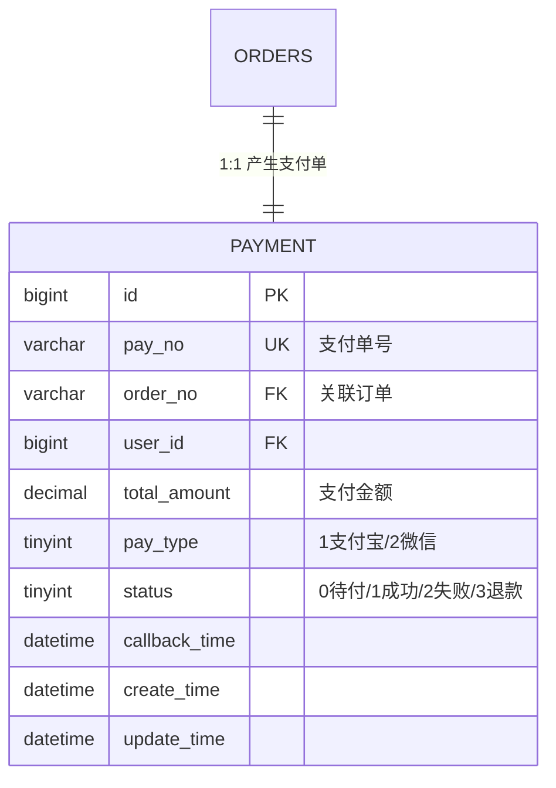

---

#### 3.4.1 payment（支付流水表）

| # | 字段名 | 数据类型 | 长度 | 允许空 | 默认值 | 键 | 说明 |
|:--:|:-------|:--------|:---:|:-----:|:-----:|:--:|:-----|
| 1 | id | BIGINT | — | ❌ | — | 🔑 PK | 支付记录 ID |
| 2 | pay_no | VARCHAR | 32 | ❌ | — | 🔷 UQ | 支付单号 |
| 3 | order_no | VARCHAR | 32 | ❌ | — | 🟩 IDX | 关联订单号 |
| 4 | user_id | BIGINT | — | ❌ | — | 🟩 IDX | 用户 ID |
| 5 | total_amount | DECIMAL | 10,2 | ❌ | — | — | 支付金额 |
| 6 | pay_type | TINYINT | — | ❌ | — | — | 支付方式 |
| 7 | status | TINYINT | — | ✅ | 0 | — | 支付状态（见数据字典） |
| 8 | callback_time | DATETIME | — | ✅ | NULL | — | 回调时间 |
| 9 | create_time | DATETIME | — | ❌ | — | — | 创建时间 |
| 10 | update_time | DATETIME | — | ❌ | — | — | 更新时间 |

**DDL**：

```sql
CREATE TABLE ecommerce_payment.`payment` (
    `id`            BIGINT        NOT NULL,
    `pay_no`        VARCHAR(32)   NOT NULL,
    `order_no`      VARCHAR(32)   NOT NULL,
    `user_id`       BIGINT        NOT NULL,
    `total_amount`  DECIMAL(10,2) NOT NULL,
    `pay_type`      TINYINT       NOT NULL,
    `status`        TINYINT       DEFAULT 0,
    `callback_time` DATETIME      DEFAULT NULL,
    `create_time`   DATETIME      NOT NULL,
    `update_time`   DATETIME      NOT NULL,
    PRIMARY KEY (`id`),
    UNIQUE KEY `uk_pay_no` (`pay_no`),
    KEY `idx_order_no` (`order_no`),
    KEY `idx_user_id` (`user_id`)
) ENGINE=InnoDB DEFAULT CHARSET=utf8mb4 COLLATE=utf8mb4_unicode_ci COMMENT='支付流水表';
```

---

### 3.5 merchant-service — ecommerce_merchant

商家入驻管理体系，5 张表。核心特征：审核工作流、资质文件管理、子账号体系。

**领域 ER 图**：

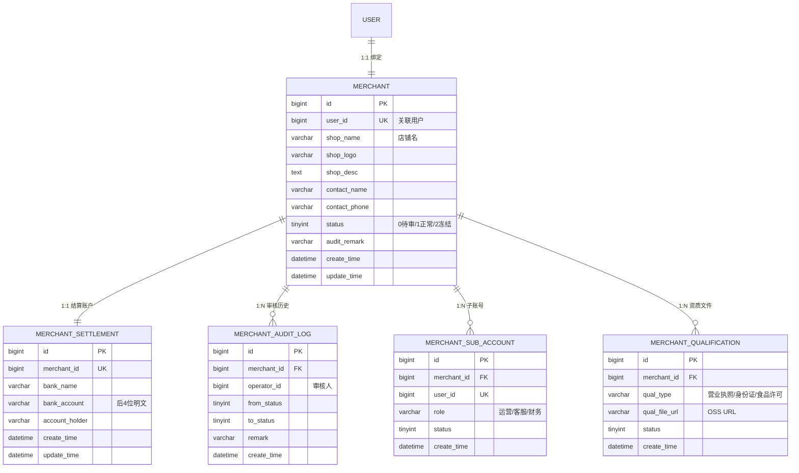

---

#### 3.5.1 merchant（商家/店铺主表）

| # | 字段名 | 数据类型 | 长度 | 允许空 | 默认值 | 键 | 说明 |
|:--:|:-------|:--------|:---:|:-----:|:-----:|:--:|:-----|
| 1 | id | BIGINT | — | ❌ | — | 🔑 PK | 商家 ID |
| 2 | user_id | BIGINT | — | ❌ | — | 🔷 UQ | 关联用户 ID |
| 3 | shop_name | VARCHAR | 100 | ❌ | — | — | 店铺名称 |
| 4 | shop_logo | VARCHAR | 500 | ✅ | NULL | — | 店铺 Logo URL |
| 5 | shop_desc | TEXT | — | ✅ | NULL | — | 店铺简介 |
| 6 | contact_name | VARCHAR | 50 | ❌ | — | — | 联系人 |
| 7 | contact_phone | VARCHAR | 20 | ❌ | — | — | 联系电话 |
| 8 | status | TINYINT | — | ✅ | 0 | 🟩 IDX | 0=待审核 / 1=正常 / 2=冻结 |
| 9 | audit_remark | VARCHAR | 500 | ✅ | NULL | — | 审核备注 |
| 10 | create_time | DATETIME | — | ❌ | — | — | 创建时间 |
| 11 | update_time | DATETIME | — | ❌ | — | — | 更新时间 |

**DDL**：

```sql
CREATE TABLE ecommerce_merchant.`merchant` (
    `id`            BIGINT       NOT NULL,
    `user_id`       BIGINT       NOT NULL,
    `shop_name`     VARCHAR(100) NOT NULL,
    `shop_logo`     VARCHAR(500) DEFAULT NULL,
    `shop_desc`     TEXT         DEFAULT NULL,
    `contact_name`  VARCHAR(50)  NOT NULL,
    `contact_phone` VARCHAR(20)  NOT NULL,
    `status`        TINYINT      DEFAULT 0,
    `audit_remark`  VARCHAR(500) DEFAULT NULL,
    `create_time`   DATETIME     NOT NULL,
    `update_time`   DATETIME     NOT NULL,
    PRIMARY KEY (`id`),
    UNIQUE KEY `uk_user_id` (`user_id`),
    KEY `idx_status` (`status`)
) ENGINE=InnoDB DEFAULT CHARSET=utf8mb4 COLLATE=utf8mb4_unicode_ci COMMENT='商家/店铺主表';
```

---

#### 3.5.2 merchant_settlement（商家结算账户表）

| # | 字段名 | 数据类型 | 长度 | 允许空 | 默认值 | 键 | 说明 |
|:--:|:-------|:--------|:---:|:-----:|:-----:|:--:|:-----|
| 1 | id | BIGINT | — | ❌ | — | 🔑 PK | 账户 ID |
| 2 | merchant_id | BIGINT | — | ❌ | — | 🔷 UQ | 商家 ID |
| 3 | bank_name | VARCHAR | 100 | ❌ | — | — | 开户银行 |
| 4 | bank_account | VARCHAR | 50 | ❌ | — | — | 银行账号（仅存后 4 位明文，其余加密） |
| 5 | account_holder | VARCHAR | 50 | ❌ | — | — | 开户人 |
| 6 | create_time | DATETIME | — | ❌ | — | — | 创建时间 |
| 7 | update_time | DATETIME | — | ❌ | — | — | 更新时间 |

**DDL**：

```sql
CREATE TABLE ecommerce_merchant.`merchant_settlement` (
    `id`             BIGINT       NOT NULL,
    `merchant_id`    BIGINT       NOT NULL,
    `bank_name`      VARCHAR(100) NOT NULL,
    `bank_account`   VARCHAR(50)  NOT NULL,
    `account_holder` VARCHAR(50)  NOT NULL,
    `create_time`    DATETIME     NOT NULL,
    `update_time`    DATETIME     NOT NULL,
    PRIMARY KEY (`id`),
    UNIQUE KEY `uk_merchant_id` (`merchant_id`)
) ENGINE=InnoDB DEFAULT CHARSET=utf8mb4 COLLATE=utf8mb4_unicode_ci COMMENT='商家结算账户表';
```

---

#### 3.5.3 merchant_audit_log（商家审核日志表）

| # | 字段名 | 数据类型 | 长度 | 允许空 | 默认值 | 键 | 说明 |
|:--:|:-------|:--------|:---:|:-----:|:-----:|:--:|:-----|
| 1 | id | BIGINT | — | ❌ | — | 🔑 PK | 日志 ID |
| 2 | merchant_id | BIGINT | — | ❌ | — | 🟩 IDX | 商家 ID |
| 3 | operator_id | BIGINT | — | ❌ | — | — | 审核人 ID |
| 4 | from_status | TINYINT | — | ❌ | — | — | 原状态 |
| 5 | to_status | TINYINT | — | ❌ | — | — | 新状态 |
| 6 | remark | VARCHAR | 500 | ✅ | NULL | — | 审核备注 |
| 7 | create_time | DATETIME | — | ❌ | — | — | 操作时间 |

**DDL**：

```sql
CREATE TABLE ecommerce_merchant.`merchant_audit_log` (
    `id`          BIGINT       NOT NULL,
    `merchant_id` BIGINT       NOT NULL,
    `operator_id` BIGINT       NOT NULL,
    `from_status` TINYINT      NOT NULL,
    `to_status`   TINYINT      NOT NULL,
    `remark`      VARCHAR(500) DEFAULT NULL,
    `create_time` DATETIME     NOT NULL,
    PRIMARY KEY (`id`),
    KEY `idx_merchant_id` (`merchant_id`)
) ENGINE=InnoDB DEFAULT CHARSET=utf8mb4 COLLATE=utf8mb4_unicode_ci COMMENT='商家审核日志表';
```

---

#### 3.5.4 merchant_sub_account（商家子账号表）

| # | 字段名 | 数据类型 | 长度 | 允许空 | 默认值 | 键 | 说明 |
|:--:|:-------|:--------|:---:|:-----:|:-----:|:--:|:-----|
| 1 | id | BIGINT | — | ❌ | — | 🔑 PK | 子账号 ID |
| 2 | merchant_id | BIGINT | — | ❌ | — | 🟩 IDX | 所属商家 ID |
| 3 | user_id | BIGINT | — | ❌ | — | 🔷 UQ | 关联用户 ID |
| 4 | role | VARCHAR | 30 | ❌ | — | — | 子账号角色（如运营/客服/财务） |
| 5 | status | TINYINT | — | ✅ | 1 | — | 状态 |
| 6 | create_time | DATETIME | — | ❌ | — | — | 创建时间 |

**DDL**：

```sql
CREATE TABLE ecommerce_merchant.`merchant_sub_account` (
    `id`          BIGINT      NOT NULL,
    `merchant_id` BIGINT      NOT NULL,
    `user_id`     BIGINT      NOT NULL,
    `role`        VARCHAR(30) NOT NULL,
    `status`      TINYINT     DEFAULT 1,
    `create_time` DATETIME    NOT NULL,
    PRIMARY KEY (`id`),
    UNIQUE KEY `uk_user_id` (`user_id`),
    KEY `idx_merchant_id` (`merchant_id`)
) ENGINE=InnoDB DEFAULT CHARSET=utf8mb4 COLLATE=utf8mb4_unicode_ci COMMENT='商家子账号表（P2阶段）';
```

---

#### 3.5.5 merchant_qualification（商家资质文件表）

| # | 字段名 | 数据类型 | 长度 | 允许空 | 默认值 | 键 | 说明 |
|:--:|:-------|:--------|:---:|:-----:|:-----:|:--:|:-----|
| 1 | id | BIGINT | — | ❌ | — | 🔑 PK | 资质 ID |
| 2 | merchant_id | BIGINT | — | ❌ | — | 🟩 IDX | 所属商家 ID |
| 3 | qual_type | VARCHAR | 30 | ❌ | — | — | 资质类型（BUSINESS_LICENSE/ID_CARD/FOOD_PERMIT） |
| 4 | qual_file_url | VARCHAR | 500 | ❌ | — | — | 资质文件 OSS URL |
| 5 | status | TINYINT | — | ✅ | 0 | — | 审核状态 |
| 6 | create_time | DATETIME | — | ❌ | — | — | 创建时间 |

**DDL**：

```sql
CREATE TABLE ecommerce_merchant.`merchant_qualification` (
    `id`            BIGINT       NOT NULL,
    `merchant_id`   BIGINT       NOT NULL,
    `qual_type`     VARCHAR(30)  NOT NULL,
    `qual_file_url` VARCHAR(500) NOT NULL,
    `status`        TINYINT      DEFAULT 0,
    `create_time`   DATETIME     NOT NULL,
    PRIMARY KEY (`id`),
    KEY `idx_merchant_id` (`merchant_id`)
) ENGINE=InnoDB DEFAULT CHARSET=utf8mb4 COLLATE=utf8mb4_unicode_ci COMMENT='商家资质文件表';
```

---

### 3.6 settlement-service — ecommerce_settlement

结算财务体系，3 张表。最高安全级别，批处理特征。核心：佣金规则匹配 → 账单生成 → 明细关联。

**领域 ER 图**：

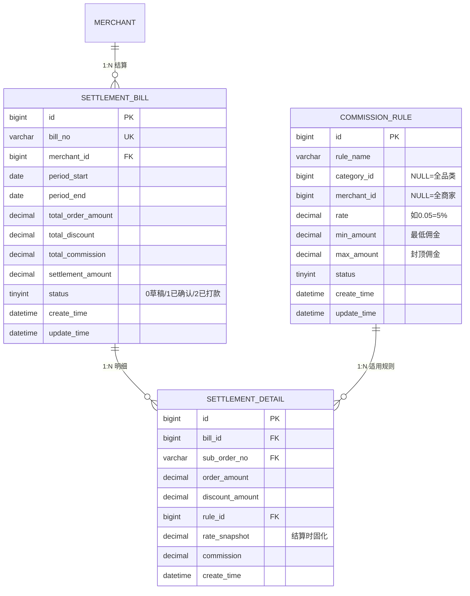

---

#### 3.6.1 commission_rule（平台抽佣规则表）

| # | 字段名 | 数据类型 | 长度 | 允许空 | 默认值 | 键 | 说明 |
|:--:|:-------|:--------|:---:|:-----:|:-----:|:--:|:-----|
| 1 | id | BIGINT | — | ❌ | — | 🔑 PK | 规则 ID |
| 2 | rule_name | VARCHAR | 100 | ❌ | — | — | 规则名称 |
| 3 | category_id | BIGINT | ✅ | NULL | — | 🟩 IDX | 适用分类（NULL=全品类） |
| 4 | merchant_id | BIGINT | ✅ | NULL | — | 🟩 IDX | 适用商家（NULL=全商家） |
| 5 | rate | DECIMAL | 5,4 | ❌ | — | — | 佣金率（如 0.0500 = 5%） |
| 6 | min_amount | DECIMAL | 10,2 | ✅ | 0.00 | — | 最低佣金金额 |
| 7 | max_amount | DECIMAL | 10,2 | ✅ | NULL | — | 佣金封顶金额（NULL=不封顶） |
| 8 | status | TINYINT | — | ✅ | 1 | — | 1=启用 / 0=停用 |
| 9 | create_time | DATETIME | — | ❌ | — | — | 创建时间 |
| 10 | update_time | DATETIME | — | ❌ | — | — | 更新时间 |

**DDL**：

```sql
CREATE TABLE ecommerce_settlement.`commission_rule` (
    `id`          BIGINT        NOT NULL,
    `rule_name`   VARCHAR(100)  NOT NULL,
    `category_id` BIGINT        DEFAULT NULL,
    `merchant_id` BIGINT        DEFAULT NULL,
    `rate`        DECIMAL(5,4)  NOT NULL,
    `min_amount`  DECIMAL(10,2) DEFAULT 0.00,
    `max_amount`  DECIMAL(10,2) DEFAULT NULL,
    `status`      TINYINT       DEFAULT 1,
    `create_time` DATETIME      NOT NULL,
    `update_time` DATETIME      NOT NULL,
    PRIMARY KEY (`id`),
    KEY `idx_category_id` (`category_id`),
    KEY `idx_merchant_id` (`merchant_id`)
) ENGINE=InnoDB DEFAULT CHARSET=utf8mb4 COLLATE=utf8mb4_unicode_ci COMMENT='平台抽佣规则表';
```

---

#### 3.6.2 settlement_bill（结算账单表）

| # | 字段名 | 数据类型 | 长度 | 允许空 | 默认值 | 键 | 说明 |
|:--:|:-------|:--------|:---:|:-----:|:-----:|:--:|:-----|
| 1 | id | BIGINT | — | ❌ | — | 🔑 PK | 账单 ID |
| 2 | bill_no | VARCHAR | 32 | ❌ | — | 🔷 UQ | 账单号 |
| 3 | merchant_id | BIGINT | — | ❌ | — | 🟩 IDX | 商家 ID |
| 4 | period_start | DATE | — | ❌ | — | — | 结算周期开始 |
| 5 | period_end | DATE | — | ❌ | — | — | 结算周期结束 |
| 6 | total_order_amount | DECIMAL | 12,2 | ❌ | — | — | 周期内订单总额 |
| 7 | total_discount | DECIMAL | 12,2 | ✅ | 0.00 | — | 周期内优惠总额 |
| 8 | total_commission | DECIMAL | 12,2 | ❌ | — | — | 应缴佣金总额 |
| 9 | settlement_amount | DECIMAL | 12,2 | ❌ | — | — | 实际结算金额 |
| 10 | status | TINYINT | — | ✅ | 0 | 🟩 IDX | 0=草稿 / 1=已确认 / 2=已打款 |
| 11 | create_time | DATETIME | — | ❌ | — | — | 创建时间 |
| 12 | update_time | DATETIME | — | ❌ | — | — | 更新时间 |

**DDL**：

```sql
CREATE TABLE ecommerce_settlement.`settlement_bill` (
    `id`                  BIGINT         NOT NULL,
    `bill_no`             VARCHAR(32)    NOT NULL,
    `merchant_id`         BIGINT         NOT NULL,
    `period_start`        DATE           NOT NULL,
    `period_end`          DATE           NOT NULL,
    `total_order_amount`  DECIMAL(12,2)  NOT NULL,
    `total_discount`      DECIMAL(12,2)  DEFAULT 0.00,
    `total_commission`    DECIMAL(12,2)  NOT NULL,
    `settlement_amount`   DECIMAL(12,2)  NOT NULL,
    `status`              TINYINT        DEFAULT 0,
    `create_time`         DATETIME       NOT NULL,
    `update_time`         DATETIME       NOT NULL,
    PRIMARY KEY (`id`),
    UNIQUE KEY `uk_bill_no` (`bill_no`),
    KEY `idx_merchant_id` (`merchant_id`),
    KEY `idx_status` (`status`)
) ENGINE=InnoDB DEFAULT CHARSET=utf8mb4 COLLATE=utf8mb4_unicode_ci COMMENT='结算账单表';
```

---

#### 3.6.3 settlement_detail（结算明细表）

| # | 字段名 | 数据类型 | 长度 | 允许空 | 默认值 | 键 | 说明 |
|:--:|:-------|:--------|:---:|:-----:|:-----:|:--:|:-----|
| 1 | id | BIGINT | — | ❌ | — | 🔑 PK | 明细 ID |
| 2 | bill_id | BIGINT | — | ❌ | — | 🟩 IDX | 所属账单 ID |
| 3 | sub_order_no | VARCHAR | 32 | ❌ | — | 🟩 IDX | 子订单号 |
| 4 | order_amount | DECIMAL | 10,2 | ❌ | — | — | 订单金额 |
| 5 | discount_amount | DECIMAL | 10,2 | ✅ | 0.00 | — | 优惠金额 |
| 6 | rule_id | BIGINT | — | ❌ | — | — | 适用佣金规则 ID |
| 7 | rate_snapshot | DECIMAL | 5,4 | ❌ | — | — | 佣金率快照（结算时固化） |
| 8 | commission | DECIMAL | 10,2 | ❌ | — | — | 该笔佣金 |
| 9 | create_time | DATETIME | — | ❌ | — | — | 创建时间 |

**DDL**：

```sql
CREATE TABLE ecommerce_settlement.`settlement_detail` (
    `id`              BIGINT        NOT NULL,
    `bill_id`         BIGINT        NOT NULL,
    `sub_order_no`    VARCHAR(32)   NOT NULL,
    `order_amount`    DECIMAL(10,2) NOT NULL,
    `discount_amount` DECIMAL(10,2) DEFAULT 0.00,
    `rule_id`         BIGINT        NOT NULL,
    `rate_snapshot`   DECIMAL(5,4)  NOT NULL,
    `commission`      DECIMAL(10,2) NOT NULL,
    `create_time`     DATETIME      NOT NULL,
    PRIMARY KEY (`id`),
    KEY `idx_bill_id` (`bill_id`),
    KEY `idx_sub_order_no` (`sub_order_no`)
) ENGINE=InnoDB DEFAULT CHARSET=utf8mb4 COLLATE=utf8mb4_unicode_ci COMMENT='结算明细表';
```

---

### 3.7 promotion-service — ecommerce_promotion

促销引擎独立 Schema，8 张表。核心特征：优惠状态机 + 下单快照 + Redis 并发控制 + 适用范围多态关联。

**领域 ER 图**：

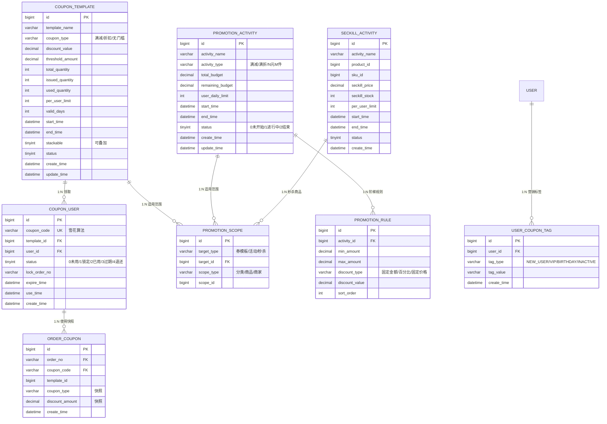

---

#### 3.7.1 coupon_template（优惠券模板表）

| # | 字段名 | 数据类型 | 长度 | 允许空 | 默认值 | 键 | 说明 |
|:--:|:-------|:--------|:---:|:-----:|:-----:|:--:|:-----|
| 1 | id | BIGINT | — | ❌ | — | 🔑 PK | 模板 ID |
| 2 | template_name | VARCHAR | 100 | ❌ | — | — | 券名称 |
| 3 | coupon_type | VARCHAR | 20 | ❌ | — | — | FULL_REDUCTION / DISCOUNT / NO_THRESHOLD |
| 4 | discount_value | DECIMAL | 10,2 | ❌ | — | — | 优惠值（满减=金额，折扣=比例如 0.85，无门槛=金额） |
| 5 | threshold_amount | DECIMAL | 10,2 | ✅ | 0.00 | — | 使用门槛金额（无门槛券为 0） |
| 6 | total_quantity | INT | — | ❌ | — | — | 发行总量 |
| 7 | issued_quantity | INT | — | ✅ | 0 | — | 已领取数量 |
| 8 | used_quantity | INT | — | ✅ | 0 | — | 已使用数量 |
| 9 | per_user_limit | INT | — | ✅ | 1 | — | 每人限领数量 |
| 10 | valid_days | INT | — | ❌ | — | — | 有效天数（自领取起） |
| 11 | start_time | DATETIME | — | ❌ | — | — | 领取开始时间 |
| 12 | end_time | DATETIME | — | ❌ | — | — | 领取结束时间 |
| 13 | stackable | TINYINT | — | ✅ | 0 | — | 是否可叠加其他优惠（0=否/1=是） |
| 14 | status | TINYINT | — | ✅ | 1 | — | 1=启用 / 0=停用 |
| 15 | create_time | DATETIME | — | ❌ | — | — | 创建时间 |
| 16 | update_time | DATETIME | — | ❌ | — | — | 更新时间 |

**DDL**：

```sql
CREATE TABLE ecommerce_promotion.`coupon_template` (
    `id`               BIGINT         NOT NULL,
    `template_name`    VARCHAR(100)   NOT NULL,
    `coupon_type`      VARCHAR(20)    NOT NULL,
    `discount_value`   DECIMAL(10,2)  NOT NULL,
    `threshold_amount` DECIMAL(10,2)  DEFAULT 0.00,
    `total_quantity`   INT            NOT NULL,
    `issued_quantity`  INT            DEFAULT 0,
    `used_quantity`    INT            DEFAULT 0,
    `per_user_limit`   INT            DEFAULT 1,
    `valid_days`       INT            NOT NULL,
    `start_time`       DATETIME       NOT NULL,
    `end_time`         DATETIME       NOT NULL,
    `stackable`        TINYINT        DEFAULT 0,
    `status`           TINYINT        DEFAULT 1,
    `create_time`      DATETIME       NOT NULL,
    `update_time`      DATETIME       NOT NULL,
    PRIMARY KEY (`id`)
) ENGINE=InnoDB DEFAULT CHARSET=utf8mb4 COLLATE=utf8mb4_unicode_ci COMMENT='优惠券模板表';
```

---

#### 3.7.2 coupon_user（用户领券记录表）

| # | 字段名 | 数据类型 | 长度 | 允许空 | 默认值 | 键 | 说明 |
|:--:|:-------|:--------|:---:|:-----:|:-----:|:--:|:-----|
| 1 | id | BIGINT | — | ❌ | — | 🔑 PK | 记录 ID |
| 2 | coupon_code | VARCHAR | 32 | ❌ | — | 🔷 UQ | 券码（雪花算法生成，非递增防枚举） |
| 3 | template_id | BIGINT | — | ❌ | — | 🟩 IDX | 券模板 ID |
| 4 | user_id | BIGINT | — | ❌ | — | 🟩 IDX₁ | 用户 ID |
| 5 | status | TINYINT | — | ✅ | 0 | 🟩 IDX₁ | 0=未使用 / 1=已锁定 / 2=已使用 / 3=已过期 / 4=已退还 |
| 6 | lock_order_no | VARCHAR | 32 | ✅ | NULL | — | 锁定订单号 |
| 7 | expire_time | DATETIME | — | ❌ | — | — | 过期时间（领取时间 + valid_days） |
| 8 | use_time | DATETIME | ✅ | NULL | — | — | 使用时间 |
| 9 | create_time | DATETIME | — | ❌ | — | — | 领取时间 |

**DDL**：

```sql
CREATE TABLE ecommerce_promotion.`coupon_user` (
    `id`             BIGINT       NOT NULL,
    `coupon_code`    VARCHAR(32)  NOT NULL,
    `template_id`    BIGINT       NOT NULL,
    `user_id`        BIGINT       NOT NULL,
    `status`         TINYINT      DEFAULT 0,
    `lock_order_no`  VARCHAR(32)  DEFAULT NULL,
    `expire_time`    DATETIME     NOT NULL,
    `use_time`       DATETIME     DEFAULT NULL,
    `create_time`    DATETIME     NOT NULL,
    PRIMARY KEY (`id`),
    UNIQUE KEY `uk_coupon_code` (`coupon_code`),
    KEY `idx_user_status` (`user_id`, `status`),
    KEY `idx_template_id` (`template_id`),
    KEY `idx_expire_time` (`expire_time`)
) ENGINE=InnoDB DEFAULT CHARSET=utf8mb4 COLLATE=utf8mb4_unicode_ci COMMENT='用户领券记录表';
```

---

#### 3.7.3 order_coupon（订单用券快照表）

| # | 字段名 | 数据类型 | 长度 | 允许空 | 默认值 | 键 | 说明 |
|:--:|:-------|:--------|:---:|:-----:|:-----:|:--:|:-----|
| 1 | id | BIGINT | — | ❌ | — | 🔑 PK | 快照 ID |
| 2 | order_no | VARCHAR | 32 | ❌ | — | 🟩 IDX | 订单号 |
| 3 | coupon_code | VARCHAR | 32 | ❌ | — | 🟩 IDX | 券码 |
| 4 | template_id | BIGINT | — | ❌ | — | — | 券模板 ID |
| 5 | coupon_type | VARCHAR | 20 | ❌ | — | — | 券类型（快照） |
| 6 | discount_amount | DECIMAL | 10,2 | ❌ | — | — | 实际优惠金额（快照） |
| 7 | create_time | DATETIME | — | ❌ | — | — | 创建时间 |

**DDL**：

```sql
CREATE TABLE ecommerce_promotion.`order_coupon` (
    `id`              BIGINT        NOT NULL,
    `order_no`        VARCHAR(32)   NOT NULL,
    `coupon_code`     VARCHAR(32)   NOT NULL,
    `template_id`     BIGINT        NOT NULL,
    `coupon_type`     VARCHAR(20)   NOT NULL,
    `discount_amount` DECIMAL(10,2) NOT NULL,
    `create_time`     DATETIME      NOT NULL,
    PRIMARY KEY (`id`),
    KEY `idx_order_no` (`order_no`),
    KEY `idx_coupon_code` (`coupon_code`)
) ENGINE=InnoDB DEFAULT CHARSET=utf8mb4 COLLATE=utf8mb4_unicode_ci COMMENT='订单用券快照表';
```

---

#### 3.7.4 promotion_activity（促销活动定义表）

| # | 字段名 | 数据类型 | 长度 | 允许空 | 默认值 | 键 | 说明 |
|:--:|:-------|:--------|:---:|:-----:|:-----:|:--:|:-----|
| 1 | id | BIGINT | — | ❌ | — | 🔑 PK | 活动 ID |
| 2 | activity_name | VARCHAR | 100 | ❌ | — | — | 活动名称 |
| 3 | activity_type | VARCHAR | 30 | ❌ | — | — | FULL_REDUCTION / FULL_DISCOUNT / N_M |
| 4 | total_budget | DECIMAL | 12,2 | ✅ | NULL | — | 总预算（NULL=不限） |
| 5 | remaining_budget | DECIMAL | 12,2 | ✅ | NULL | — | 剩余预算 |
| 6 | user_daily_limit | INT | — | ✅ | NULL | — | 每人每天参与上限（NULL=不限） |
| 7 | start_time | DATETIME | — | ❌ | — | 🟩 IDX | 开始时间 |
| 8 | end_time | DATETIME | — | ❌ | — | 🟩 IDX | 结束时间 |
| 9 | status | TINYINT | — | ✅ | 0 | 🟩 IDX | 0=未开始 / 1=进行中 / 2=已结束 |
| 10 | create_time | DATETIME | — | ❌ | — | — | 创建时间 |
| 11 | update_time | DATETIME | — | ❌ | — | — | 更新时间 |

**DDL**：

```sql
CREATE TABLE ecommerce_promotion.`promotion_activity` (
    `id`               BIGINT         NOT NULL,
    `activity_name`    VARCHAR(100)   NOT NULL,
    `activity_type`    VARCHAR(30)    NOT NULL,
    `total_budget`     DECIMAL(12,2)  DEFAULT NULL,
    `remaining_budget` DECIMAL(12,2)  DEFAULT NULL,
    `user_daily_limit` INT            DEFAULT NULL,
    `start_time`       DATETIME       NOT NULL,
    `end_time`         DATETIME       NOT NULL,
    `status`           TINYINT        DEFAULT 0,
    `create_time`      DATETIME       NOT NULL,
    `update_time`      DATETIME       NOT NULL,
    PRIMARY KEY (`id`),
    KEY `idx_start_time` (`start_time`),
    KEY `idx_end_time` (`end_time`),
    KEY `idx_status` (`status`)
) ENGINE=InnoDB DEFAULT CHARSET=utf8mb4 COLLATE=utf8mb4_unicode_ci COMMENT='促销活动定义表';
```

---

#### 3.7.5 promotion_rule（促销阶梯规则表）

| # | 字段名 | 数据类型 | 长度 | 允许空 | 默认值 | 键 | 说明 |
|:--:|:-------|:--------|:---:|:-----:|:-----:|:--:|:-----|
| 1 | id | BIGINT | — | ❌ | — | 🔑 PK | 规则 ID |
| 2 | activity_id | BIGINT | — | ❌ | — | 🟩 IDX | 所属活动 ID |
| 3 | min_amount | DECIMAL | 10,2 | ✅ | NULL | — | 最低金额门槛 |
| 4 | max_amount | DECIMAL | 10,2 | ✅ | NULL | — | 最高金额门槛 |
| 5 | discount_type | VARCHAR | 20 | ❌ | — | — | 优惠类型（FIXED_AMOUNT / PERCENTAGE / FIXED_PRICE） |
| 6 | discount_value | DECIMAL | 10,2 | ❌ | — | — | 优惠值 |
| 7 | sort_order | INT | — | ✅ | 0 | — | 阶梯顺序 |

**DDL**：

```sql
CREATE TABLE ecommerce_promotion.`promotion_rule` (
    `id`             BIGINT        NOT NULL,
    `activity_id`    BIGINT        NOT NULL,
    `min_amount`     DECIMAL(10,2) DEFAULT NULL,
    `max_amount`     DECIMAL(10,2) DEFAULT NULL,
    `discount_type`  VARCHAR(20)   NOT NULL,
    `discount_value` DECIMAL(10,2) NOT NULL,
    `sort_order`     INT           DEFAULT 0,
    PRIMARY KEY (`id`),
    KEY `idx_activity_id` (`activity_id`)
) ENGINE=InnoDB DEFAULT CHARSET=utf8mb4 COLLATE=utf8mb4_unicode_ci COMMENT='促销阶梯规则表';
```

---

#### 3.7.6 promotion_scope（促销适用范围表）

| # | 字段名 | 数据类型 | 长度 | 允许空 | 默认值 | 键 | 说明 |
|:--:|:-------|:--------|:---:|:-----:|:-----:|:--:|:-----|
| 1 | id | BIGINT | — | ❌ | — | 🔑 PK | 范围 ID |
| 2 | target_type | VARCHAR | 20 | ❌ | — | 🟩 IDX₁ | COUPON_TEMPLATE / PROMOTION / SECKILL |
| 3 | target_id | BIGINT | — | ❌ | — | 🟩 IDX₁ | 目标 ID（模板/活动/秒杀） |
| 4 | scope_type | VARCHAR | 20 | ❌ | — | — | CATEGORY / PRODUCT / MERCHANT |
| 5 | scope_id | BIGINT | — | ❌ | — | — | 适用范围 ID |

**DDL**：

```sql
CREATE TABLE ecommerce_promotion.`promotion_scope` (
    `id`          BIGINT      NOT NULL,
    `target_type` VARCHAR(20) NOT NULL,
    `target_id`   BIGINT      NOT NULL,
    `scope_type`  VARCHAR(20) NOT NULL,
    `scope_id`    BIGINT      NOT NULL,
    PRIMARY KEY (`id`),
    KEY `idx_target` (`target_type`, `target_id`)
) ENGINE=InnoDB DEFAULT CHARSET=utf8mb4 COLLATE=utf8mb4_unicode_ci COMMENT='促销适用范围表';
```

---

#### 3.7.7 seckill_activity（秒杀活动表）

| # | 字段名 | 数据类型 | 长度 | 允许空 | 默认值 | 键 | 说明 |
|:--:|:-------|:--------|:---:|:-----:|:-----:|:--:|:-----|
| 1 | id | BIGINT | — | ❌ | — | 🔑 PK | 秒杀 ID |
| 2 | activity_name | VARCHAR | 100 | ❌ | — | — | 秒杀活动名称 |
| 3 | product_id | BIGINT | — | ❌ | — | — | 秒杀商品 ID |
| 4 | sku_id | BIGINT | — | ❌ | — | — | 秒杀 SKU ID |
| 5 | seckill_price | DECIMAL | 10,2 | ❌ | — | — | 秒杀价格 |
| 6 | seckill_stock | INT | — | ❌ | — | — | 秒杀库存 |
| 7 | per_user_limit | INT | — | ✅ | 1 | — | 每人限购数量 |
| 8 | start_time | DATETIME | — | ❌ | — | 🟩 IDX | 秒杀开始时间 |
| 9 | end_time | DATETIME | — | ❌ | — | — | 秒杀结束时间 |
| 10 | status | TINYINT | — | ✅ | 0 | — | 0=未开始 / 1=进行中 / 2=已结束 |
| 11 | create_time | DATETIME | — | ❌ | — | — | 创建时间 |

**DDL**：

```sql
CREATE TABLE ecommerce_promotion.`seckill_activity` (
    `id`             BIGINT        NOT NULL,
    `activity_name`  VARCHAR(100)  NOT NULL,
    `product_id`     BIGINT        NOT NULL,
    `sku_id`         BIGINT        NOT NULL,
    `seckill_price`  DECIMAL(10,2) NOT NULL,
    `seckill_stock`  INT           NOT NULL,
    `per_user_limit` INT           DEFAULT 1,
    `start_time`     DATETIME      NOT NULL,
    `end_time`       DATETIME      NOT NULL,
    `status`         TINYINT       DEFAULT 0,
    `create_time`    DATETIME      NOT NULL,
    PRIMARY KEY (`id`),
    KEY `idx_start_time` (`start_time`)
) ENGINE=InnoDB DEFAULT CHARSET=utf8mb4 COLLATE=utf8mb4_unicode_ci COMMENT='秒杀活动表';
```

---

#### 3.7.8 user_coupon_tag（用户优惠标签表）

| # | 字段名 | 数据类型 | 长度 | 允许空 | 默认值 | 键 | 说明 |
|:--:|:-------|:--------|:---:|:-----:|:-----:|:--:|:-----|
| 1 | id | BIGINT | — | ❌ | — | 🔑 PK | 标签 ID |
| 2 | user_id | BIGINT | — | ❌ | — | 🟩 IDX | 用户 ID |
| 3 | tag_type | VARCHAR | 30 | ❌ | — | — | NEW_USER / VIP / BIRTHDAY / INACTIVE |
| 4 | tag_value | VARCHAR | 100 | ✅ | NULL | — | 标签值（JSON/字符串） |
| 5 | create_time | DATETIME | — | ❌ | — | — | 打标时间 |

**DDL**：

```sql
CREATE TABLE ecommerce_promotion.`user_coupon_tag` (
    `id`          BIGINT       NOT NULL,
    `user_id`     BIGINT       NOT NULL,
    `tag_type`    VARCHAR(30)  NOT NULL,
    `tag_value`   VARCHAR(100) DEFAULT NULL,
    `create_time` DATETIME     NOT NULL,
    PRIMARY KEY (`id`),
    KEY `idx_user_tag` (`user_id`, `tag_type`)
) ENGINE=InnoDB DEFAULT CHARSET=utf8mb4 COLLATE=utf8mb4_unicode_ci COMMENT='用户优惠标签表';
```

---

### 3.8 message-service — ecommerce_message

消息通信体系，3 张表。核心特征：时序数据、WebSocket 实时推送、离线兜底、会话-消息父子结构。

**领域 ER 图**：

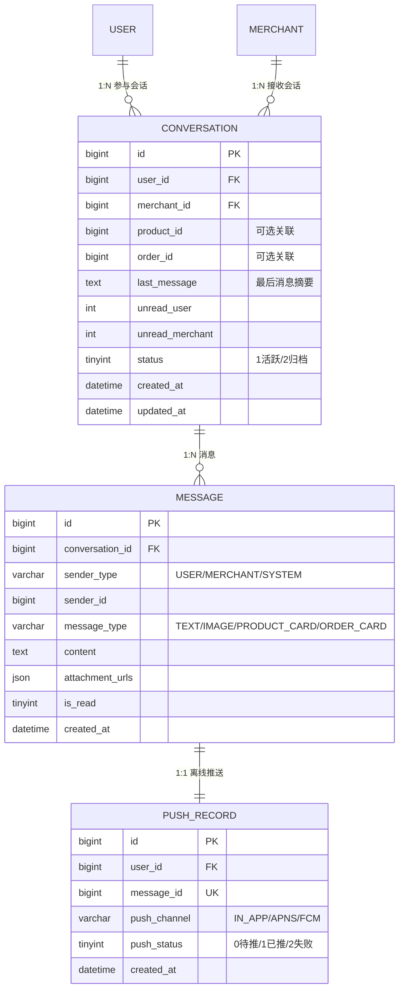

---

#### 3.8.1 conversation（消息会话表）

| # | 字段名 | 数据类型 | 长度 | 允许空 | 默认值 | 键 | 说明 |
|:--:|:-------|:--------|:---:|:-----:|:-----:|:--:|:-----|
| 1 | id | BIGINT | — | ❌ | — | 🔑 PK | 会话 ID |
| 2 | user_id | BIGINT | — | ❌ | — | 🔷 UQ₁, 🟩 IDX₁ | 用户 ID |
| 3 | merchant_id | BIGINT | — | ❌ | — | 🔷 UQ₁, 🟩 IDX₂ | 商家 ID |
| 4 | product_id | BIGINT | ✅ | NULL | — | 🔷 UQ₁ | 关联商品（可选） |
| 5 | order_id | BIGINT | ✅ | NULL | — | 🔷 UQ₁ | 关联订单（可选） |
| 6 | last_message | TEXT | — | ✅ | NULL | — | 最后一条消息摘要 |
| 7 | unread_user | INT | — | ✅ | 0 | — | 用户未读数 |
| 8 | unread_merchant | INT | — | ✅ | 0 | — | 商家未读数 |
| 9 | status | TINYINT | — | ✅ | 1 | — | 1=活跃 / 2=归档 |
| 10 | created_at | DATETIME | — | ❌ | — | — | 创建时间 |
| 11 | updated_at | DATETIME | — | ❌ | — | 🟩 IDX₁, 🟩 IDX₂ | 更新时间 |

**DDL**：

```sql
CREATE TABLE ecommerce_message.`conversation` (
    `id`               BIGINT   NOT NULL,
    `user_id`          BIGINT   NOT NULL,
    `merchant_id`      BIGINT   NOT NULL,
    `product_id`       BIGINT   DEFAULT NULL,
    `order_id`         BIGINT   DEFAULT NULL,
    `last_message`     TEXT     DEFAULT NULL,
    `unread_user`      INT      DEFAULT 0,
    `unread_merchant`  INT      DEFAULT 0,
    `status`           TINYINT  DEFAULT 1,
    `created_at`       DATETIME NOT NULL,
    `updated_at`       DATETIME NOT NULL,
    PRIMARY KEY (`id`),
    UNIQUE KEY `uk_user_merchant_context` (`user_id`, `merchant_id`,
        COALESCE(`product_id`, 0), COALESCE(`order_id`, 0)),
    KEY `idx_user_updated` (`user_id`, `updated_at` DESC),
    KEY `idx_merchant_updated` (`merchant_id`, `updated_at` DESC)
) ENGINE=InnoDB DEFAULT CHARSET=utf8mb4 COLLATE=utf8mb4_unicode_ci COMMENT='消息会话表';
```

> **UNIQUE KEY 说明**：`uk_user_merchant_context` 使用 `COALESCE(product_id, 0)` 和 `COALESCE(order_id, 0)` 处理 NULL 值，保证同一用户与同一商家关于同一商品/订单只有一个会话。MySQL 8.0 支持函数索引（functional index）。

---

#### 3.8.2 message（消息记录表）

| # | 字段名 | 数据类型 | 长度 | 允许空 | 默认值 | 键 | 说明 |
|:--:|:-------|:--------|:---:|:-----:|:-----:|:--:|:-----|
| 1 | id | BIGINT | — | ❌ | — | 🔑 PK | 消息 ID |
| 2 | conversation_id | BIGINT | — | ❌ | — | 🟩 IDX | 所属会话 ID |
| 3 | sender_type | VARCHAR | 10 | ❌ | — | — | USER / MERCHANT / SYSTEM |
| 4 | sender_id | BIGINT | — | ❌ | — | — | 发送者 ID |
| 5 | message_type | VARCHAR | 20 | ✅ | 'TEXT' | — | TEXT / IMAGE / PRODUCT_CARD / ORDER_CARD |
| 6 | content | TEXT | — | ✅ | NULL | — | 消息内容 |
| 7 | attachment_urls | JSON | — | ✅ | NULL | — | 附件 URL 列表 |
| 8 | is_read | TINYINT | — | ✅ | 0 | — | 是否已读 |
| 9 | created_at | DATETIME | — | ❌ | — | 🟩 IDX | 发送时间 |

**DDL**：

```sql
CREATE TABLE ecommerce_message.`message` (
    `id`              BIGINT      NOT NULL,
    `conversation_id` BIGINT      NOT NULL,
    `sender_type`     VARCHAR(10) NOT NULL,
    `sender_id`       BIGINT      NOT NULL,
    `message_type`    VARCHAR(20) DEFAULT 'TEXT',
    `content`         TEXT        DEFAULT NULL,
    `attachment_urls` JSON        DEFAULT NULL,
    `is_read`         TINYINT     DEFAULT 0,
    `created_at`      DATETIME    NOT NULL,
    PRIMARY KEY (`id`),
    KEY `idx_conversation_time` (`conversation_id`, `created_at`)
) ENGINE=InnoDB DEFAULT CHARSET=utf8mb4 COLLATE=utf8mb4_unicode_ci COMMENT='消息记录表';
```

---

#### 3.8.3 push_record（离线推送记录表）

| # | 字段名 | 数据类型 | 长度 | 允许空 | 默认值 | 键 | 说明 |
|:--:|:-------|:--------|:---:|:-----:|:-----:|:--:|:-----|
| 1 | id | BIGINT | — | ❌ | — | 🔑 PK | 推送记录 ID |
| 2 | user_id | BIGINT | — | ❌ | — | — | 目标用户 ID |
| 3 | message_id | BIGINT | — | ❌ | — | 🔷 UQ | 消息 ID |
| 4 | push_channel | VARCHAR | 20 | ✅ | NULL | — | IN_APP / APNS / FCM |
| 5 | push_status | TINYINT | — | ✅ | 0 | — | 0=待推送 / 1=已推送 / 2=推送失败 |
| 6 | created_at | DATETIME | — | ❌ | — | — | 创建时间 |

**DDL**：

```sql
CREATE TABLE ecommerce_message.`push_record` (
    `id`           BIGINT      NOT NULL,
    `user_id`      BIGINT      NOT NULL,
    `message_id`   BIGINT      NOT NULL,
    `push_channel` VARCHAR(20) DEFAULT NULL,
    `push_status`  TINYINT     DEFAULT 0,
    `created_at`   DATETIME    NOT NULL,
    PRIMARY KEY (`id`),
    UNIQUE KEY `uk_message` (`message_id`)
) ENGINE=InnoDB DEFAULT CHARSET=utf8mb4 COLLATE=utf8mb4_unicode_ci COMMENT='离线推送记录表';
```

---

### 3.9 cs-service — ecommerce_customer_service

官方客服工单体系，4 张表。核心特征：工单状态机 + SLA 管控 + 不可删除审计日志 + agent 多对多工单。

**领域 ER 图**：

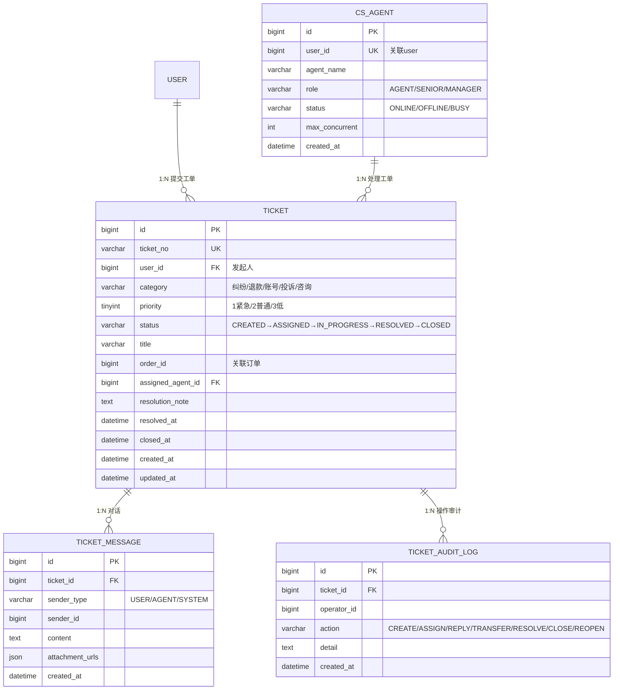

---

#### 3.9.1 ticket（客服工单表）

| # | 字段名 | 数据类型 | 长度 | 允许空 | 默认值 | 键 | 说明 |
|:--:|:-------|:--------|:---:|:-----:|:-----:|:--:|:-----|
| 1 | id | BIGINT | — | ❌ | — | 🔑 PK | 工单 ID |
| 2 | ticket_no | VARCHAR | 20 | ❌ | — | 🔷 UQ | 工单号 |
| 3 | user_id | BIGINT | — | ❌ | — | 🟩 IDX₁ | 发起用户 ID |
| 4 | category | VARCHAR | 30 | ✅ | NULL | — | ORDER_DISPUTE / REFUND / ACCOUNT / COMPLAINT / GENERAL |
| 5 | priority | TINYINT | — | ✅ | 2 | — | 1=紧急 / 2=普通 / 3=低 |
| 6 | status | VARCHAR | 20 | ✅ | 'CREATED' | 🟩 IDX₁, 🟩 IDX₂ | CREATED→ASSIGNED→IN_PROGRESS→RESOLVED→CLOSED |
| 7 | title | VARCHAR | 200 | ✅ | NULL | — | 工单标题 |
| 8 | order_id | BIGINT | ✅ | NULL | — | — | 关联订单 ID |
| 9 | assigned_agent_id | BIGINT | ✅ | NULL | 🟩 IDX₂ | — | 被分配客服 ID |
| 10 | resolution_note | TEXT | — | ✅ | NULL | — | 处理备注 |
| 11 | resolved_at | DATETIME | — | ✅ | NULL | — | 解决时间 |
| 12 | closed_at | DATETIME | — | ✅ | NULL | — | 关闭时间 |
| 13 | created_at | DATETIME | — | ❌ | — | — | 创建时间 |
| 14 | updated_at | DATETIME | — | ❌ | — | — | 更新时间 |

**DDL**：

```sql
CREATE TABLE ecommerce_customer_service.`ticket` (
    `id`                BIGINT       NOT NULL,
    `ticket_no`         VARCHAR(20)  NOT NULL,
    `user_id`           BIGINT       NOT NULL,
    `category`          VARCHAR(30)  DEFAULT NULL,
    `priority`          TINYINT      DEFAULT 2,
    `status`            VARCHAR(20)  DEFAULT 'CREATED',
    `title`             VARCHAR(200) DEFAULT NULL,
    `order_id`          BIGINT       DEFAULT NULL,
    `assigned_agent_id` BIGINT       DEFAULT NULL,
    `resolution_note`   TEXT         DEFAULT NULL,
    `resolved_at`       DATETIME     DEFAULT NULL,
    `closed_at`         DATETIME     DEFAULT NULL,
    `created_at`        DATETIME     NOT NULL,
    `updated_at`        DATETIME     NOT NULL,
    PRIMARY KEY (`id`),
    UNIQUE KEY `uk_ticket_no` (`ticket_no`),
    KEY `idx_user_status` (`user_id`, `status`),
    KEY `idx_agent_status` (`assigned_agent_id`, `status`)
) ENGINE=InnoDB DEFAULT CHARSET=utf8mb4 COLLATE=utf8mb4_unicode_ci COMMENT='客服工单表';
```

---

#### 3.9.2 ticket_message（工单消息表）

| # | 字段名 | 数据类型 | 长度 | 允许空 | 默认值 | 键 | 说明 |
|:--:|:-------|:--------|:---:|:-----:|:-----:|:--:|:-----|
| 1 | id | BIGINT | — | ❌ | — | 🔑 PK | 消息 ID |
| 2 | ticket_id | BIGINT | — | ❌ | — | 🟩 IDX | 所属工单 ID |
| 3 | sender_type | VARCHAR | 10 | ❌ | — | — | USER / AGENT / SYSTEM |
| 4 | sender_id | BIGINT | — | ❌ | — | — | 发送者 ID |
| 5 | content | TEXT | — | ✅ | NULL | — | 消息内容 |
| 6 | attachment_urls | JSON | — | ✅ | NULL | — | 附件 URL |
| 7 | created_at | DATETIME | — | ❌ | — | 🟩 IDX | 发送时间 |

**DDL**：

```sql
CREATE TABLE ecommerce_customer_service.`ticket_message` (
    `id`              BIGINT      NOT NULL,
    `ticket_id`       BIGINT      NOT NULL,
    `sender_type`     VARCHAR(10) NOT NULL,
    `sender_id`       BIGINT      NOT NULL,
    `content`         TEXT        DEFAULT NULL,
    `attachment_urls` JSON        DEFAULT NULL,
    `created_at`      DATETIME    NOT NULL,
    PRIMARY KEY (`id`),
    KEY `idx_ticket_time` (`ticket_id`, `created_at`)
) ENGINE=InnoDB DEFAULT CHARSET=utf8mb4 COLLATE=utf8mb4_unicode_ci COMMENT='工单消息表';
```

---

#### 3.9.3 ticket_audit_log（工单操作审计日志表）

| # | 字段名 | 数据类型 | 长度 | 允许空 | 默认值 | 键 | 说明 |
|:--:|:-------|:--------|:---:|:-----:|:-----:|:--:|:-----|
| 1 | id | BIGINT | — | ❌ | — | 🔑 PK | 日志 ID |
| 2 | ticket_id | BIGINT | — | ❌ | — | 🟩 IDX | 所属工单 ID |
| 3 | operator_id | BIGINT | — | ❌ | — | — | 操作人 ID |
| 4 | action | VARCHAR | 30 | ❌ | — | — | CREATE / ASSIGN / REPLY / TRANSFER / RESOLVE / CLOSE / REOPEN |
| 5 | detail | TEXT | — | ✅ | NULL | — | 操作详情 |
| 6 | created_at | DATETIME | — | ❌ | — | — | 操作时间 |

**DDL**：

```sql
CREATE TABLE ecommerce_customer_service.`ticket_audit_log` (
    `id`          BIGINT      NOT NULL,
    `ticket_id`   BIGINT      NOT NULL,
    `operator_id` BIGINT      NOT NULL,
    `action`      VARCHAR(30) NOT NULL,
    `detail`      TEXT        DEFAULT NULL,
    `created_at`  DATETIME    NOT NULL,
    PRIMARY KEY (`id`),
    KEY `idx_ticket_id` (`ticket_id`)
) ENGINE=InnoDB DEFAULT CHARSET=utf8mb4 COLLATE=utf8mb4_unicode_ci COMMENT='工单操作审计日志表（不可物理删除）';
```

---

#### 3.9.4 cs_agent（客服表）

| # | 字段名 | 数据类型 | 长度 | 允许空 | 默认值 | 键 | 说明 |
|:--:|:-------|:--------|:---:|:-----:|:-----:|:--:|:-----|
| 1 | id | BIGINT | — | ❌ | — | 🔑 PK | Agent ID |
| 2 | user_id | BIGINT | — | ❌ | — | 🔷 UQ | 关联 user_id |
| 3 | agent_name | VARCHAR | 50 | ✅ | NULL | — | 客服昵称 |
| 4 | role | VARCHAR | 20 | ✅ | 'AGENT' | — | AGENT / SENIOR / MANAGER |
| 5 | status | VARCHAR | 20 | ✅ | 'OFFLINE' | — | ONLINE / OFFLINE / BUSY |
| 6 | max_concurrent | INT | — | ✅ | 5 | — | 最大并发处理工单数 |
| 7 | created_at | DATETIME | — | ❌ | — | — | 创建时间 |

**DDL**：

```sql
CREATE TABLE ecommerce_customer_service.`cs_agent` (
    `id`             BIGINT      NOT NULL,
    `user_id`        BIGINT      NOT NULL,
    `agent_name`     VARCHAR(50) DEFAULT NULL,
    `role`           VARCHAR(20) DEFAULT 'AGENT',
    `status`         VARCHAR(20) DEFAULT 'OFFLINE',
    `max_concurrent` INT         DEFAULT 5,
    `created_at`     DATETIME    NOT NULL,
    PRIMARY KEY (`id`),
    UNIQUE KEY `uk_user_id` (`user_id`)
) ENGINE=InnoDB DEFAULT CHARSET=utf8mb4 COLLATE=utf8mb4_unicode_ci COMMENT='客服人员表';
```

---

### 3.10 recommendation-service — ecommerce_recommendation + ecommerce_behavior

推荐引擎，跨 2 个 Schema，4 张表。核心特征：离线批处理写入 + 在线 Redis 缓存读取 + 行为日志按日分区 + 商品相似度矩阵。

**领域 ER 图**：

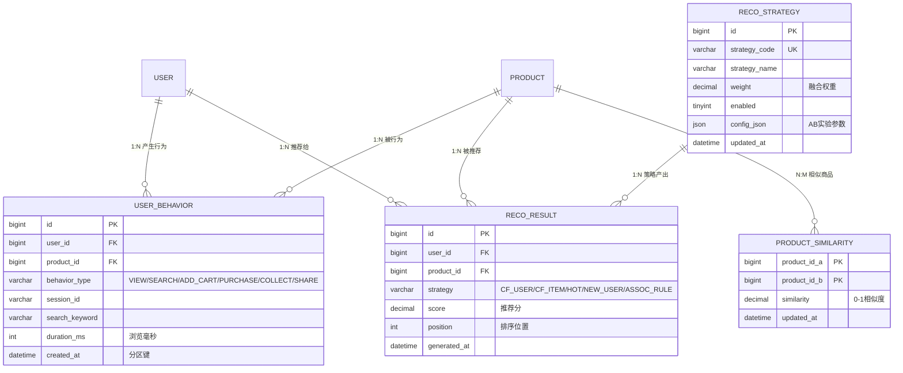

---

#### 3.10.1 user_behavior（用户行为日志表）—— Schema: ecommerce_behavior

| # | 字段名 | 数据类型 | 长度 | 允许空 | 默认值 | 键 | 说明 |
|:--:|:-------|:--------|:---:|:-----:|:-----:|:--:|:-----|
| 1 | id | BIGINT | — | ❌ | — | 🔑 PK₁ (联合) | 行为 ID |
| 2 | user_id | BIGINT | — | ❌ | — | 🟩 IDX₁ | 用户 ID |
| 3 | product_id | BIGINT | — | ❌ | — | 🟩 IDX₂ | 商品 ID |
| 4 | behavior_type | VARCHAR | 20 | ❌ | — | — | VIEW / SEARCH / ADD_CART / PURCHASE / COLLECT / SHARE |
| 5 | session_id | VARCHAR | 64 | ✅ | NULL | — | 会话 ID |
| 6 | search_keyword | VARCHAR | 100 | ✅ | NULL | — | 搜索关键词 |
| 7 | duration_ms | INT | — | ✅ | 0 | — | 浏览停留时长（毫秒） |
| 8 | created_at | DATETIME | — | ❌ | — | 🔑 PK₂ (联合), 🟩 IDX₁, 🟩 IDX₂ | 行为发生时间 |

**DDL**：

```sql
CREATE TABLE ecommerce_behavior.`user_behavior` (
    `id`             BIGINT       NOT NULL,
    `user_id`        BIGINT       NOT NULL,
    `product_id`     BIGINT       NOT NULL,
    `behavior_type`  VARCHAR(20)  NOT NULL,
    `session_id`     VARCHAR(64)  DEFAULT NULL,
    `search_keyword` VARCHAR(100) DEFAULT NULL,
    `duration_ms`    INT          DEFAULT 0,
    `created_at`     DATETIME     NOT NULL,
    PRIMARY KEY (`id`, `created_at`),
    KEY `idx_user_time` (`user_id`, `created_at`),
    KEY `idx_product_time` (`product_id`, `created_at`)
) ENGINE=InnoDB DEFAULT CHARSET=utf8mb4 COLLATE=utf8mb4_unicode_ci COMMENT='用户行为日志表'
PARTITION BY RANGE (TO_DAYS(`created_at`)) (
    PARTITION p20260701 VALUES LESS THAN (TO_DAYS('2026-07-02')),
    PARTITION p20260702 VALUES LESS THAN (TO_DAYS('2026-07-03'))
    -- 后续分区由 Flyway 迁移脚本按周批量创建
);
```

> **分区说明**：按 `created_at` 日期 RANGE 分区，每日一个分区。Flyway 迁移脚本每周末自动创建下周 7 天的分区。30 天前的分区通过定时任务 DROP 或归档到冷存储。

---

#### 3.10.2 reco_result（推荐结果物化表）—— Schema: ecommerce_recommendation

| # | 字段名 | 数据类型 | 长度 | 允许空 | 默认值 | 键 | 说明 |
|:--:|:-------|:--------|:---:|:-----:|:-----:|:--:|:-----|
| 1 | id | BIGINT | — | ❌ | — | 🔑 PK | 推荐结果 ID |
| 2 | user_id | BIGINT | — | ❌ | — | 🟩 IDX₁ | 用户 ID |
| 3 | product_id | BIGINT | — | ❌ | — | — | 推荐商品 ID |
| 4 | strategy | VARCHAR | 30 | ❌ | — | 🟩 IDX₁ | CF_USER / CF_ITEM / HOT / NEW_USER / ASSOC_RULE |
| 5 | score | DECIMAL | 10,4 | ❌ | — | 🟩 IDX₁ | 推荐分数 |
| 6 | position | INT | — | ✅ | 0 | — | 排序位置 |
| 7 | generated_at | DATETIME | — | ❌ | — | 🟩 IDX₂ | 生成时间 |

**DDL**：

```sql
CREATE TABLE ecommerce_recommendation.`reco_result` (
    `id`           BIGINT        NOT NULL,
    `user_id`      BIGINT        NOT NULL,
    `product_id`   BIGINT        NOT NULL,
    `strategy`     VARCHAR(30)   NOT NULL,
    `score`        DECIMAL(10,4) NOT NULL,
    `position`     INT           DEFAULT 0,
    `generated_at` DATETIME      NOT NULL,
    PRIMARY KEY (`id`),
    KEY `idx_user_strategy` (`user_id`, `strategy`, `score` DESC),
    KEY `idx_generated` (`generated_at`)
) ENGINE=InnoDB DEFAULT CHARSET=utf8mb4 COLLATE=utf8mb4_unicode_ci COMMENT='推荐结果物化表（离线计算写入，在线服务读取）';
```

---

#### 3.10.3 product_similarity（商品相似度矩阵表）—— Schema: ecommerce_recommendation

| # | 字段名 | 数据类型 | 长度 | 允许空 | 默认值 | 键 | 说明 |
|:--:|:-------|:--------|:---:|:-----:|:-----:|:--:|:-----|
| 1 | product_id_a | BIGINT | — | ❌ | — | 🔑 CK₁ | 商品 A |
| 2 | product_id_b | BIGINT | — | ❌ | — | 🔑 CK₂ | 商品 B |
| 3 | similarity | DECIMAL | 10,4 | ❌ | — | — | 相似度（0~1） |
| 4 | updated_at | DATETIME | — | ❌ | — | — | 最后更新时间 |

**DDL**：

```sql
CREATE TABLE ecommerce_recommendation.`product_similarity` (
    `product_id_a` BIGINT        NOT NULL,
    `product_id_b` BIGINT        NOT NULL,
    `similarity`   DECIMAL(10,4) NOT NULL,
    `updated_at`   DATETIME      NOT NULL,
    PRIMARY KEY (`product_id_a`, `product_id_b`)
) ENGINE=InnoDB DEFAULT CHARSET=utf8mb4 COLLATE=utf8mb4_unicode_ci COMMENT='商品相似度矩阵表（Item-CF 离线计算）';
```

---

#### 3.10.4 reco_strategy（推荐策略配置表）—— Schema: ecommerce_recommendation

| # | 字段名 | 数据类型 | 长度 | 允许空 | 默认值 | 键 | 说明 |
|:--:|:-------|:--------|:---:|:-----:|:-----:|:--:|:-----|
| 1 | id | BIGINT | — | ❌ | — | 🔑 PK | 策略 ID |
| 2 | strategy_code | VARCHAR | 30 | ❌ | — | 🔷 UQ | CF_USER / CF_ITEM / HOT / NEW_USER / ASSOC_RULE |
| 3 | strategy_name | VARCHAR | 100 | ✅ | NULL | — | 策略中文名 |
| 4 | weight | DECIMAL | 5,2 | ✅ | 1.00 | — | 融合权重 |
| 5 | enabled | TINYINT | — | ✅ | 1 | — | 是否启用 |
| 6 | config_json | JSON | — | ✅ | NULL | — | 策略参数（含 A/B 实验分流配置） |
| 7 | updated_at | DATETIME | — | ✅ | NULL | — | 更新时间 |

**DDL**：

```sql
CREATE TABLE ecommerce_recommendation.`reco_strategy` (
    `id`            BIGINT        NOT NULL,
    `strategy_code` VARCHAR(30)   NOT NULL,
    `strategy_name` VARCHAR(100)  DEFAULT NULL,
    `weight`        DECIMAL(5,2)  DEFAULT 1.00,
    `enabled`       TINYINT       DEFAULT 1,
    `config_json`   JSON          DEFAULT NULL,
    `updated_at`    DATETIME      DEFAULT NULL,
    PRIMARY KEY (`id`),
    UNIQUE KEY `uk_strategy_code` (`strategy_code`)
) ENGINE=InnoDB DEFAULT CHARSET=utf8mb4 COLLATE=utf8mb4_unicode_ci COMMENT='推荐策略配置表';
```

---

## 四、索引设计

### 4.1 索引策略总览

| 索引类型 | 数量 | 主要用途 |
|:--------|:---:|:--------|
| PRIMARY KEY | 46 | 聚簇索引，全部为 BIGINT 雪花 ID |
| UNIQUE KEY | 28 | 业务唯一约束（用户名、手机号、订单号、券码、工单号等） |
| 普通 INDEX | 73 | 查询优化（用户维度、时间范围、状态筛选、排序） |
| 联合 INDEX | 22 | 多条件组合查询（user_id + status + time 等） |
| 函数 INDEX | 1 | conversation 的 COALESCE UNIQUE KEY |

**设计原则**：

1. **高频查询覆盖**：所有按 user_id 查询的路径都有对应索引
2. **最左前缀匹配**：联合索引按查询频率排列字段顺序（如 `user_id + status + create_time`）
3. **避免冗余索引**：联合索引可以覆盖单字段查询（如 `idx_user_status_create` 覆盖 `user_id` 单字段查询）
4. **前缀索引**：长 VARCHAR 字段（如 product.name(50)）使用前缀索引节省空间
5. **覆盖索引**：查询频繁且字段少的场景尽量使用覆盖索引（如 `reco_result.idx_user_strategy` 覆盖 user_id + strategy + score）

### 4.2 联合索引明细

| Schema | 表 | 索引名 | 字段 | 覆盖场景 |
|:-------|:---|:------|:-----|:--------|
| ecommerce_user | user_role | uk_user_role | (user_id, role_id) | 防重 + 用户角色查询 |
| ecommerce_user | role_permission | uk_role_perm | (role_id, permission_id) | 防重 + 角色权限查询 |
| ecommerce_user | user_address | idx_user_default | (user_id, is_default) | 查询默认地址 |
| ecommerce_product | product | idx_category_status | (category_id, status) | 分类下上架商品 |
| ecommerce_product | product | idx_category_status_sales | (category_id, status, sales) | 分类下热销商品排序 |
| ecommerce_product | product_sku | idx_product_stock | (product_id, stock) | 商品库存列表 |
| ecommerce_product | cart_item | uk_user_sku | (user_id, product_id, sku_id) | 防重 + 购物车查询 |
| ecommerce_product | review | uk_order_sku | (order_no, sku_id) | 防重评价 |
| ecommerce_product | review | idx_product_status_time | (product_id, status, create_time) | 商品评价列表（时间序） |
| ecommerce_product | stock_notification | uk_sku_user | (sku_id, user_id) | 防重订阅 |
| ecommerce_product | stock_notification | idx_sku_notified | (sku_id, notified) | 未通知的订阅批量查询 |
| ecommerce_order | orders | idx_user_status_create | (user_id, status, create_time) | 用户订单列表 |
| ecommerce_order | orders | idx_status_create | (status, create_time) | 按状态扫描订单 |
| ecommerce_order | order_message | idx_status_update | (status, update_time) | 定时扫描未投递消息 |
| ecommerce_message | conversation | uk_user_merchant_context | (user_id, merchant_id, COALESCE(product_id,0), COALESCE(order_id,0)) | 防重会话 |
| ecommerce_message | conversation | idx_user_updated | (user_id, updated_at DESC) | 用户会话列表 |
| ecommerce_message | conversation | idx_merchant_updated | (merchant_id, updated_at DESC) | 商家会话列表 |
| ecommerce_message | message | idx_conversation_time | (conversation_id, created_at) | 会话消息列表（时间序） |
| ecommerce_customer_service | ticket | idx_user_status | (user_id, status) | 用户工单列表 |
| ecommerce_customer_service | ticket | idx_agent_status | (assigned_agent_id, status) | agent 待处理工单 |
| ecommerce_customer_service | ticket_message | idx_ticket_time | (ticket_id, created_at) | 工单消息列表 |
| ecommerce_recommendation | reco_result | idx_user_strategy | (user_id, strategy, score DESC) | 推荐查询 + 策略过滤 + 分数排序 |
| ecommerce_behavior | user_behavior | idx_user_time | (user_id, created_at) | 用户行为时间线 |
| ecommerce_behavior | user_behavior | idx_product_time | (product_id, created_at) | 商品行为分析 |
| ecommerce_promotion | coupon_user | idx_user_status | (user_id, status) | 用户可用券列表 |
| ecommerce_promotion | promotion_scope | idx_target | (target_type, target_id) | 查询优惠适用范围 |
| ecommerce_promotion | user_coupon_tag | idx_user_tag | (user_id, tag_type) | 用户标签查询 |

---

## 五、字段约束与校验规则

### 5.1 数据库层约束

| 约束类型 | 应用范围 | 示例 |
|:--------|:--------|:-----|
| **NOT NULL** | 所有主键、业务必填字段 | id, username, order_no, product_id |
| **UNIQUE KEY** | 业务唯一标识 | username, phone, order_no, coupon_code, ticket_no, bill_no, pay_no |
| **DEFAULT** | 状态字段、计数字段 | status=0, deleted=0, quantity=1, stock=0 |
| **TINYINT 范围** | 状态/标记字段 | 约定 0/1 或 0/1/2/3/4 |
| **DECIMAL 精度** | 金额字段 | (10,2) 商品价格，(12,2) 结算金额，(5,4) 佣金率 |
| **VARCHAR 长度** | 文本字段 | 50（名称/标题），200（描述），500（URL） |
| **JSON 格式** | 灵活结构字段 | SKU 规格、评价图片、消息附件 |
| **分区约束** | 行为日志表 | RANGE (TO_DAYS(created_at))，按日分区 |

### 5.2 应用层校验规则（关键字段）

| 字段 | 校验规则 | 说明 |
|:-----|:--------|:-----|
| **username** | `[a-zA-Z0-9_]{4,20}` | 4-20 位字母数字下划线 |
| **password** | 长度 8-128，BCrypt cost=12 | 加密后长度 ≤ 255 |
| **phone** | `1[3-9]\d{9}` + AES-256 加密 | 存加密密文，日志脱敏为 `138****8888` |
| **email** | RFC 5322 格式 | `xxx@domain.tld` |
| **product.price** | ≥ 0.01 | 最小 1 分钱 |
| **product_sku.price** | ≥ 0.01 | SKU 价格可等于或高于主商品价格 |
| **product_sku.stock** | ≥ 0 | 库存不可为负（应用层+Redis 校验） |
| **orders.total_amount** | = SUM(order_item.subtotal) | 应用层核对 |
| **orders.pay_amount** | = total_amount - discount | 实付金额不可大于总额 |
| **order_item.quantity** | ≥ 1 | 最少买 1 件 |
| **review.score** | 1 ≤ score ≤ 5 | 5 星评分 |
| **coupon_user.status** | 0/1/2/3/4 | 状态枚举校验 |
| **commission_rule.rate** | 0 < rate < 1 | 佣金率在 0~100% 之间 |
| **ticket.priority** | 1/2/3 | 紧急/普通/低 |
| **ticket.status** | CREATED→ASSIGNED→IN_PROGRESS→RESOLVED→CLOSED | 状态机单向流转（REOPEN 可回退一次） |
| **cs_agent.max_concurrent** | 1-20 | 单个客服最大并发工单数 |
| **user_behavior.behavior_type** | VIEW/SEARCH/ADD_CART/PURCHASE/COLLECT/SHARE | 预定义行为枚举 |
| **reco_strategy.weight** | 0 ≤ weight ≤ 100 | 推荐策略融合权重 |
| **conversation.status** | 1/2 | 1=活跃/2=归档 |

### 5.3 跨表业务约束（应用层保证）

| 约束 | 实现方式 |
|:-----|:--------|
| 每个用户最多 20 个收货地址 | 插入前 COUNT(user_id) < 20 |
| 同一订单同一 SKU 只能评价一次 | review.uk_order_sku + 应用层二重校验 |
| 优惠券不可超领 | Redis Lua 原子自增 + MySQL issued_quantity <= total_quantity |
| 秒杀商品不可超卖 | Redis 原子 DECR + 库存 ≤ 0 拒绝 |
| 客服工单不可由非分配 agent 操作 | 应用层 @PreAuthorize + ticket.assigned_agent_id 校验 |
| 同一用户对同一商家同产品/订单只有一个活跃会话 | conversation.uk_user_merchant_context 唯一约束 |
| 同一用户对同一 SKU 只能订阅一次到货通知 | stock_notification.uk_sku_user 唯一约束 |

---

## 六、数据字典

### 6.1 用户状态码

| 值 | 字段 | 含义 |
|:--:|:-----|:----|
| 0 | user.status | 禁用 |
| 1 | user.status | 正常 |

| 值 | 字段 | 含义 |
|:--:|:-----|:----|
| 0 | user.deleted | 正常 |
| 1 | user.deleted | 已删除（逻辑删除） |

### 6.2 商品状态码

| 值 | 字段 | 含义 |
|:--:|:-----|:----|
| 0 | product.status | 下架 |
| 1 | product.status | 上架 |
| 0 | product.audit_status | 待审核 |
| 1 | product.audit_status | 审核通过 |
| 2 | product.audit_status | 审核拒绝 |

### 6.3 订单状态码

| 值 | 字段 | 含义 |
|:--:|:-----|:----|
| 0 | orders.status | 待支付 |
| 1 | orders.status | 已支付 |
| 2 | orders.status | 已发货 |
| 3 | orders.status | 已完成 |
| 4 | orders.status | 已取消 |
| 5 | orders.status | 已退款 |

### 6.4 支付方式 / 状态码

| 值 | 字段 | 含义 |
|:--:|:-----|:----|
| 1 | payment.pay_type | 支付宝 |
| 2 | payment.pay_type | 微信支付 |
| 0 | payment.status | 待支付 |
| 1 | payment.status | 支付成功 |
| 2 | payment.status | 支付失败 |
| 3 | payment.status | 已退款 |

### 6.5 商家状态码

| 值 | 字段 | 含义 |
|:--:|:-----|:----|
| 0 | merchant.status | 待审核 |
| 1 | merchant.status | 正常 |
| 2 | merchant.status | 冻结 |

### 6.6 优惠券状态码

| 值 | 字段 | 含义 |
|:--:|:-----|:----|
| 0 | coupon_user.status | 未使用 |
| 1 | coupon_user.status | 已锁定（下单中） |
| 2 | coupon_user.status | 已使用 |
| 3 | coupon_user.status | 已过期 |
| 4 | coupon_user.status | 已退还 |

### 6.7 工单状态码

| 值 | 含义 | 说明 |
|:---|:----|:-----|
| CREATED | 已创建 | 用户提交，待分配 |
| ASSIGNED | 已分配 | 客服认领或管理员分配 |
| IN_PROGRESS | 处理中 | 客服正在处理 |
| RESOLVED | 已解决 | 客服标记解决，等待用户确认 |
| CLOSED | 已关闭 | 用户确认或超时自动关闭 |

### 6.8 工单分类码

| 值 | 含义 | SLA 首次响应 |
|:---|:----|:----------:|
| ORDER_DISPUTE | 订单纠纷 | 2h |
| REFUND | 退款争议 | 2h |
| ACCOUNT | 账号申诉 | 4h |
| COMPLAINT | 投诉举报 | 4h |
| GENERAL | 一般咨询 | 24h |

### 6.9 消息类型码

| 值 | 含义 | 说明 |
|:---|:----|:-----|
| TEXT | 文本消息 | 纯文本 |
| IMAGE | 图片消息 | attachment_urls 存储图片 URL |
| PRODUCT_CARD | 商品卡片 | payload 含商品快照 JSON |
| ORDER_CARD | 订单卡片 | payload 含订单快照 JSON |

### 6.10 消息发送者类型码

| 值 | 含义 |
|:---|:----|
| USER | 普通用户 |
| MERCHANT | 商家 |
| SYSTEM | 系统消息（如"订单已发货"） |

### 6.11 行为类型码

| 值 | 含义 | 推荐权重 |
|:---|:----|:------:|
| VIEW | 浏览 | 1 |
| SEARCH | 搜索 | 3 |
| ADD_CART | 加购 | 5 |
| PURCHASE | 购买 | 10 |
| COLLECT | 收藏 | 4 |
| SHARE | 分享 | 3 |

### 6.12 客服角色码

| 值 | 含义 | 权限 |
|:---|:----|:-----|
| AGENT | 普通客服 | 认领自己工单、回复、标记解决 |
| SENIOR | 高级客服 | + 处理申诉升级工单 |
| MANAGER | 客服主管 | + 分配工单、转接、查全量工单 |

### 6.13 推荐策略码

| 值 | 含义 | 计算方式 |
|:---|:----|:--------|
| CF_USER | 基于用户的协同过滤 | 相似用户购买行为 |
| CF_ITEM | 基于物品的协同过滤 | 被共同浏览/购买的商品相似度 |
| HOT | 热门排行 | 销售量 + 浏览 + 评分加权 |
| NEW_USER | 新人推荐 | 全局热门 + 新人专享商品 |
| ASSOC_RULE | 关联规则 | 基于 order_item 共现关系挖掘 |

### 6.14 客服推送渠道码

| 值 | 含义 |
|:---|:----|
| IN_APP | 站内信推送 |
| APNS | Apple Push Notification Service |
| FCM | Firebase Cloud Messaging（Android） |

---

## 七、分库分表策略

### 7.1 当前阶段（单 MySQL 实例 + 独立 Schema）

当前目标为日均 10 万+ 订单，单 MySQL 实例 + 13 个独立 Schema 完全满足需求：

| 指标 | 当前要求 | 单机能力 |
|:-----|:------:|:------:|
| 订单写入 TPS | ~12 TPS（10 万/天） | 500+ TPS |
| 商品查询 QPS | ~2000 QPS（Cache 为主） | 5000+ QPS |
| 行为日志写入 | ~1 万行/分钟 | 2 万+ 行/分钟 |
| 消息写入 TPS | ~200 TPS | 1000+ TPS |

### 7.2 演进路径

```
当前阶段（Phase 1-5）          10 万订单/天
─────────────────────────────────────────────
单 MySQL 实例 + 13 个独立 Schema
│
├─ Redis 分担读压力（商品缓存、购物车、库存、
│   券锁定、在线状态、推荐热缓存）
├─ ES 分担搜索（IK 分词搜索、聚合、FAQ 搜索）
└─ 行为日志按日分区（提前为大数据量做准备）


阶段二（日均 100 万订单）       写入瓶颈出现
─────────────────────────────────────────────
│
├─ 交易库独立：ecommerce_order + ecommerce_payment
│   拆分到独立 MySQL 实例
├─ 日志库独立：ecommerce_behavior 拆分到独立实例（或多个）
├─ 读写分离：所有库搭建主从复制
│   ├─ 读走从库（使用 Spring 多数据源 + 读写分离中间件）
│   └─ 写走主库
│


阶段三（日均 500 万+ 订单）    分库分表全面实施
─────────────────────────────────────────────
│
├─ orders 分库分表
│   ├─ 分库键：user_id（减少跨库 JOIN）
│   ├─ 分表键：user_id
│   ├─ 分片算法：user_id % 256 → 256 个分表
│   └─ 路由表：order_no → user_id 映射（Redis 维护）
│
├─ order_message 分库分表
│   └─ 跟随 orders 同分库分表策略
│
├─ user_behavior 分库
│   ├─ 按 (user_id % N) 分库
│   └─ 每个库内按日期分区
│
├─ message 分库
│   └─ 按 conversation_id % N 分库
│
└─ 全局 ID 生成器：雪花算法 → 号段模式（Leaf-Segment）
```

### 7.3 分片键选择原则

| 表 | 分片键 | 理由 |
|:---|:------|:-----|
| orders | user_id | 用户查询订单是最核心路径，避免跨分片 |
| order_item | 跟随 orders | 与主表同分片，避免分布式 JOIN |
| order_message | 跟随 orders | 同分片内事务一致性 |
| user_behavior | user_id | 用户行为分析是同用户维度的 |
| message | conversation_id | 会话查询是同会话维度的 |
| conversation | user_id | 用户会话列表是最核心查询路径 |

### 7.4 不拆分（垂直拆分）

| Schema | 理由 |
|:-------|:-----|
| ecommerce_promotion | 8 张表总量小（<100 万行），写多读多但缓存命中率>95% |
| ecommerce_settlement | 批处理特征，日常写入量极小，按周期维度查询 |
| ecommerce_user | 用户主数据量中等（<1000 万），读极多写极少 |
| ecommerce_product | 商品数据量中等（<100 万），读极多写极少 |
| ecommerce_merchant | 商家数量少（<1 万），全量缓存 |
| ecommerce_customer_service | 工单量小（日均 <1000），不需要拆分 |

---

## 八、数据迁移与初始化脚本概要

### 8.1 Flyway 版本管理

使用 Flyway 管理所有 DDL 变更，版本号格式 `V{YYYYMMDD}{序号}__{描述}.sql`：

```
src/main/resources/db/migration/
├── ecommerce_user/
│   ├── V2026070101__init_user.sql           → user, role, user_role, permission, role_permission
│   ├── V2026070102__init_user_address.sql   → user_address
│   └── V2026071301__add_cs_agent_roles.sql  → 插入 ROLE_CS_AGENT, ROLE_CS_MANAGER
│
├── ecommerce_product/
│   ├── V2026070101__init_product.sql        → category, product, product_sku
│   ├── V2026070102__init_cart.sql           → cart_item
│   ├── V2026070103__init_review.sql         → review
│   ├── V2026070104__init_stock_notif.sql    → stock_notification
│   └── V2026071101__add_promo_fields.sql    → ALTER product ADD promo_tag, promo_end_time
│
├── ecommerce_order/
│   ├── V2026070101__init_orders.sql         → orders, order_item
│   ├── V2026070102__init_order_split.sql    → order_split
│   ├── V2026070103__init_order_message.sql  → order_message
│   └── V2026071201__add_discount_fields.sql → ALTER order_item ADD discount_amount
│
├── ecommerce_payment/
│   └── V2026070101__init_payment.sql        → payment
│
├── ecommerce_merchant/
│   ├── V2026070101__init_merchant.sql       → merchant
│   ├── V2026070102__init_merchant_settle.sql→ merchant_settlement
│   ├── V2026070103__init_audit_log.sql      → merchant_audit_log
│   ├── V2026070104__init_sub_account.sql    → merchant_sub_account
│   └── V2026070105__init_qualification.sql  → merchant_qualification
│
├── ecommerce_settlement/
│   ├── V2026070101__init_commission_rule.sql → commission_rule
│   ├── V2026070102__init_settlement_bill.sql → settlement_bill
│   └── V2026070103__init_settlement_detail.sql → settlement_detail
│
├── ecommerce_promotion/
│   ├── V2026070101__init_coupon_template.sql
│   ├── V2026070102__init_coupon_user.sql
│   ├── V2026070103__init_order_coupon.sql
│   ├── V2026070104__init_promotion_activity.sql
│   ├── V2026070105__init_promotion_rule.sql
│   ├── V2026070106__init_promotion_scope.sql
│   ├── V2026070107__init_seckill_activity.sql
│   └── V2026070108__init_user_coupon_tag.sql
│
├── ecommerce_message/
│   ├── V2026071301__init_conversation.sql
│   ├── V2026071302__init_message.sql
│   └── V2026071303__init_push_record.sql
│
├── ecommerce_customer_service/
│   ├── V2026071301__init_ticket.sql
│   ├── V2026071302__init_ticket_message.sql
│   ├── V2026071303__init_ticket_audit_log.sql
│   └── V2026071304__init_cs_agent.sql
│
├── ecommerce_recommendation/
│   ├── V2026071301__init_reco_result.sql
│   ├── V2026071302__init_product_similarity.sql
│   └── V2026071303__init_reco_strategy.sql
│
└── ecommerce_behavior/
    ├── V2026071301__init_user_behavior.sql
    └── V2026071302__add_partition_2nd_week.sql  ← Repeatable migration: 创建下周分区
```

### 8.2 初始化种子数据

每个服务包含各自 Schema 的种子数据（通过 Flyway repeatable migration 或独立 data SQL 文件）：

**ecommerce_user** — 角色与权限种子数据：

```sql
INSERT INTO role (id, name, description, create_time) VALUES
(1, 'ROLE_ADMIN',       '系统管理员', NOW()),
(2, 'ROLE_USER',        '普通用户',   NOW()),
(3, 'ROLE_MERCHANT',    '入驻商家',   NOW()),
(4, 'ROLE_CS_AGENT',    '客服人员',   NOW()),
(5, 'ROLE_CS_MANAGER',  '客服主管',   NOW());

INSERT INTO permission (id, name, description, create_time) VALUES
(1,  'product:list',    '商品列表查看', NOW()),
(2,  'product:create',  '商品新增',     NOW()),
(3,  'product:update',  '商品更新',     NOW()),
(4,  'product:delete',  '商品删除',     NOW()),
(5,  'order:list',      '订单列表查看', NOW()),
(6,  'order:detail',    '订单详情查看', NOW()),
(7,  'order:ship',      '订单发货',     NOW()),
(8,  'user:list',       '用户列表查看', NOW()),
(9,  'user:manage',     '用户管理',     NOW()),
(10, 'ticket:list',     '工单列表查看', NOW()),
(11, 'ticket:assign',   '工单分配',     NOW()),
(12, 'ticket:resolve',  '工单解决',     NOW()),
(13, 'reco:config',     '推荐策略配置', NOW());

-- ROLE_ADMIN 拥有全部权限
-- ROLE_CS_AGENT 拥有 ticket:list, ticket:resolve
-- ROLE_CS_MANAGER 拥有 ticket:list, ticket:assign, ticket:resolve
-- ROLE_USER 拥有 product:list, order:list, order:detail
-- ROLE_MERCHANT 拥有 product:create, product:update, order:list, order:detail, order:ship
```

**ecommerce_product** — 分类种子数据：

```sql
INSERT INTO category (id, parent_id, name, sort_order, create_time) VALUES
(1, 0, '电子产品', 1, NOW()),
(2, 0, '服装鞋帽', 2, NOW()),
(3, 0, '食品饮料', 3, NOW()),
(4, 0, '家居生活', 4, NOW()),
(5, 1, '手机通讯', 1, NOW()),
(6, 1, '电脑办公', 2, NOW()),
(7, 1, '智能穿戴', 3, NOW()),
(8, 2, '男装',     1, NOW()),
(9, 2, '女装',     2, NOW()),
(10, 2, '鞋靴',    3, NOW());
```

**ecommerce_settlement** — 默认佣金规则：

```sql
INSERT INTO commission_rule (id, rule_name, category_id, merchant_id, rate, min_amount, max_amount, status, create_time, update_time) VALUES
(1, '电子产品默认佣金',    1, NULL, 0.0300, 0.01, NULL, 1, NOW(), NOW()),
(2, '服装鞋帽默认佣金',    2, NULL, 0.0500, 0.01, NULL, 1, NOW(), NOW()),
(3, '食品饮料默认佣金',    3, NULL, 0.0200, 0.01, NULL, 1, NOW(), NOW()),
(4, '家居生活默认佣金',    4, NULL, 0.0500, 0.01, NULL, 1, NOW(), NOW()),
(5, '全品类兜底佣金',    NULL, NULL, 0.0500, 0.01, NULL, 1, NOW(), NOW());
```

**ecommerce_recommendation** — 默认推荐策略配置：

```sql
INSERT INTO reco_strategy (id, strategy_code, strategy_name, weight, enabled, config_json, updated_at) VALUES
(1, 'CF_USER',    '协同过滤-用户',   6.50, 1, '{"minCommonItems":3}',     NOW()),
(2, 'CF_ITEM',    '协同过滤-物品',   5.00, 1, '{"minCoViews":5}',         NOW()),
(3, 'HOT',        '热门排行',        3.00, 1, '{"timeWindow":"7d"}',      NOW()),
(4, 'NEW_USER',   '新人推荐',        2.00, 1, '{"daysSinceReg":14}',      NOW()),
(5, 'ASSOC_RULE', '关联规则',        4.00, 1, '{"minConfidence":0.3}',    NOW());
```

### 8.3 版本升级策略（Phase 1 → Phase 5 演进）

| 阶段 | Flyway 变更 | 影响范围 |
|:-----|:----------|:--------|
| Phase 1 | 基础 16 张表 DDL（user/product/order/payment） | 新增 |
| Phase 2 | merchant 5 张表 + promotion 8 张表 + settlement 3 张表 + ALTER 3 张表 | 新增 + 变更 |
| Phase 3 | 无新增表，安全加固 + 压测 | — |
| Phase 4 | message 3 张表 + customer_service 4 张表 + user role 种子数据更新 | 新增 |
| Phase 5 | recommendation 3 张表 + behavior 1 张表（含分区） | 新增 |

### 8.4 回滚策略

- **Flyway 版本可回滚**：每个 `V*.sql` 配套 `U*.sql`（Undo Migration），生产环境谨慎使用
- **DDL 变更**：ALTER TABLE 类变更需在预生产环境验证后再上线
- **数据迁移**：插入类种子数据不回滚（追加性质），变更类使用事务包裹
- **分区管理**：分区 DDL 为幂等操作（IF NOT EXISTS），回滚即 DROP PARTITION

### 8.5 现有 init.sql 的定位

当前 `docker/mysql/init.sql` 是开发环境的 **快速启动脚本**，用于本地 Docker Compose 一键初始化：

- 包含 Phase 1 的基础表 DDL + 种子数据
- **不包含** Database per Service 的独立 Schema 划分（所有表在同一个 `ecommerce` 库中）
- 生产环境应使用 Flyway 按 Schema 分离的正式迁移脚本
- Phase 2-5 的新表在 init.sql 中逐步追加，保持开发环境与设计文档同步

---

> **编制完结**  
> 本文档基于《系统设计完整报告》v3.0 编制，覆盖 15 个微服务、13 个 Schema、46 张 MySQL 表的完整数据库设计。  
> 版本：v1.0 | 日期：2026-07-13
